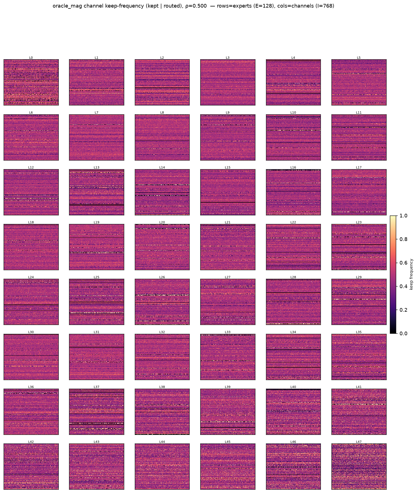
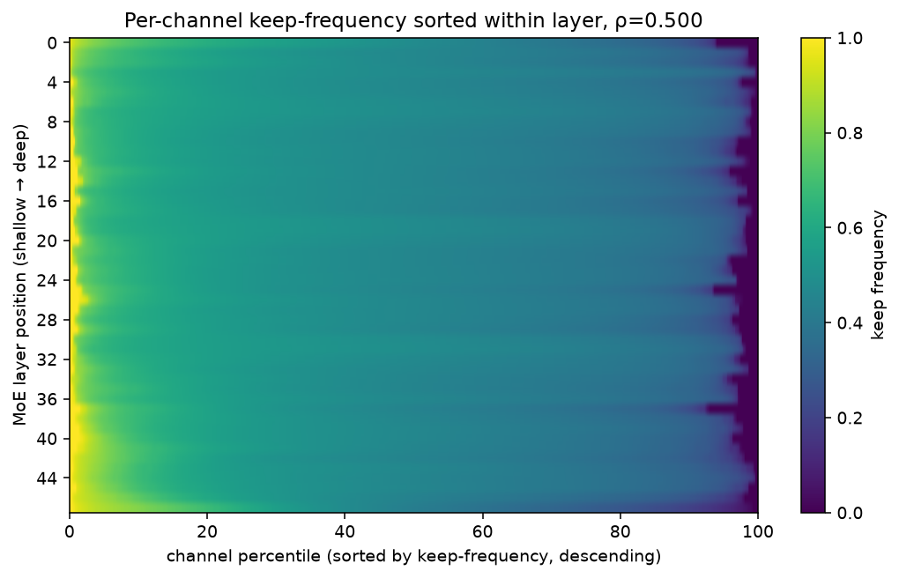
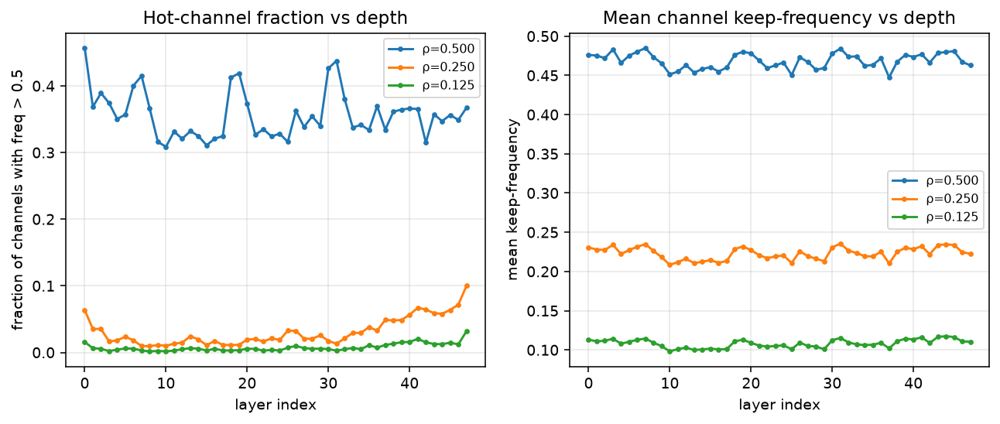
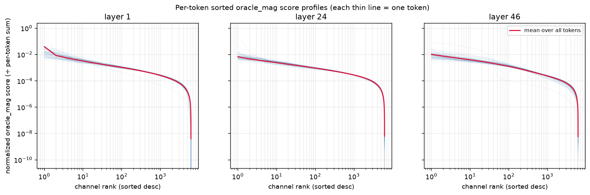
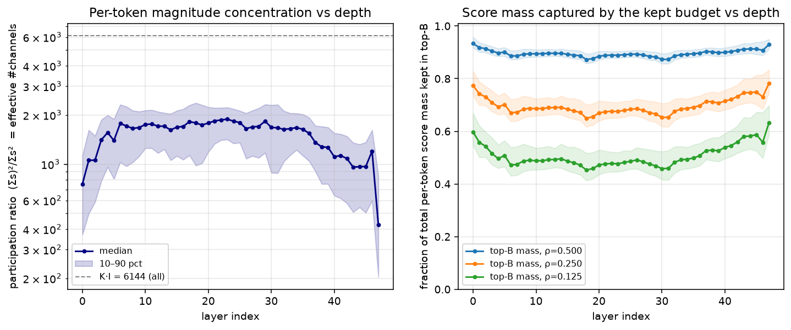

# Dynamic Per-Token, Per-Expert Active-Parameter Allocation — Qwen3-30B-A3B

Distributes a fixed per-token channel budget **unevenly across each token's
top-K experts** (masking simulation, no fine-tuning), keeping activated
expert-FFN params at ρ = 0.67 of `K·I` (33% cut). Two orthogonal knobs:

- **criterion** — how much budget each expert gets: `router_prob` (per-token
  softmax weight), `contribution` (`expert_out_token_contrib`, per-expert
  scalar), or `uniform` (dynamic-path baseline, even split).
- **channel_metric** — which channels each expert keeps: `activation` (repo
  default) or `leverage` (Nyström ridge-leverage score; score-only, no
  down_proj reconstruction).

Base model `Qwen/Qwen3-30B-A3B-Thinking-2507`, scores from
`.../Qwen_Qwen3-30B-A3B-Thinking-2507/c4/scores`. No fine-tuning, `real_slim: false` (masking simulation gives exact accuracy at budget). HellaSwag 0-shot.

## Results (HellaSwag 0-shot)

| Config                        | criterion    | channel_metric | acc     | acc_norm |
| ----------------------------- | ------------ | -------------- | ------- | -------- |
| Dense baseline (unpruned)     | —           | —             | _TBD_ | 78.56%*  |
| Uniform nystrom baseline      | uniform      |                | 49.55%  | 66.29%   |
| Uniform MoBE baseline         |              |                |         | 69.54%   |
| Dynamic prob × activation    | router_prob  | activation     | 57.31%  | 75.96%   |
| Dynamic prob × leverage      | router_prob  | leverage       | 57.65%  | 76.13%   |
| Dynamic contrib × activation | contribution | activation     | 50.58%  | 67.79%   |
| Dynamic contrib × leverage   | contribution | leverage       | 51.49%  | 69.46%   |

\* Dense baseline `-Thinking-2507` (78.56%) carried from
`docs/results/attribution_guided/nystrom.md`.

**Why the static attribution-guided 33% rows are *not* the right baseline.**
The static pruning pipeline's "33%" is 33% of the **expert-FFN storage** — it
removes whole channels from every expert offline. But only `K` of `E` experts
fire per token (Qwen3-30B: K=8, E=128), so the **activated** compute per token
drops by only ~2–3%, not 33%. That method trades storage, not active FLOPs. The
dynamic scheme here cuts **33% of the active** expert-FFN params *per token*, so
the apples-to-apples baselines at the same active budget are methods that also
shrink the per-token active path to ρ≈0.67:

- **Uniform nystrom** — static uniform prune to 67% of channels per expert (no
  attribution weighting), i.e. every token/expert keeps the same 515 channels.
  This is exactly the ρ=0.67 active budget, and equals `Dynamic uniform × activation` here (66.29%) since uniform allocation reduces to a static uniform
  keep-set.
- **Uniform MoBE** — one-shot MoBE decomposition to 67% (`compression_ratio: 0.67`, 16 bases, rank 768, no fine-tuning); shrinks the active per-token FFN
  work by ~33%. Source:
  `run_results/.../compress_then_train/ce_mobe_calib-c4-0.67_*/benchmark_comparison.json`.
  Caveat: MoBE/uniform-nystrom baselines ran on base `Qwen3-30B-A3B` (dense
  77.68%), whereas the dynamic rows use `-Thinking-2507` (dense 78.56%) — so
  treat the cross-model gap of ~0.9pt as noise when comparing.

**`contrib` bug (found & fixed, 2026-07-15→17).** The first run of the two
`contribution` configs silently fell back to uniform: `expert_out_token_contrib`
is stored as a *negative* per-expert scalar (more-important experts more
negative), and the initial `precompute.py` clamped raw values to ≥0, zeroing
everything. Fixed by negating before clamping (matches the repo's static
`attr_coverage` path, `prepare_scores.py:116`); the `contrib_*` rows above are
from the corrected re-run. `router_prob`/`uniform` rows were never affected.

## 50% reduction — coverage-maximized allocation (`coverage_alloc`)

New criterion combining **router contribution + expert info-concentration**,
following the paper's coverage-maximized allocation (§4.2, Alg. 1) applied
*per-token* over each token's K experts. Coverage ratio for the top-n channels
is `ρ_e(n) = S_e(n)/S_tot_e` (prefix sums of the descending-sorted leverage
scores). The per-expert coverage **target** is initialized from the router
probability and a single scaling factor α: `ρ_e(α) = min(α·p_{t,e}, 1)`; α is
binary-searched per token so the total kept channels `Σ_e N_e(ρ_e(α)) ≤ B`, then
a coverage-aware top-up lands `Σ_e k = B` exactly (same active budget as
`router_prob`). Intuition: two experts with equal router prob get equal coverage
*targets*, but an expert whose leverage is **concentrated** reaches that target
with **fewer** channels, freeing budget for experts whose leverage is spread out.

The dynamic arms use `channel_metric = leverage` (ridge-leverage score),
`prune_ratio = 0.50` (keep ρ = 0.5 of `K·I`), `k_min = 16`, no fine-tuning,
`real_slim: false`. HellaSwag 0-shot. The leverage score is **precomputed once**
(derived from the cached `expert_covariances.pth`, no forward recompute) and
reused across all runs via the `dynamic_alloc_leverage_v2.pth` artifact cache.

**Two ways to halve the active expert-FFN budget** are compared here:
*narrower experts* (the dynamic scheme — keep all K=8 experts but zero half their
channels per token) vs *fewer experts* (**reduce-top-k** — route each token to
top-4 of 8 experts at full width, `reduce_topk: 4`, original weights, no
slimming). Both cut per-token active expert-FFN params by ~50%.

| Config                                  | criterion      | channel_metric | acc              | acc_norm         |
| --------------------------------------- | -------------- | -------------- | ---------------- | ---------------- |
| Dense baseline (unpruned)               | —             | —             | _TBD_          | 78.56%*          |
| Reduce top-k (8→4 experts)             | fewer-experts  | —             | 57.42%           | 75.96%           |
| Dynamic uniform × leverage             | uniform        | leverage       | 43.97%           | 58.89%           |
| Dynamic prob × leverage                | router_prob    | leverage       | 53.47%           | 71.46%           |
| Dynamic coverage × leverage            | coverage_alloc | leverage       | 54.92%           | 72.94%           |
| **Level 1 — pivchol global g²** | pivchol_global | pivot-Cholesky | **56.05%** | **74.26%** |

\* Dense baseline carried from `docs/results/attribution_guided/nystrom.md`.
stderr ≈ 0.43–0.44pt on acc_norm for all rows.

**Takeaways (50%).**

- **`coverage_alloc` beats `router_prob`** by **+1.45pt acc / +1.48pt acc_norm**
  (72.94 vs 71.46), a gap ~3× the stderr — combining router contribution with
  each expert's leverage-concentration curve allocates the fixed active budget
  better than router probability alone.
- Both budget-aware criteria crush the **uniform** dynamic-path baseline
  (58.89% acc_norm) by **+12.6 / +14.0pt** — at the harder 50% cut the per-token,
  per-expert split matters even more than at 33%.
- **Fewer experts > narrower experts at 50%.** Reduce-top-k (75.96% acc_norm)
  beats even `coverage_alloc` (72.94%) by +3.0pt, and comes within 2.6pt of the
  dense baseline. Halving the active budget by dropping the 4 lowest-probability
  experts per token is *less destructive* than keeping all 8 and halving each
  expert's channels — a token's low-ranked experts contribute little, whereas
  narrowing every expert (including the dominant ones) damages the experts that
  matter most. This is a strong baseline for the dynamic-narrowing story: the
  narrowing methods must ultimately justify themselves against it (e.g. via
  fine-tuning recovery, or regimes where routing top-k is already small).
- **Level 1 (`pivchol_global`) — the corrected narrowing baseline.** Global g²·σ
  threshold + pivoted-Cholesky nested ordering reaches **74.26%**, **+1.32pt over
  `coverage_alloc`** (the three fixes: global competition, g² not g,
  redundancy-aware ordering). At 50% it trails reduce-top-k (75.2%) by ~0.9pt —
  L1's scoring matrix `Θ_k` is block-diagonal (no cross-expert terms), so at loose
  budgets it can't exploit cross-expert redundancy the way dropping whole experts
  does. **But the budget sweep below shows L1 overtakes reduce-top-k as the budget
  tightens** (−62.5%: +0.7, −75%: +14.2pt): dropping experts discards unique
  knowledge, while narrowing keeps each active expert's load-bearing channels.
  Cross-expert redundancy remains the ceiling at loose budgets, motivating a
  cross-expert (Level 3) method. See `plan/plan_level1.md`,
  `plan/plan_level1_impl.md`, and the sweep table below.

### Takeaways

- **Budget-aware allocation clearly helps.** Both `router_prob` configs (75.96 /
  76.13% acc_norm) beat the same-active-budget uniform baselines (66.29% uniform
  nystrom, 69.54% MoBE) by **+6 to +10 pts**, with zero fine-tuning and no
  physical slimming — the per-token, per-expert budget split is doing real work.
- **`router_prob` ≫ `contribution`.** Per-token softmax weight (76.1%) far
  outperforms the calibration-averaged per-expert contribution (67.8 / 69.5%),
  which barely edges out uniform. Expected: `expert_out_token_contrib` is a
  fixed per-expert scalar, so `contribution` only varies through *which* experts
  a token picks — it is not truly per-token. `router_prob` is.
- **leverage ≥ activation** for channel ranking under both criteria
  (prob: 76.13 vs 75.96; contrib: 69.46 vs 67.79), consistent with the static
  Nyström story — but the gap is small (<0.2pt) under the stronger `router_prob`.

## Level 1 — Global g²-weighted nested channel selection (`pivchol_global`)

Realizes `plan/plan_level1.md`. Replaces the current method's three components:
per-expert quota by linear-g → **global** g² threshold (quotas emerge, a
dominated expert may get 0); ridge-leverage in-expert order → **pivoted-Cholesky**
nested, redundancy-aware order.

**Offline (Phase B):** per expert build the coupling `Θ_k = G_k ⊙ B_k` where
`G_k = E[φ_k φ_kᵀ]` is the cached activation Gram (`expert_covariances.pth`, the
uncentered second moment of the down_proj input) and `B_k = W_downᵀ W_down` is the
weight Gram (H = I). Batched ridge-pivoted Cholesky (shared `λ_r = 1.0`) to
completion gives a pivot order `π_k` and monotone marginal gains `σ_k`. Stored as
`pivchol_artifact.pth` (pivot ranks + gains, 57MB). Built by
`scripts/warm_pivchol_cache.py` on the box holding the covariances; factorization
runs on **CPU** (~5 min/48 layers) to avoid crashing CUBLAS on a GPU still holding
a `device_map='auto'` shard.

**Online:** per token, score each active expert's channels by `g_k² · σ_{k,r}`
(σ monotone, g² a per-expert constant → each expert's sequence is pre-sorted),
keep the global top-`B`; per-expert prefix length `t_k` (hence `ρ_k = t_k/m`)
emerges from one shadow price. Implemented as `_pivchol_allocate` in `allocate.py`
(global top-B over the pooled `K·I` scores, count per expert; `Σ t_k = B` exactly,
no `k_min` floor). The keep-mask `pivrank < t_k` reproduces the pivot prefix.

### Budget sweep — Level 1 vs `router_prob × activation` (HellaSwag 0-shot)

Three methods across four active-param reductions (Level 1 reuses the cached
budget-agnostic `pivchol_artifact.pth`; `router_prob × activation`, the winning
33%-study criterion, `k_min = 16`; **reduce-top-k** = route to fewer full-width
experts, from `docs/intern_plan/proposal/per_token_adaptive_activate.md`). acc_norm:

| Reduction | ρ (kept) | B (of 6144) | reduce top-k | router_prob × act | Level 1 (pivchol) | Δ (L1 − topk) |
| --------- | --------- | ----------- | ------------ | ------------------ | ----------------- | --------------- |
| 50%       | 0.50      | 3072        | 75.2 (8→4)  | 71.46%†           | 74.26%            | −0.9           |
| 62.5%     | 0.375     | 2304        | 69.8 (8→3)  | 61.00%             | **70.54%**  | +0.7            |
| 75%       | 0.25      | 1536        | 49.4 (8→2)  | 43.66%             | **63.60%**  | +14.2           |
| 87.5%     | 0.125     | 768         | 26.2 (8→1)  | 30.32%             | 44.15%            | —              |

† 50% baseline row is `router_prob × leverage` (71.46%); the other three rows are
`router_prob × activation`. reduce-top-k maps to integer expert counts (8→4/3/2/1);
−87.5% (8→1) is not reported in the proposal. (acc for L1: 56.05 / 53.16 / 47.56 /
35.24%; for router_prob×act: 53.47 / 45.71 / 34.93 / 27.84%.)

**Level 1 beats `router_prob × activation` at every budget, and the margin widens
as the cut deepens** — the baseline collapses toward chance (25% acc) by 87.5%: its
per-expert linear-g quota keeps spending budget on low-probability experts and, in
each expert, ridge-leverage double-counts redundant channels. Level 1's global g²r
competition starves weak experts and its pivoted-Cholesky ordering avoids redundant
channels, so it degrades gracefully (74.3 → 70.5 → 63.6 → 44.2).

**vs reduce-top-k (the strong "fewer experts" baseline):** Level 1 matches it at
moderate cuts (−50%: 74.3 vs 75.2) and **overtakes it as the budget tightens**
(−62.5%: +0.7pt, −75%: **+14.2pt**). When budget is scarce, dropping whole experts
discards each dropped expert's *unique* knowledge, whereas Level 1 keeps every
active expert's most load-bearing (non-redundant) channels.

### MMLU (5-shot) — Level 1 vs `router_prob × activation` @ 75% reduction

Full MMLU, 5-shot, same 75% active-param budget (B = 1536 of 6144). Overall acc:

| Method                             | criterion      | MMLU acc (5-shot) |
| ---------------------------------- | -------------- | ----------------- |
| Reduce top-k (8→2)               |                | 34.90%            |
| `router_prob × activation`      | router_prob    | 49.17%            |
| **Level 1 (pivchol global)** | pivchol_global | **70.81%**  |

**Level 1 leads by +21.6pt** — an even larger margin than HellaSwag at the same
75% budget (+19.9pt). MMLU (knowledge-heavy, 5-shot) is more sensitive to
destroying expert capacity, so the baseline's redundant-channel double-spend and
low-g over-feeding cost it more; Level 1's redundancy-aware global selection holds
up. This corroborates the HellaSwag trend on a second, harder benchmark.

### MMLU (5-shot) — Level 1 budget sweep

Level 1 (`pivchol_global`) across all four active-param reductions, full MMLU
5-shot (reuses the budget-agnostic `pivchol_artifact.pth`; only `prune_ratio`
changes). The 50/62.5/87.5% rows were run on 2026-08-10
(`configs/eval/qwen3_30b_a3b_dynamic_pivchol_{50,625,875}_mmlu.yaml`, A100-New);
75% is carried from the table above. Overall acc, dense 5-shot MMLU **80.91**
(measured 2026-08-11, full MMLU, `configs/eval/qwen3_30b_a3b_baseline_mmlu_full.yaml`,
A100-Sagemaker; stderr 0.32pt):

| Reduction | ρ (kept) | B (of 6144) | Level 1 MMLU acc (5-shot) | Δ vs dense (80.91) | HellaSwag acc_norm (ref) |
| --------- | --------- | ----------- | ------------------------- | -------------------- | ------------------------ |
| 50%       | 0.50      | 3072        | **78.85%**          | −2.06               | 74.26                    |
| 62.5%     | 0.375     | 2304        | **76.16%**          | −4.75               | 70.54                    |
| 75%       | 0.25      | 1536        | 70.81%                    | −10.10              | 63.60                    |
| 87.5%     | 0.125     | 768         | **45.51%**          | −35.40              | 44.15                    |

stderr on the new MMLU rows: 0.33 / 0.34 / — / 0.41pt on acc. HellaSwag acc_norm
column carried from the budget-sweep table above.

**Takeaways.**

- **At 50% Level 1 is nearly lossless on MMLU** — 78.85% is within 2.1pt of
  the dense 5-shot reference (80.91), at half the active expert-FFN budget with no
  fine-tuning. 62.5% still holds within 4.8pt.
- **MMLU degrades far more gracefully than HellaSwag until the tightest budget.**
  From 50%→75% Level 1 loses 8.0pt on MMLU (78.85→70.81) but 10.7pt on HellaSwag
  acc_norm (74.26→63.60) — consistent with the rest of this document: 5-shot MMLU
  tolerates lost expert capacity better, since the few-shot context props up
  knowledge recall even when the per-token FFN is heavily narrowed.
- **Both benchmarks fall off a cliff at 87.5%.** MMLU drops 25.3pt from 75%→87.5%
  (70.81→45.51, well above the 25% random floor but no longer usable), tracking
  HellaSwag's collapse (63.60→44.15) at the same ρ=0.125. Keeping only 1/8 of each
  active expert's channels is past the point where redundancy-aware ordering can
  compensate, on either benchmark.

## Level 2 — cross-expert selection (`oracle_mag`, `pubsub`)

Level 1's scoring matrix `Θ_k` is **block-diagonal**: channels are ranked
within-expert, so a low-probability expert may spend budget on channels already
covered by a co-activated high-probability expert. Level 2 asks how much this
costs and whether a cross-expert method recovers it. Realizes
`plan/plan_level2_impl.md`. Two runnable selectors, both selecting a per-token
**global top-B over the pooled K·I channels** of a token's active experts:

- **`oracle_mag` (Oracle-A ceiling).** Scores each channel by its *exact
  per-token* output magnitude `g_e·|inter_{e,j}(x)|·‖W_down[:,j]‖` and keeps the
  global top-B. Block-diagonal (no off-diagonal coupling) but uses the true
  per-token activation instead of only the router `g` — so it upper-bounds every
  router-only offline method. The gap `oracle_mag − Level-1` is the value of
  per-token activation information.
- **`pubsub` (the Level-2 method).** Offline, builds a shared **public basis**
  `U` = top-r eigenvectors of `Σ_e W_down_e G_e W_down_eᵀ` (directions many
  experts write into), deflates each expert's `down_proj` by `U`, and runs the
  Level-1 pivoted Cholesky on the *private* residual → `σ^priv`. Online (router
  only), for each public direction it force-keeps the single best-carrying
  channel among the co-activated experts (dedup — load shared knowledge **once**),
  then fills the rest by the Level-1 rule `g²·σ^priv`. Preserves prefix
  contiguity; touches no expert weights beyond the ~57 MB artifact.

### HellaSwag 0-shot — budget sweep (acc_norm)

Level-1 and reduce-top-k rows carried from the sweep table above. `oracle_mag`
and `pubsub` are new (masking simulation, no fine-tuning).

| Reduction | reduce top-k | Level 1 (pivchol) | `pubsub` (L2) | `oracle_mag` (ceiling) | real cut | real score |
| --------- | ------------ | ----------------- | --------------- | ------------------------ | -------- | ---------- |
| 50%       | 75.2 (8→4)  | 74.26             | 74.31           | **78.54**          | -32.6%   | 77.76      |
| 62.5%     | 69.8 (8→3)  | 70.54             | 70.51           | **78.76**          | -39.17%  | 77.62      |
| 75%       | 49.4 (8→2)  | 63.60             | 63.46           | **78.28**          | -45.69%  | 77.34      |
| 87.5%     | 26.2 (8→1)  | 44.15             | 44.66           | **76.84**          | -52.22%  | 72/58      |
|           |              |                   |                 |                          | -58.75%  | 70.92      |

Dense baseline 78.56. stderr ≈ 0.41–0.44pt on acc_norm.

**Reads.**

- **`pubsub` ≈ Level-1 at every budget** (Δ = +0.05 / −0.03 / −0.14 / +0.51pt,
  all inside 1 stderr). Restoring cross-expert coupling — loading shared "public"
  knowledge once and re-spending the freed budget on private channels — buys
  **nothing** measurable. This is the decisive **M1 result**: the Oracle-B −
  Level-1 gap is negligible, so the offline-cross-expert-scoring effort (Level 2
  proper) is not worth the ≫57 MB pairwise statistics it would need. It confirms
  the earlier stacked-covariance finding (cross-expert coupling holds ~70% of the
  covariance energy but changes channel *selection* by <2%): the off-diagonal
  mass is real but it does not move which channels you'd keep.
- **`oracle_mag` stays near dense at every budget** (78.5 → 78.8 → 78.3 → 76.8
  vs dense 78.56), beating Level-1 by **+4.3 / +8.2 / +14.7 / +32.7pt** and
  losing <2pt even at a 7/8 cut. The entire remaining headroom is **per-token
  activation information** (`|inter(x)|`), not cross-expert structure: the router
  `g` alone (all offline methods) cannot tell which channels a *specific* token
  actually lights up. `oracle_mag` is an unreachable ceiling (it reads the true
  per-token intermediate), but it relocates the Level-2 target — the gap to close
  is online per-token, not offline cross-expert.

### MMLU 5-shot (acc)

Dense: 80.91

| Channel cut | reduce k | Level 1 (pivchol) | `pubsub` (L2) | `oracle_mag` (ceiling) | real cut | real score |
| ----------- | -------- | ----------------- | --------------- | ------------------------ | -------- | ---------- |
| -50%        | 74.1     | 78.85             |                 | 80.22                    | -32.6%   | 79.33      |
| -62.5%      | 65.1     | 76.16             |                 | **80.89**          | -39.17%  | 79.50      |
| −75%       | 34.9     | 70.81             | 71.03           | **80.53**          | -45.69%  | 79.15      |
| -87.5%      | 24.4     | 45.51             |                 | 79.48                    | -52.22%  | 77.85      |
| -95%        |          |                   |                 | **76.16**          | -58.75%  | 74.14      |

Same pattern on the harder, knowledge-heavy benchmark: `pubsub` matches Level-1
(+0.22pt), while `oracle_mag` recovers to **80.53** — within 0.4pt of the full
model (dense 5-shot MMLU is 80.91) at a 75% active cut, +9.7pt over Level-1. Per-token
activation information matters *more* on MMLU, consistent with its sensitivity to
destroyed expert capacity.

### M4 regime diagnostic — `g^{2β}` sharpness sweep (HellaSwag, −50%)

Scores channels by `g^{2β}·σ` (β=1 is Level-1; β→∞ degenerates to reduce-top-k).

| β       | 1 (Level 1) | 1.5   | 2     | 3     |
| -------- | ----------- | ----- | ----- | ----- |
| acc_norm | 74.26       | 74.51 | 74.54 | 74.54 |

Sharpening the router weight helps only marginally (+0.28pt, ≈½ stderr) and
saturates by β=2. The mid-budget Level-1-vs-reduce-top-k gap is **not** a
score-dynamic-range problem — it is not closed by concentrating budget on the
top experts, ruling out the simplest explanation and leaving cross-expert
overlap as the (small, per the M1 result) residual.

### M1 oracle ladder + M3 structure (reconstruction, ~2k C4 tokens, layer 46)

_TBD — reconstruction relative-error ladder (`level1` / `pubsub` / `oracle_mag` /
per-token OMP `oracle_exact`) and M3 coherence-vs-pivot-rank; from
`scripts/level2_oracle_ladder.py`._

## `oracle_mag` activation structure — why the down_proj is so sparsely driven

`oracle_mag` recovers near-dense accuracy at a 7/8 active cut (76.84% acc_norm at
ρ=0.125), which says the exact per-token output magnitude
`s_{e,j}(x) = g_e·|inter_{e,j}(x)|·‖W_down[:,j]‖` is concentrated in a small
fraction of the `K·I = 6144` channels each token actually pools. This section
opens that up with calibration data: we replay the exact `oracle_mag` selection
over **69,764 C4 tokens** (padding stripped) on the full un-slimmed
`Qwen3-30B-A3B-Thinking-2507` (K=8, E=128, I=768, 48 MoE layers) and record, per
layer, (1) how often each intermediate channel survives the per-token global
top-B — the **activation frequency** — and (2) each token's sorted score profile
and concentration. Capture: `scripts/oracle_mag_freq_capture.py` (A100-New, 8
GPUs, sharded bf16/sdpa, ~5 min); the replay reproduces `block.py`'s
`_cross_expert_keep` scoring exactly (verified: identical score tensor, 100%
keep-mask agreement on a mock block). Plots: `scripts/oracle_mag_freq_plot.py`.
Figures in `figures/oracle_mag/`; summary numbers in
`figures/oracle_mag/stats.json`.

**Activation frequency** of channel `(layer, e, j)` is its keep-count divided by
its expert's route-count — i.e. *given the expert fired*, how often channel `j`
lands in the token's kept budget. We report it at three budgets ρ ∈ {0.5, 0.25,
0.125}. (A "budget-agnostic" static keep would sit at freq = ρ everywhere; the
spread away from ρ is exactly the per-token dynamism `oracle_mag` exploits.)

### Investigation 1 — per-channel activation frequency (heatmaps)

*Figure: keep-frequency (kept | routed) for every MoE layer at ρ=0.5. Rows =
experts (E=128), cols = channels (I=768). See `freq_layer{1,24,46}_r0.500.png`
for single-layer full-res views and `freq_grid_r0.{250,125}.png` for the tighter
budgets.*

**Findings.**

- **The dominant structure is horizontal banding — variance is between experts,
  not between a fixed set of "always-on" channels.** Decomposing the per-channel
  keep-frequency variance at ρ=0.5: **73.9% is *within*-expert** (channel-to-channel
  inside one expert) and **26.1% is *between*-expert** (whole rows brighter/darker).
  So there is no small, stable, cross-token set of "load-bearing channels" you
  could prune to statically — a channel that is hot for one token is cold for the
  next. This is the direct micro-level explanation for the earlier M1 result that
  **router-only offline methods (Level-1, `pubsub`) cannot approach `oracle_mag`**:
  the information is per-token, and no fixed keep-set captures it.
- **Almost nothing is always-in or always-out.** At ρ=0.5, over well-sampled
  channels (expert route ≥ 50): only **0.3%** are kept >95% of the time and only
  **0.4%** are kept <5% of the time; **64.6%** sit in the mid band (0.4–0.6, i.e.
  near ρ). At ρ=0.125 only **0.09%** of channels are hot (>0.5) and **6.3%** are
  never kept. The keep decision is genuinely re-made per token.
- **Within a single expert, channels still differ widely** (this is the 73.9%).
  For a well-sampled expert at layer 24 the per-channel frequency spans e.g.
  0.35 → 0.48 (median) → 0.89, with an average within-expert std of 0.083. So the
  intra-expert ranking `oracle_mag` uses (`|inter_{e,j}|·‖W_down[:,j]‖`) is real
  and token-dependent, not a static per-expert channel mask.
- **The bright/dark bands are a routing-frequency artifact, not "super-channels".**
  The few bright rows (expert-mean freq > 0.7: just 5 of 6144) are heavily-routed
  experts (median route 5189); the dark rows (< 0.1: 66 rows) are **dead experts
  that never fired** (median route 0 — 33 of 48 layers have ≥1 dead expert over
  this calibration set). Among experts that *do* fire, mean keep-frequency is
  tightly clustered (p5–p95 = 0.376–0.585 around ρ=0.5) and correlates only
  moderately with log-route (r≈0.46): a token's own budget competition, not a
  global "important expert" label, sets how many of an expert's channels survive.
- **Sparsity is remarkably uniform with depth.** Mean keep-frequency tracks ρ
  almost flat across all 48 layers (0.45–0.49 at ρ=0.5; 0.10–0.11 at ρ=0.125) —
  no layer is systematically easier or harder to sparsify under `oracle_mag`.
  The hot-channel fraction (freq>0.5, ρ=0.5) wobbles 0.31–0.46 with mild peaks at
  the very first layers and a slow rise over the last ~10 layers, but the effect
  is small. This says a **single global per-token budget B** (what `oracle_mag`
  and the dynamic scheme already use) is well-matched to the model — there is no
  strong case for a depth-dependent budget schedule.

### Investigation 2 — per-token score profiles (is the pattern token-dependent?)

For each token we sort its pooled `K·I` scores descending and look at the shape.
Two views: individual normalized sorted curves (each thin line = one token,
divided by its own sum so only *shape* is compared), and per-token concentration
— participation ratio `PR = (Σs)²/Σs²` (the effective number of channels, = KI
for a flat token, small for a peaky one) and the fraction of total score mass the
top-B budget captures.

**Findings.**

- **Yes — tokens differ markedly at the same layer, and the difference is in the
  *head* of the distribution.** The normalized sorted curves fan out most at low
  rank (the top few channels): some tokens put >2% of their magnitude in a single
  channel and decay fast (peaky), others start near ~1% and spread it out (flat).
  All tokens share a common heavy tail that collapses only in the last ~5% of
  channels. Concretely, the per-token participation ratio spans a **2.7×** range
  within a layer (all-layer p10–p90 = 769–2099 effective channels of 6144); at
  layer 1 the spread is **3.2×** (p10=498, p90=1620). So a fixed keep-fraction is
  a poor per-token fit — exactly the slack a per-token budget (or the `oracle_mag`
  global top-B) exploits, and which router-only methods, blind to `|inter(x)|`,
  cannot see.
- **Tokens are peaky in an absolute sense: ~25% of channels carry the magnitude.**
  Median participation ratio is **1525 ≈ 24.8% of K·I**. At ρ=0.5 the kept budget
  captures a median **89.6%** of each token's total score mass (p10–p90 =
  87.6–92.1%); at ρ=0.25, **69.4%**; at ρ=0.125, **50.1%**. That the top 1/8 of
  channels still holds half the magnitude is the concentration that lets
  `oracle_mag` lose <2 pts at ρ=0.125 — but note the mass is spread over ~768
  channels, not a handful, so the ceiling comes from *ranking every token's own
  channels*, not from a sparse universal basis.
- **The concentration pattern changes with depth — a shallow/deep "U".** Median
  participation ratio is **lowest (most peaky) at the ends**: L1 ≈ 1057 (17.2%)
  and L46 ≈ 1203 (19.6%), versus the **flattest at mid-depth** L24 ≈ 1834
  (29.8%). Early and late layers concentrate each token's magnitude into fewer
  channels; middle layers spread it. The per-token *heterogeneity* follows the
  same U (spread 3.2× at L1 and 2.7× at L46 vs 1.6× at L24). Read together with
  Investigation 1's flat mean-frequency: **the total budget the model needs is
  depth-independent, but where within a token the magnitude sits (few vs many
  channels) is not** — early/late layers are where per-token routing of the
  budget has the most to gain, mid layers the least.

**Takeaway for the method.** Both investigations point the same way as the M1
oracle result: the headroom `oracle_mag` exposes is **per-token activation
structure**, not a static or cross-expert one. There is no stable sparse keep-set
(within-expert variance dominates, ~0.3% of channels are ever "always on"), and
per-token concentration varies 2.7–3.2× at fixed depth — so the target for a
practical Level-2 method is a cheap online predictor of `|inter_{e,j}(x)|` (or
its rank), not more offline statistics. A uniform global budget B is already
well-matched to depth, though early/late layers (peakier, more heterogeneous)
are where a per-token budget would pay off most.

## `oracle_mag` ablations — which factor carries the signal, and can we cut gate_proj too?

Two questions about the `oracle_mag` score
`s_{e,j}(x) = g_e·|inter_{e,j}(x)|·‖W_down[:,j]‖`, both at −75% and −87.5%, on
HellaSwag (0-shot) and MMLU (5-shot). Masking simulation, no fine-tuning,
`k_min = 0`, `real_slim: false` — same protocol as the `oracle_mag` rows above.

- **Q1 `oracle_mag_noW`** — *does the weight term matter?* Rank and select by
  `g_e·|inter_{e,j}(x)|` **only**, dropping the `‖W_down[:,j]‖` column-norm
  factor. Like `oracle_mag`, it reduces `down_proj` alone.
- **Q2 `oracle_up`** — *can the decision be made before `gate_proj` runs?* Score
  by `g_e·|up_{e,j}(x)|·‖W_down[:,j]‖` — the **`up_proj` output**, which is
  available before `gate_proj` — keep the global top-B, then compute `gate_proj`
  **and** `down_proj` only on the kept channels (`up_proj` stays full width).

### Reduction accounting — what the "75%" denominator is

Worth stating explicitly, because it differs between the rows. `prune_ratio`
sets `B = round((1−prune_ratio)·K·I)`, i.e. it always measures the **intermediate
dimension** (equivalently, `down_proj`'s active columns). But which *matrices*
that budget actually shrinks differs:

| Method                              | ranking signal                            | up_proj | gate_proj | down_proj | full-FFN active kept |
| ----------------------------------- | ----------------------------------------- | ------- | --------- | --------- | -------------------- |
| `oracle_mag` / `oracle_mag_noW` | `\|inter\|` (needs gate **and** up) | full    | full      | ρ        | (1+1+ρ)/3           |
| `oracle_up`                       | `\|up\|` (pre-gate)                       | full    | ρ        | ρ        | (1+2ρ)/3            |

Because the masking simulation must evaluate the full SwiGLU intermediate before
it can score channels, `oracle_mag` leaves `gate_proj` and `up_proj` at full
width — so a nominal "−75%" is a −75% cut of `down_proj` only, and just
**−25% of the whole expert FFN**. `oracle_up` moves the decision ahead of
`gate_proj`, so the same B cuts two of the three matrices: **−50% whole-FFN** at
the same nominal budget. At −87.5%: −29.2% vs **−58.3%** whole-FFN.
So the two Q2 rows buy **2× the real active-param reduction** of the
`oracle_mag` row they sit next to — they are not iso-compute comparisons at
equal nominal ρ.

### Results

| Reduction (nominal) | Method                          | whole-FFN active cut | HellaSwag acc | HellaSwag acc_norm | MMLU acc (5-shot) |
| ------------------- | ------------------------------- | -------------------- | ------------- | ------------------ | ----------------- |
| −75%               | `oracle_mag` (ref)            | −25.0%              | 59.71         | 78.28              | 80.53             |
| −75%               | **Q1 `oracle_mag_noW`** | −25.0%              | 59.77         | **78.36**    | **80.70**   |
| −75%               | **Q2 `oracle_up`**      | **−50.0%**    | 57.81         | 75.31              | 79.47             |
| −87.5%             | `oracle_mag` (ref)            | −29.2%              | 58.40         | 76.84              | 79.48             |
| −87.5%             | **Q1 `oracle_mag_noW`** | −29.2%              | 58.60         | **77.11**    | **79.44**   |
| −87.5%             | **Q2 `oracle_up`**      | **−58.3%**    | 54.51         | 71.30              | 76.43             |

Dense baseline: HellaSwag 78.56 acc_norm; MMLU 5-shot 80.91. stderr ≈0.41–0.45pt
on HellaSwag acc_norm, ≈0.32–0.34pt on MMLU acc. `oracle_mag` reference rows are
the existing runs (re-read from their `lm_harness/*results.json`, matching the
tables above), except `oracle_mag` MMLU@−87.5% (79.48), which was never run in
the Level-2 sweep and was measured separately on 2026-08-01 to complete the row
(`configs/eval/qwen3_30b_a3b_dynamic_oracle_mag_875_mmlu.yaml`). All twelve cells
are therefore measured, not carried from prose.

### Reads

- **Q1: the `‖W_down[:,j]‖` factor is nearly irrelevant — the per-token
  activation carries essentially all the signal.** Dropping it moves HellaSwag
  acc_norm by **+0.08pt** (−75%) and **+0.27pt** (−87.5%), and MMLU acc by
  **+0.17pt** (−75%) and **−0.04pt** (−87.5%) — all four deltas **well within 1
  stderr**, i.e. statistically indistinguishable at both budgets and on both
  benchmarks (MMLU@−87.5% is a dead heat: 79.44 vs 79.48). This
  sharpens the M1 story: `oracle_mag`'s near-dense accuracy comes from reading
  the true per-token `|inter_{e,j}(x)|`, **not** from any weight-geometry term.
  Mechanically it makes sense — across channels within an expert the column norms
  vary far less (and are static) than the per-token activations, so they rarely
  flip a top-B decision. **Practical consequence:** a future online predictor
  needs to predict only the *activation* magnitude (or its rank); it can ignore
  `W_down` geometry entirely, which removes a per-expert `(I,)` table and makes
  the target purely a function of the token.
- **Q2: moving the decision before `gate_proj` doubles the real cut and costs
  1–5.5pt.** `oracle_up` gives up **−2.97pt** (HellaSwag, −75%), **−5.54pt**
  (HellaSwag, −87.5%), **−1.06pt** (MMLU, −75%) and **−3.05pt** (MMLU, −87.5%)
  versus `oracle_mag` at the
  same nominal ρ — while cutting **twice** the active parameters. Judged at
  *equal whole-FFN reduction* the trade is clearly favourable: `oracle_up` at
  −50% whole-FFN scores 75.31, whereas reaching −50% whole-FFN in the
  `oracle_mag` family would need ρ far below 0.125 (its −87.5% row only reaches
  −29.2%). Still 3.3pt below dense at −50% whole-FFN with **no fine-tuning**.
- **Why `|up|` is a weaker ranker than `|inter|`, and why the gap widens.** The
  SwiGLU output is `SiLU(gate_j)·up_j`; ranking by `|up_j|` alone discards the
  gate, which is precisely the multiplicative term that decides whether a channel
  is switched on for this token. The penalty grows as budget tightens on **both**
  benchmarks (HellaSwag −2.97 → −5.54pt; MMLU −1.06 → −3.05pt) because at small B
  the selection must be far more precise, and a channel with large `|up_j|` but a
  near-zero `SiLU(gate_j)` wastes budget. MMLU degrades roughly half as fast as
  HellaSwag at each budget, consistent with 5-shot MMLU tolerating capacity loss
  better — but the *trend* is the same, so the widening gap is a property of the
  `|up|` proxy, not of one benchmark.
- **Net direction for the method.** Q1 says the *only* thing worth predicting is
  the per-token activation magnitude; Q2 says a **pre-gate** proxy for it is
  already good enough to double the realized compute saving at a 3pt cost. That
  is an encouraging sign for a practical (non-oracle) Level-2 predictor: it does
  not need `W_down`, and it can be positioned before `gate_proj` — but a raw
  `|up_j|` proxy leaves ~3–6pt on the table, so a predictor that approximates
  `SiLU(gate_j)·up_j` (rather than `up_j`) is where the remaining headroom is.

## Stacking both reductions — top-4 experts × narrower experts

The two ways to shrink the per-token active expert FFN have so far been studied
as *alternatives* (see "Fewer experts > narrower experts at 50%" above). They are
orthogonal, so this section **composes** them: route each token to **top-4 of 8**
experts (`reduce_topk: 4`, −50% on its own) *and* narrow each surviving expert
with the Q1/Q2 winners from the ablation above. If they compose cleanly, the
reductions multiply and reach whole-FFN cuts (−58% to −75%) that neither knob
reaches alone.

Both criteria are re-used unchanged — the best-per-signal ablation results:
`oracle_mag_noW` (Q1: rank by `g_e·|inter_{e,j}(x)|`, no `‖W_down‖` factor;
statistically tied with full `oracle_mag` while needing no weight statistics) and
`oracle_up` (Q2: rank by the pre-gate `g_e·|up_{e,j}(x)|·‖W_down[:,j]‖`, so the
budget also cuts `gate_proj`). Masking simulation, no fine-tuning, `k_min = 0`,
`real_slim: false`. HellaSwag 0-shot and full MMLU 5-shot.

**Implementation.** `reduce_topk` previously short-circuited to eval; it now
falls through when `dynamic_alloc.enabled` is also set, so the two stack
(`src/train/merge_slim_eval.py`). Order matters and is: set `top_k` on all 48 MoE
blocks *first*, then install the dynamic forward — `install_dynamic_alloc` reads
`K` from `model.config.num_experts_per_tok`, which the reduce-top-k step has
already lowered to 4. So the per-token budget is measured against the
**already-halved** active path:

    B = round((1 − prune_ratio) · K_new · I) = (1 − prune_ratio) · 4 · 768

Verified on the box: `Reduce-top-k: routing top_k 8 -> 4` then
`[DynamicAlloc] ... K=4, I=768, prune_ratio=0.75, B=768 (of K*I=3072)`.
Unit tests for the stacked path (budget conservation against `K_new·I`, and
ρ=1 reproducing plain reduce-top-k exactly) are in
`src/dynamic_active_param/tests/test_level2.py`.

### Reduction accounting — the nominal % is *not* the whole-FFN cut

Two compoundings make the denominators worth spelling out. `prune_ratio` measures
the intermediate dimension of the **reduced** path, and (as in the Q1/Q2 section)
which *matrices* it shrinks depends on the criterion. Writing ρ = 1 − prune_ratio
and taking the dense top-8 model (3 matrices × K=8 × I) as the denominator:

| Method                     | up_proj      | gate_proj    | down_proj  | full-FFN active kept   |
| -------------------------- | ------------ | ------------ | ---------- | ---------------------- |
| `oracle_mag_noW` @ top-4 | full (×4/8) | full (×4/8) | ρ (×4/8) | `4·(1+1+ρ)/(8·3)` |
| `oracle_up` @ top-4      | full (×4/8) | ρ (×4/8)   | ρ (×4/8) | `4·(1+2ρ)/(8·3)`  |

| Config                           | nominal | B (of 3072) | whole-FFN active cut |
| -------------------------------- | ------- | ----------- | -------------------- |
| top-4 alone (`reduce_topk: 4`) | —      | 3072        | **−50.0%**    |
| top-4 ×`oracle_mag_noW`       | −50%   | 1536        | **−58.3%**    |
| top-4 ×`oracle_mag_noW`       | −75%   | 768         | **−62.5%**    |
| top-4 ×`oracle_up`            | −50%   | 1536        | **−66.7%**    |
| top-4 ×`oracle_up`            | −75%   | 768         | **−75.0%**    |

Note how compressed the `oracle_mag_noW` range is (−58.3% → −62.5% for a 2× budget
change): with `gate_proj` and `up_proj` both at full width, two of the three
matrices are untouched, so ρ moves only 1/3 of the FFN. `oracle_up` cuts two of
three and spans −66.7% → −75.0%. **The rows are therefore not iso-compute across
criteria** — compare `oracle_up` @ −50% (−66.7% whole-FFN) against
`oracle_mag_noW` @ −75% (−62.5%) for the closest pairing.

### Results

All 12 cells measured. The 8 stacked runs are `scripts/run_topk4_stack_sweep.sh`
(A100-New, 4 waves × 2 jobs × 4 GPUs, 2026-08-03→04, all rc 0, `ALL_WAVES_DONE`);
the plain top-4 MMLU reference row is `qwen3_30b_a3b_reduce_topk4_mmlu.yaml`
(A100-Sagemaker, **77.40** — its log contains non-fatal `CUDACachingAllocator`
OOM-retry warnings, but the run completed and saved results).

| Method                                | nominal | whole-FFN active cut | HellaSwag acc | HellaSwag acc_norm | MMLU acc (5-shot) |
| ------------------------------------- | ------- | -------------------- | ------------- | ------------------ | ----------------- |
| Dense baseline (top-8, unpruned)      | —      | —                   | —            | 78.56              | 80.91            |
| top-4 only (`reduce_topk: 4`)       | —      | −50.0%              | 57.42         | 75.96              | 77.40             |
| top-8 ×`oracle_mag_noW` (ref)      | −75%   | −25.0%              | 59.77         | 78.36              | 80.70             |
| top-8 ×`oracle_mag_noW` (ref)      | −87.5% | −29.2%              | 58.60         | 77.11              | 79.44             |
| top-8 ×`oracle_up` (ref)           | −75%   | −50.0%              | 57.81         | 75.31              | 79.47             |
| top-8 ×`oracle_up` (ref)           | −87.5% | −58.3%              | 54.51         | 71.30              | 76.43             |
| **top-4 × `oracle_mag_noW`** | −50%   | **−58.3%**    | 57.28         | **75.67**    | **77.30**   |
| **top-4 × `oracle_mag_noW`** | −75%   | **−62.5%**    | 56.79         | **75.14**    | **76.58**   |
| **top-4 × `oracle_up`**      | −50%   | **−66.7%**    | 56.36         | **74.02**    | **77.18**   |
| **top-4 × `oracle_up`**      | −75%   | **−75.0%**    | 53.42         | **69.99**    | **74.31**   |

The four `top-8 ×` reference rows are the Q1/Q2 rows from the ablation table above
(re-read from their `lm_harness/*results.json`); the `top-4 only` HellaSwag number
is the existing reduce-top-k run. stderr on the new rows: 0.43 / 0.43 / 0.44 /
0.46pt on acc_norm.

### Reads (HellaSwag)

- **Stacking works, and it dominates narrowing-only at equal compute.** The one
  exactly iso-compute pair in the table is at **−58.3% whole-FFN**: stacking
  (top-4 × `oracle_mag_noW` −50%) scores **75.67** versus **71.30** for pure
  narrowing (top-8 × `oracle_up` −87.5%) — **+4.37pt**, ~10× stderr. Even the
  *deeper* stacked cut (top-4 × `oracle_mag_noW` −75%, **−62.5%**) beats that
  −58.3% narrowing-only point by **+3.84pt** while removing 4.2pp more of the FFN.
  Reaching a given active budget by *halving the expert count first and narrowing
  the survivors moderately* is clearly better than narrowing all 8 experts hard.
- **The first ~12pp of narrowing on top of top-4 is nearly free.** Going top-4 →
  top-4 × `oracle_mag_noW` −50% costs **−0.29pt** (75.96 → 75.67, well inside 1
  stderr) for an extra 8.3pp of whole-FFN cut; pushing to −75% nominal costs only
  **−0.82pt** total for 12.5pp. Consistent with the Q1 finding that per-token
  `|inter|` ranking is near-lossless at moderate ρ — it stays near-lossless after
  the expert count is halved, i.e. the two reductions are close to independent
  rather than compounding their damage.
- **`oracle_up`'s pre-gate penalty compounds under stacking.** At top-8 the
  `noW → up` gap at −75% nominal was −3.05pt (78.36 → 75.31); at top-4 the same
  nominal comparison costs −1.65pt (−50%: 75.67 → 74.02) and −5.15pt (−75%: 75.14
  → 69.99). Judged on whole-FFN cut instead, `oracle_up` still extends the frontier
  where `oracle_mag_noW` cannot reach (−66.7% at 74.02 and −75.0% at 69.99, versus
  `oracle_mag_noW`'s floor of −62.5%) — so the `|up|` proxy remains the only way to
  claim `gate_proj`, just at a widening price as budget tightens.
- **Frontier summary** (acc_norm vs whole-FFN active cut, dense 78.56): −50.0%
  → 75.96 (top-4 only) · −58.3% → 75.67 · −62.5% → 75.14 · −66.7% → 74.02 ·
  −75.0% → 69.99. Accuracy holds within ~3.4pt of dense out to a **−62.5%** active
  cut with no fine-tuning, then falls off sharply once `gate_proj` is also cut at
  the tightest budget.

### Reads (MMLU)

MMLU is far more forgiving of stacking than HellaSwag, and — up to a point — it
reshuffles the criterion ranking:

- **Narrowing on top of top-4 is nearly free out to −62.5% whole-FFN.** Versus
  the plain top-4 baseline (77.40), the three cheaper stacked rows cost
  **−0.10pt** (`noW` −50%, **77.30**), **−0.22pt** (`up` −50%, **77.18**) and
  **−0.82pt** (`noW` −75%, **76.58**). The first two are well inside 1 stderr
  (0.34pt), so 8.3–16.7pp of extra whole-FFN cut is statistically free on top of
  the halved expert count. Same shape as HellaSwag, where the corresponding costs
  were −0.29 / −1.94 / −0.82pt.
- **The `|up|` pre-gate penalty is budget-dependent — free at −50%, expensive at
  −75%.** At nominal −50% the two criteria are a dead heat (`noW` 77.30 vs `up`
  77.18, **+0.12pt**), so the cheaper-to-realize `oracle_up` — which also cuts
  `gate_proj`, reaching −66.7% whole-FFN — costs nothing. At nominal −75% the gap
  opens to **+2.27pt** (76.58 vs 74.31). This is the same widening-with-tightening
  -budget behaviour as the top-8 Q2 rows, just shifted: halving the expert count
  buys one budget step of tolerance for the proxy before it starts to hurt.
- **The cliff is `oracle_up` past −66.7%.** Going `up` −50% → −75% (−66.7% →
  −75.0% whole-FFN) costs **−2.87pt** on MMLU (77.18 → 74.31), versus −0.72pt for
  the corresponding `noW` step. HellaSwag showed the same cliff more violently
  (−4.03pt, 74.02 → 69.99). So "narrowing on top of top-4 is free" holds only
  through ≈−66.7%; cutting `gate_proj` at ρ=0.25 on half the experts is where both
  benchmarks break.
- **The iso-compute win holds on MMLU but is much smaller.** At −58.3% whole-FFN:
  stacking (`top-4 × noW` −50%, **77.30**) vs pure narrowing (`top-8 × up` −87.5%,
  **76.43**) = **+0.87pt** (~2.6 stderr), against HellaSwag's +4.37pt. And the
  deeper stacked cut (−62.5%, **76.58**) still edges that −58.3% narrowing-only
  point by **+0.15pt** — a tie within noise, where HellaSwag showed +3.84pt.
  Consistent with the rest of this document: 5-shot MMLU tolerates lost expert
  capacity far better than 0-shot HellaSwag, so the two routes to a given budget
  look similar here and **the choice between them should be made on the harder
  benchmark.**
- **Best whole-FFN cut at ≈dense accuracy:** `oracle_up` @ top-4 −50% holds
  **77.18** (3.7pt below the 80.91 dense 5-shot reference) at a **−66.7%** active
  expert-FFN cut, and `oracle_mag_noW` @ −75% holds **76.58** (−4.3pt) at −62.5%,
  both with no fine-tuning.

### Frontier summary (both benchmarks)

acc_norm / acc vs whole-FFN active cut, both from the halved-K path unless noted:

| whole-FFN cut    | config                | HellaSwag acc_norm | MMLU acc |
| ---------------- | --------------------- | ------------------ | -------- |
| — (dense top-8) | —                    | 78.56              | 80.91   |
| −50.0%          | top-4 only            | 75.96              | 77.40    |
| −58.3%          | top-4 ×`noW` −50% | 75.67              | 77.30    |
| −62.5%          | top-4 ×`noW` −75% | 75.14              | 76.58    |
| −66.7%          | top-4 ×`up` −50%  | 74.02              | 77.18    |
| −75.0%          | top-4 ×`up` −75%  | 69.99              | 74.31    |

**Bottom line.** Accuracy holds within ~3.4pt (HellaSwag) / ~4.3pt (MMLU) of dense
out to a **−62.5%** active expert-FFN cut with **no fine-tuning**, and −66.7% is
reachable at ~3.7pt on MMLU. Reaching a target budget by *halving the expert count
first, then narrowing the survivors moderately* beats narrowing all 8 experts hard
at equal compute — decisively on HellaSwag (+4.4pt at −58.3%), marginally on MMLU
(+0.9pt). Both benchmarks break at the same place: cutting `gate_proj` at ρ=0.25 on
top of top-4 (−75.0%).

**Caveat on the oracle status.** These are still oracle selectors — they read the
true per-token `|inter_{e,j}(x)|` (or `|up_{e,j}(x)|`) — so the numbers are a
*ceiling* for a practical method, not a deployable result. What stacking
establishes is that the ceiling stays high when the expert count is halved first,
which makes "top-k reduction + a cheap online width predictor" the more promising
target than pushing width alone.

## Configs

33% study:
`configs/eval/qwen3_30b_a3b_dynamic_{prob,contrib,uniform}_{act,lev}_hellaswag.yaml`
(5 files). Each: `prune_ratio: 0.33`, `dynamic_alloc.enabled: true`,
`k_min: 16`, `real_slim: false`.

50% study:
`configs/eval/qwen3_30b_a3b_dynamic_{prob,coverage,uniform}_lev50_hellaswag.yaml`
(3 files). Each: `prune_ratio: 0.50`, `channel_metric: leverage`, `k_min: 16`,
`real_slim: false`. Reduce-top-k baseline:
`configs/eval/qwen3_30b_a3b_reduce_topk4_hellaswag.yaml`
(`prune_ratio: 0.0`, `reduce_topk: 4`). Level 1:
`configs/eval/qwen3_30b_a3b_dynamic_pivchol_lev50_hellaswag.yaml`
(`criterion: pivchol_global`, `lambda_r: 1.0`, `k_min: 0`); build the artifact
once with `scripts/warm_pivchol_cache.py --config <that yaml>`.

Budget sweep (HellaSwag): Level 1
`configs/eval/qwen3_30b_a3b_dynamic_pivchol_{625,75,875}_hellaswag.yaml` and
baseline `configs/eval/qwen3_30b_a3b_dynamic_prob_act_{625,75,875}_hellaswag.yaml`
(reuse the cached artifacts; only `prune_ratio` changes). MMLU (5-shot):
`configs/eval/qwen3_30b_a3b_dynamic_{pivchol,prob_act}_75_mmlu.yaml`, plus the
Level-1 MMLU budget sweep `configs/eval/qwen3_30b_a3b_dynamic_pivchol_{50,625,875}_mmlu.yaml`
(same, only `prune_ratio` changes; run via `scripts/run_pivchol_mmlu_sweep_tail.sh`
which waits on the 50% job then reuses its GPUs for 87.5%). Sweep
orchestrator (2 jobs/wave, 4 GPUs each): `scripts/run_level1_sweep.sh`.

Q1/Q2 `oracle_mag` ablations (8 configs):
`configs/eval/qwen3_30b_a3b_dynamic_{oracle_mag_noW,oracle_up}_{75,875}_{hellaswag,mmlu}.yaml`.
Each: `criterion: oracle_mag_noW` | `oracle_up`, `k_min: 0`, `real_slim: false`,
no artifact needed (`oracle_mag_noW` uses no offline statistics at all;
`oracle_up` only needs the `down_proj` column norms, built inline in
`install_dynamic_alloc`). Orchestrator (4 waves × 2 jobs × 4 GPUs):
`scripts/run_oracle_q1q2_sweep.sh`. Missing reference row filled by
`configs/eval/qwen3_30b_a3b_dynamic_oracle_mag_875_mmlu.yaml`.

top-4 stacking study (8 configs):
`configs/eval/qwen3_30b_a3b_dynamic_topk4_{oracle_mag_noW,oracle_up}_{50,75}_{hellaswag,mmlu}.yaml`.
Each combines `reduce_topk: 4` with `dynamic_alloc.enabled: true`,
`criterion: oracle_mag_noW` | `oracle_up`, `k_min: 0`, `real_slim: false`, and
`prune_ratio: 0.50` | `0.75` measured against the reduced `K_new = 4`. No
artifacts needed. Orchestrator (4 waves × 2 jobs × 4 GPUs):
`scripts/run_topk4_stack_sweep.sh`. The plain top-4 MMLU reference row is
`configs/eval/qwen3_30b_a3b_reduce_topk4_mmlu.yaml` (independent, so run in
parallel on the second box rather than as a fifth wave).

## Notes

- `expert_out_token_contrib` is a per-expert *scalar* (calibration-averaged),
  so the `contribution` criterion gives a fixed per-expert weight; per-token
  variation comes only through *which* experts a token selects. `router_prob`
  is the truly per-token criterion.
- Implementation: `src/dynamic_active_param/` (allocate / precompute / block /
  install), unit-tested in `src/dynamic_active_param/tests/`.
- `oracle_mag_noW` / `oracle_up` are registered in `_CROSS_EXPERT_CRITERIA`
  (`allocate.py`) and scored in `block._cross_expert_keep`; `oracle_up`
  additionally materializes the per-token `(K, I)` `up_proj` activation, since its
  ranking signal is the pre-gate `|up_{e,j}(x)|`. `install.py` builds
  `_dyn_col_norm` for `{oracle_mag, oracle_up}` only. Both are masking
  simulations: the kept-channel arithmetic is identical to zeroing the non-kept
  intermediate before `down_proj`, so the reported accuracy is exact at budget —
  what changes between them is *which* channels are kept and *which matrices*
  the budget is claimed against (see the accounting table above).
- `reduce_topk` **composes** with `dynamic_alloc` (it used to short-circuit to
  eval). When both are set, `merge_slim_eval.py` lowers `top_k` on every MoE
  block *and* `model.config.num_experts_per_tok`, then falls through to install
  the dynamic forward — which reads the reduced `K`, so `B` is derived from
  `K_new · I`, not the original `K · I`. `reduce_topk` alone still behaves
  exactly as before.
- `coverage_alloc` adds `prefix_sums (L,E,I)` to the artifact (cache bumped to
  `dynamic_alloc_<metric>_v2.pth`) and a vectorized, token-chunked per-token
  binary search over α in `allocate._coverage_allocate`. Only the
  `_dyn_prefix` tensor is threaded through `block.py`/`install.py`; the
  router_prob/uniform/contribution paths are unchanged.
- Leverage is **precomputed once**: `scripts/warm_leverage_cache.py` derives
  ridge-leverage from the cached `expert_covariances.pth` (no model forward
  sweep) and writes both `expert_scores.pth[leverage]` and the v2 artifact, so
  every eval short-circuits (`merge_slim_eval.py` skips
  `ensure_leverage_and_covariances` when the v2 cache exists) — race-free when
  launching multiple jobs in parallel, and needs no covariances at eval time.
