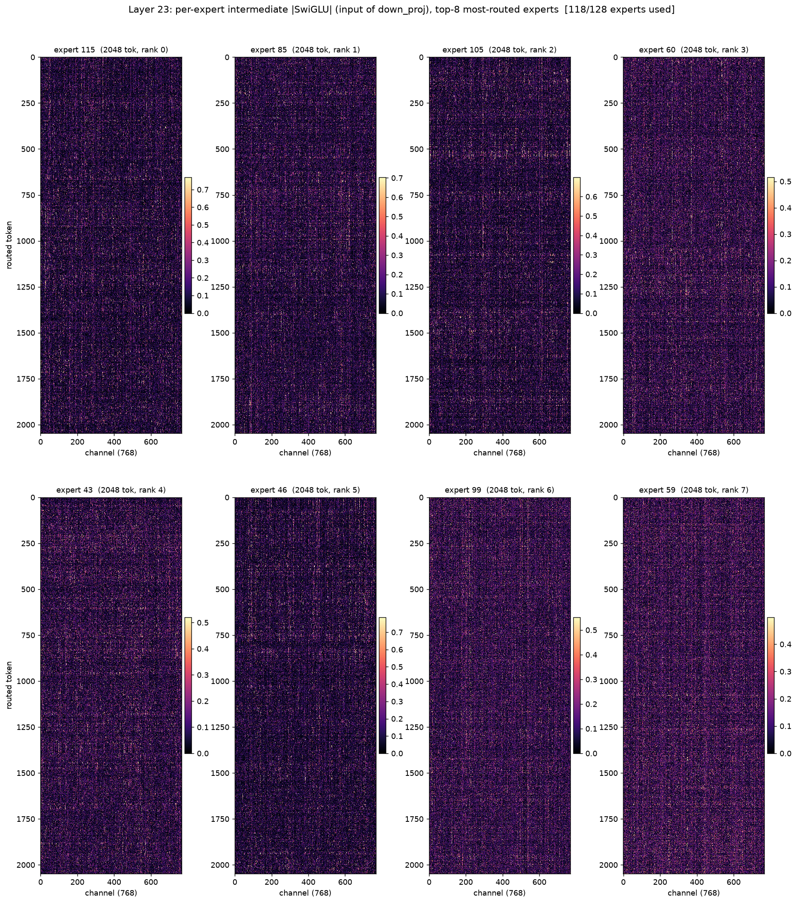
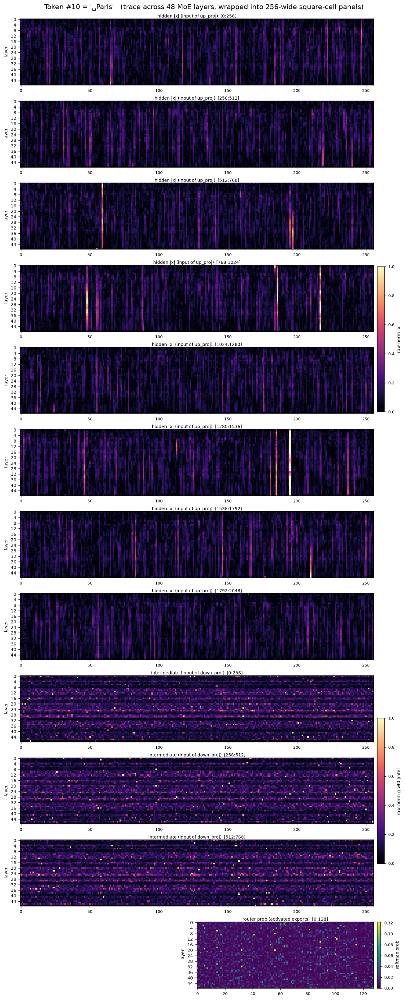
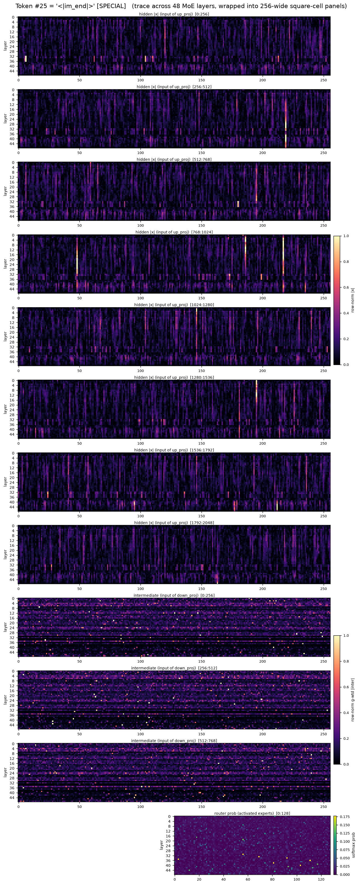
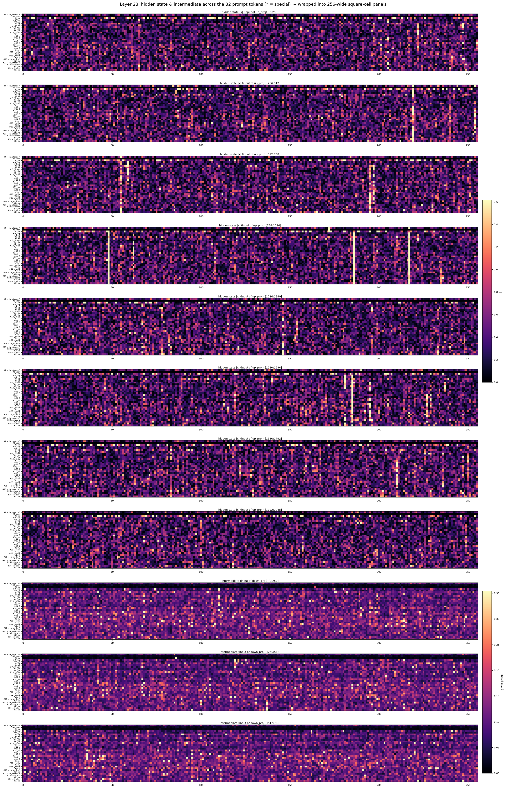

# MoE activation & routing heatmaps — Qwen3-30B-A3B (square-cell figures)

Square-cell redraw of [`heatmap.md`](heatmap.md): identical data and findings,
but every heatmap is rendered with **`aspect="equal"` so each matrix/vector
element is a square, not a stretched rectangle**. Model is
`Qwen/Qwen3-30B-A3B-Thinking-2507` (48 layers, all MoE; `E=128` experts,
`top_k=8`, per-expert intermediate `I=768`, hidden `H=2048`).

Because the layer-trace matrices are very wide (Part 2: `48 layers × 2048`
hidden dims; Part 3: `32 tokens × 2048`), literal square cells would force a
~40–64:1 thin strip. Instead the wide column axis is **wrapped into 256-wide
chunks stacked vertically** — e.g. a `48 × 2048` matrix becomes 8 stacked
`48 × 256` square-celled panels (`[0:256]`, `[256:512]`, … `[1792:2048]`) that
together cover the whole width; the `768`-wide intermediate becomes 3 panels,
and the `128`-wide router stays a single panel (rendered at half width, cells
still square).

Three views:

* **Part 1 — per-expert channel heatmaps.** For probe layers **0, 11, 23, 47**,
  one raw `tokens × channels` heatmap *per expert* (top-8 most-routed experts of
  each layer), showing the intermediate activation feeding `down_proj`. Here
  rows (tokens, ≤2048) ≥ cols (768), so a single square-celled panel per expert
  is already tall-not-wide — no wrapping needed.
* **Part 2 — per-token traces across layers.** For selected/special tokens, the
  hidden state, intermediate, and router distribution as a `layer × feature`
  heatmap across all 48 MoE layers, wrapped into 256-wide square-cell panels.
* **Part 3 — per-layer traces across tokens.** The transpose view: at a fixed
  layer (**0, 11, 23, 35, 47**), the hidden state and intermediate for the 32
  prompt tokens, wrapped into 256-wide square-cell panels.

---

## Setup / how to reproduce

* **Calibration (Part 1):** WikiText-2 test split, packed into 512-token windows
  (~131k tokens). A warmup pass counts routing to pick each layer's **top-8
  most-routed experts**; a second pass stores, for each such expert, the raw
  per-channel magnitude of the SwiGLU intermediate for up to **2048 routed
  tokens**:

  ```
  |inter_{e}(x_t)|  =  | SiLU(gate_e·x_t) · (up_e·x_t) |     # input of down_proj
  ```

  → one `(≤2048 tokens, I=768)` matrix per expert (no averaging).

* **Prompt (Parts 2 & 3):** `"The Eiffel Tower is in Paris. 2 + 2 = 4. Hello,
  world!"`, wrapped with the chat template so genuine special tokens
  (`<|im_start|>`, `<|im_end|>`, `<think>`) appear alongside content. One forward
  pass; for every MoE layer and every token we store the block input `x`
  (= input of `up_proj`/`gate_proj`), the routing-weighted intermediate magnitude
  `Σ_k g_k·|inter_{e_k}|` (input of `down_proj`, pooled over the K active
  experts), and the full softmax router probabilities over all 128 experts.

* **Commands** (heavy stage runs on an A100 box; plotting is CPU-only):

  ```bash
  # capture (A100, 4 GPUs, ~2 min incl. model load)
  PER_GPU_MEM=34GiB python scripts/heatmap_capture.py
  # plot — square-cell version (this doc)
  python scripts/heatmap_plot_square.py --tokens 0,10,11,19,25,30 --p3-layers 0,11,23,35,47
  # plot — original rectangular version (heatmap.md)
  python scripts/heatmap_plot.py --tokens 0,10,11,19,25,30 --p3-layers 0,11,23,35,47
  ```

  Raw tensors: `docs/results/heatmap/heatmap.npz` (+ `heatmap_meta.json`).

**Reading the figures.** Every cell is a square. Part-1 subplots each have their
**own** colorbar (the activation *scale* grows steeply with depth). Part-1 and
Part-3 show raw magnitude (`|·|`) with a per-panel 99th-percentile `vmax`; the
Part-2 hidden and intermediate panels are **row-normalized** (each layer ÷ its
own max-|·|) so structure is comparable across depths. In Parts 2 & 3 the panel
title tags each 256-wide chunk with its column range (e.g. `[512:768]`), and the
colorbar is shared across the chunks of one quantity.

---

## Part 1 — per-expert channel heatmaps

One heatmap per expert; each is `routed tokens (rows) × 768 channels (cols)`,
brightness = |intermediate| driven into that expert's `down_proj`. Top-8
most-routed experts per layer:

[Layer 0](sq/fig_expert_channel_L0.png) ·
[Layer 11](sq/fig_expert_channel_L11.png) ·
[Layer 23](sq/fig_expert_channel_L23.png) ·
[Layer 47](sq/fig_expert_channel_L47.png)



**What the maps show:**

* **Channels, not tokens, structure each expert — vertical striping.** Within an
  expert the bright pixels line up into *columns*: a fixed subset of channels
  fires for (almost) every token routed to that expert, while the rest stay
  dark. For the most-routed expert, only **~11–26 %** of the 768 channels are
  active for >50 % of tokens (L0 22.8 %, L11 26.0 %, L23 23.0 %, **L47 11.3 %**).
  This per-expert channel sparsity is exactly the slack structural pruning
  targets.

* **Each expert lights up a *different* channel set.** The stripe positions
  differ across the 8 subplots — experts specialize on distinct channels, so a
  channel budget can't be shared blindly across experts.

* **Scale grows sharply with depth.** Per-expert max |inter| ≈ 2.8 (L0) → 6.4
  (L11) → 8.5 (L23) → **79.5 (L47)**: deep-layer experts emit a few enormous
  values (massive-activation regime), and L47's expert is both the sparsest and
  the most outlier-dominated.

* **Expert utilization is near-complete on generic text** — 118–128 of 128
  experts fire over the calibration set at every probed layer, confirming
  redundancy is per-token-per-channel, not at the whole-expert granularity.

---

## Part 2 — per-token traces across layers

For each token: **hidden state** |x| feeding `up_proj` (`48 × 2048`, wrapped into
8 panels), **intermediate** feeding `down_proj` (`48 × 768`, 3 panels), and
**router** probability over 128 experts (`48 × 128`, 1 panel). Rows are MoE
layers 0→47.

Rendered tokens: `<|im_start|>` (0), `Paris` (10), `.` (11), `4` (19),
`<|im_end|>` (25), `<think>` (30).
[Paris](sq/fig_token_10__Paris.png) · [.](sq/fig_token_11__.png) ·
[4](sq/fig_token_19_4.png) · [\<think\>](sq/fig_token_30__think_.png)

**Content token — "Paris":**



**Special token — "\<|im_end|\>":**



**What the traces show:**

* **A few hidden dimensions are hot at every layer (residual outliers).** The
  hidden panels concentrate in a small set of *vertical* stripes — the same
  handful of hidden coordinates dominate the residual stream across nearly all
  48 layers, for every token. These outlier channels must survive any input-side
  sparsification/quantization.

* **The intermediate is layer-banded and token-dependent.** `<|im_end|>` fires
  hard at only a few layers (≈3–6, 10–12, 24, 36–37); `Paris` spreads across many
  more mid/late layers. Control tokens drive the FFN more sparsely (in depth)
  than content words.

* **Routing is sparse and re-decided at every layer.** Only 8 of 128 experts
  carry probability per row; a single token's top-1 expert changes **28–38 of 48
  layers** (`4`→28, `Paris`→31, `<|im_end|>`→38). Across the 32-token prompt,
  each layer fires **53–97 distinct experts**.

---

## Part 3 — different tokens at the same layer

At a fixed layer, hidden state |x| (`32 tokens × 2048`, wrapped into 8 panels)
and intermediate (`32 tokens × 768`, 3 panels); each row is a labeled prompt
token (`*` = special).

[L0](sq/fig_tokens_at_L0.png) · [L11](sq/fig_tokens_at_L11.png) ·
[L23](sq/fig_tokens_at_L23.png) · [L35](sq/fig_tokens_at_L35.png) ·
[L47](sq/fig_tokens_at_L47.png)



**What the maps show:**

* **Token-to-token magnitude varies enormously and grows with depth.** Per-token
  hidden-state L2 norm ranges 5–10 (L0) → 14–56 (L11) → 18–73 (L23) → 22–82 (L35)
  → 21–78 (L47). The residual stream is far from token-homogeneous.

* **Some tokens concentrate their whole hidden vector in one outlier dim.** The
  `user` role token has the *largest* norm at mid layers yet renders as an almost
  black row with a single bright spike — its magnitude sits in one massive
  dimension. Structural tokens (`\n`) instead light up broadly.

* **Outlier hidden dims are shared across tokens.** The same vertical stripes
  recur down every token row, so the outlier coordinates are a property of the
  layer, not of individual tokens.

* **The intermediate (channel) pattern is token-specific.** Which of the 768
  channels a token drives — and how hard — differs row to row, the per-token
  channel selection that motivates dynamic active-parameter allocation.

---

## Takeaways for compression

* Redundancy is **per-token, per-channel**: ~all experts used, but each expert
  only truly drives ~11–26 % of its channels (fewer in the last layer) and each
  token selects a different channel subset — the win is token-specific channel
  selection, not expert/channel dropping.
* **Depth is not uniform.** The last layer (47) is the sparsest per expert
  (~11 % active) but dominated by massive-magnitude outlier channels — cheap to
  prune in count, dangerous to prune the wrong ones.
* **Outlier hidden dims** persist across all layers and tokens (and can carry a
  token's entire hidden norm); any input-side (`up_proj`/`gate_proj`)
  sparsification or quantization must keep those coordinates.

## Files

* Figures (`sq/` subdir): `sq/fig_expert_channel_L{0,11,23,47}.{png,pdf}`
  (Part 1), `sq/fig_token_{00,10,11,19,25,30}_*.{png,pdf}` (Part 2),
  `sq/fig_tokens_at_L{0,11,23,35,47}.{png,pdf}` (Part 3).
* Data: `docs/results/heatmap/heatmap.npz`, `heatmap_meta.json`.
* Code: `scripts/heatmap_capture.py` (capture),
  `scripts/heatmap_plot_square.py` (square-cell plot),
  `scripts/heatmap_plot.py` (original rectangular plot).
