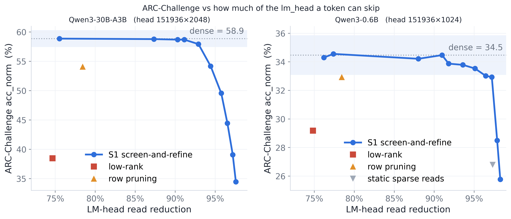

# LM-Head Compression — Results

Implementation of [`plan/baselines.md`](plan/baselines.md). Code in `src/lm_head/`.

---

## The short version

The lm_head has **three** independent efficiency axes, and they have three different
answers. The original version of this document had two, and got the third one wrong.

| axis | what it changes | verdict |
|---|---|---|
| **stored parameters** | how many numbers the head holds | **irreducible at 25%** — five families measured, none within 3.8× of the bar |
| **bits per parameter** | how precisely each is stored | **~4.3 bits is nearly free** (+1.3% PPL), below 4 bits it collapses |
| **read parameters / token** | how many are *touched* to score one token | **reducible ~4× for free** — this is the new result |

The third axis is what "active parameters" means, and it is what a memory-bound decode
actually pays for. On the primary target, at **24.48% of reads**:

| Qwen3-30B-A3B | reads | Δactive | **C4 wppl** | **HellaSwag** | **ARC-C** |
|---|---|---|---|---|---|
| *dense BF16* | *100%* | — | *25.349* | ***78.57*** | ***58.87*** |
| **S1 screen-and-refine** | **24.48%** | **−7.01%** | **25.348** | **78.57** (+0.00) | **58.87** (+0.00) |
| F2 low-rank r=512 | 25.34% | −6.93% | 88.665 (×3.50) | 60.04 (−18.53) | 38.48 (−20.39) |
| B1-p row pruning T=32768 | 21.57% | −7.28% | **∞** | 60.16 (−18.41) | 54.10 (−4.78) |
| B1-a sparse reads T=4096 | 2.70% | −9.03% | **∞** | 25.67 (−52.90) | — |

Every metric is indistinguishable from dense while touching a quarter of the head, and
**+18.4 pt of HellaSwag / +4.8 pt of ARC-C above the best previously measured method at
the same budget.** It needs no training and no quantization.

**What was wrong before.** [Part 1](#part-1--reducing-the-stored-parameter-count) closed
sparse reads on the strength of B1-a (perplexity ∞, HellaSwag at chance) and concluded
*"the parameter count is irreducible; only precision is compressible."* That reading
conflated the axis with one implementation of it. B1-a bundles two independent choices — a
**static** read set (the top-`T` frequent rows) and an **ungraded** (`−inf`) tail — and
[Part 3](#part-3--reducing-the-read-count) shows its −21.84 pt HellaSwag collapse is ~97%
attributable to *which* rows it read, not to *how few*. Choose the read set **per token**
and keep a **graded** score for everything else, and the same axis is free.

Meanwhile the *stored*-parameter conclusion survives and is now much better supported:
[§1e](#1e-the-storage-axis-five-families-at-matched-25) tests five representation families
at matched 25% storage, including the strongest one the original work never tried (a union
of subspaces), and none of them comes close.

⚠️ **Novelty of S1 is not established.** The screen-and-refine *skeleton* is close to
SVD-softmax (Shim et al., NeurIPS 2017): low-rank preview → candidate set → exact
rescoring. What is new here is the **per-token adaptive screen** and the activation-whitened
rotation — and [§3f](#3f-ablations-that-attribute-the-win) shows that component is the
*smallest* of S1's three departures from B1-a. Run a literature check before claiming the
method.

---

## What was built

```
src/lm_head/
  calib.py         unigram counts (5M C4 tokens) + activation second moment C = E[h hᵀ]
  tiering.py       frequency partition, strict masking, uniform tail fallback
  quant.py         group RTN, activation metric T_p, randomized SVD, low-rank ladder
  archead.py       ARCHead (arXiv:2608.02703), Algorithm 1 verbatim
  vq.py            group residual VQ (CARVQ) + VQ-Logits
  screen_refine.py S1 — the per-token screen + exact refine (Part 3)
  accounting.py    the three axes: parameter count, bits/param, reads — vs total + active
  install.py       install_lm_head(model, cfg) — rebinds lm_head.forward
  tests/           Phase 0 gates
```

Driven from a YAML's `prune_kwargs.lm_head` block; `merge_slim_eval.py` installs it before
`eval_dispatch` on **all six** branches, so the head arm composes with the existing
expert-pruning arm. 100+ configs from `scripts/gen_lm_head_configs.py`.

```bash
bash scripts/lm_head_run.sh   --model Qwen/Qwen3-0.6B --gates    # Phase 0
bash scripts/lm_head_run.sh   --model Qwen/Qwen3-0.6B --ladder   # C4 PPL ladder
bash scripts/lm_head_sweep.sh --model <M> --tasks hellaswag c4 --variants ...
python scripts/lm_head_accept_rate.py    --model <M>   # block-accept rate
python scripts/lm_head_task_coverage.py                # benchmark tier coverage
python scripts/show_s1.py <results.json>               # read any result file
# Part 3 diagnostics
python scripts/lm_head_adarank_diag.py   --model <M>   # per-token vs static rank headroom
python scripts/lm_head_adarank_basis.py  --model <M>   # which rotation
python scripts/lm_head_storage_struct.py --model <M>   # the five storage families
python scripts/lm_head_screen_refine.py  --model <M>   # S1 + every ablation
python scripts/lm_head_embed_reuse.py    --model <M>   # untied models only
```

`lm_head_sweep.py` exists because ~80% of a per-config `merge_slim_eval.py` run on the 30B
is spent loading a 61 GB checkpoint. It loads once and cycles head treatments through
lm-eval. Same numerics; the per-config path stays canonical.

---

## The three axes, and the ceiling

| | Qwen3-30B-A3B | Qwen3-0.6B |
|---|---|---|
| `V × D` | 151936 × 2048 | 151936 × 1024 |
| head parameters | **311.16 M** | 155.58 M |
| share of total params | 1.02% | 20.70% |
| **share of *active* params** | **9.28%** (of 3.353 B) | 20.70% |
| after −73% expert pruning | **15.33%** | — |

Measured from the live models; matches plan §1 exactly (it estimated 3.353 B active).
Confirmed before trusting any of it: `vocab_size=151936`, `hidden_size=2048`,
`tie_word_embeddings=false` on the 30B.

Three axes, tracked separately (`accounting.py:head_cost`):

- **stored parameters** — `stored_params` over `V·D`. Quantization leaves this at 100%; S1
  puts it *above* 100%.
- **read parameters per token** — `read_params_per_token` over `V·D`. This is the axis
  Part 3 moves, and the one that maps onto "active parameters".
- **bits per parameter** — where quantization's saving lives, reported in Part 2.

**Why they are kept apart.** Quantization does not reduce the parameter count at all — an
INT4 head has exactly the same 311.16 M parameters as a BF16 one. Reporting it as "25.8% of
the head" invites comparison with a low-rank head that really does hold 25.3% as many
numbers, and those are not the same claim. Symmetrically, S1 reads 24.5% but *stores*
101.35%, and gate 0b asserts `stored_param_frac > 1.0` so it can never be quietly reported
as a storage win.

The whole design space spans **0 → 9.28%** of active params on the 30B. A completely free
head buys 9.28 pp; ~4.3-bit storage banks ~6.8 pp of it in byte terms, and S1 banks
**7.01 pp** in read terms at no measurable accuracy cost.

**Qwen3-0.6B is tied** (`tie_word_embeddings: true`), so the head is **untied first** —
otherwise compressing it silently compresses the input embedding too. The untie adds
155.6 M params, so 0.6B savings are against the *untied* model, not the shipped checkpoint.

---

## Phase 0 — correctness gates

All pass (`src.lm_head.tests.test_tiering`, `test_quant`, `test_screen_refine`, and
`--gates` on a real model).

| gate | check | result |
|---|---|---|
| 0a | `tier_size=V`, 16/16 bits | logits **bit-identical**, max \|Δ\| = 0 |
| 0b | accounting vs hand-computed bytes and parameter counts | exact |
| 0c | strict masking | out-of-tier logits exactly `-inf`, in-tier bit-exact, `log_softmax` finite |
| 0d | `device_map='auto'` | passes on a 4-way shard |
| 0e | S1 with `r0=D`, `N=V` reproduces the dense head | pass; refined logits bit-identical, tail finite |
| 0f | S1 per-token screen beats a static one at matched reads | 0.00050 < 0.00125 |
| 0g | S1 score needs the column norm: `\|coef\|·‖W u_i‖` vs `\|coef\|` | 0.00414 < 0.00423 |

Gate 0d earned its place. Rebinding `lm_head.forward` *replaces* accelerate's dispatch
wrapper, so the head stopped receiving hidden states on its own device
(`mat2 is on cuda:0, different from other tensors on cuda:2`). Fixed by hooking
`_old_forward` when accelerate owns `forward` (`install.py:bind_head_forward`).

---
---

# Part 1 — Reducing the stored parameter count

Everything in this part is measured as a **fraction of the head's `V·D` stored
parameters**. §1a–1d are the original three methods; §1e broadens the search to five
representation families and is what actually closes the axis.

## 1a. Low-rank factorization — dead

`W ≈ A B` with `A: (V,r)`, `B: (r,D)` holds `(V+D)·r` parameters instead of `V·D`, all of
them read every token. It is the one full-vocabulary method that genuinely shrinks the
count. Fitted in the activation metric (`min ‖(W−Ŵ)T_p‖_F`, `p=½`, so the objective *is* the
damped logit MSE).

**Qwen3-30B-A3B (`d=2048`)** — the replication plan risk 3 asked for. Dense C4 wppl 25.349:

| rank | params stored | param frac | C4 wppl | rel | top-1 agr | HellaSwag | ARC-C |
|---|---|---|---|---|---|---|---|
| *dense* | *311.16 M* | *100%* | *25.349* | *1.000* | — | ***78.57*** | ***58.87*** |
| 512 | 78.84 M | **25.34%** | **88.665** | **3.498** | 51.6% | **60.04** (−18.53) | **38.48** (−20.39) |
| 1024 | 157.68 M | 50.67% | 38.207 | 1.508 | 74.3% | — | — |
| 1536 | 236.52 M | 76.01% | 28.277 | **1.116** | 85.3% | — | — |
| 512, *unwhitened* | 78.84 M | 25.34% | **1.6 × 10⁸** | 6.3 M× | **9.2%** | — | — |

**Qwen3-0.6B (`d=1024`, untied)** — dense C4 PPL 31.863:

| rank | param frac | whitened PPL | rel | unwhitened PPL | HellaSwag | ARC-C |
|---|---|---|---|---|---|---|
| *dense* | *100%* | *31.863* | *1.000* | — | ***47.32*** | ***34.47*** |
| 256 | 25.17% | **81.823** | 2.568 | 7 827 (245.7×) | **38.10** (−9.22) | **29.18** (−5.29) |
| 512 | 50.34% | 44.700 | 1.403 | 3 593 (112.8×) | — | — |
| 768 | 75.51% | 35.096 | 1.101 | 1 676 (52.6×) | — | — |

**Kill criterion: "if low-rank at 25% storage lands within +5% PPL, it returns to the
shortlist."** It lands at **+250%** on the 30B and **+157%** on the 0.6B — missed by 50×.
Three further nails:

- Still **+11.6% at 76%** of the parameters. A head at a *third* of that in bytes costs less.
- **Whitening is load-bearing, not optional.** Unwhitened it is destroyed at both widths
  (9.2% agreement at `d=2048`; 96× worse PPL at `d=1024`). A naive SVD of an lm_head is not
  a weak baseline, it is a broken one.
- It fails **downstream** hardest of all: HellaSwag **−18.53 pt** on the 30B at 25.3% of
  parameters, against −0.09 for a 4-bit head and **+0.00** for S1 at fewer *reads*.

**Plan §2's exclusion is confirmed at both `d=1024` and `d=2048`; risk 3 is discharged.**

## 1b. Row pruning — a real reduction that breaks multi-token tasks

Keep the top-`T` rows by calibration unigram frequency, drop the tail (`logit = −inf`).
Stores `T·D` parameters. Frequency is the only usable axis: row norms are near-uniform
(p99/p50 = 1.19–1.33) and `corr(log freq, ‖w‖) = −0.13`.

| model | T | param frac | Δactive | discarded mass | top-1 agr | C4 PPL | HellaSwag | ARC-C |
|---|---|---|---|---|---|---|---|---|
| 30B | *dense* | *100%* | — | — | — | *25.349* | ***78.57*** | ***58.87*** |
| 30B | 32 768 | **21.57%** | −7.28% | 1.94% | 98.58% | **∞** | **60.16** (−18.41) | **54.10** (−4.78) |
| 30B | 8 192 | **5.39%** | −8.78% | 11.09% | 91.46% | **∞** | — | — |
| 0.6B | *dense* | *100%* | — | — | — | *31.863* | ***47.32*** | ***34.47*** |
| 0.6B | 32 768 | **21.57%** | −16.24% | **3.08%** | 98.97% | **∞** | **40.65** (−6.67) | **32.94** (−1.54) |

Perplexity is **infinite** by construction — a dropped row cannot emit its token — and that
is the honest number, not an artifact.

The 0.6B row is the instructive one: discarding just **3.08%** of the dense probability mass
still costs **6.67 pt** of HellaSwag. Mass is the wrong intuition for multi-token scoring;
see [1d](#1d-why-1b-and-1c-fail-coveragelength-not-mass). On the 30B the same `T` costs
**18.41 pt** — the larger head has a heavier tail it cannot afford to lose.

## 1c. Static sparse activation — reads 2.7%, perplexity ∞

Store all `V·D` parameters, but *read* only the top-`T` frequent rows per position. This is
the one method here that separates stored from read.

> **This section's measurements are correct and its conclusion was too broad.** The failure
> is specific to a *static, frequency-chosen* read set with an *ungraded* tail.
> [Part 3](#part-3--reducing-the-read-count) keeps the read budget and fixes both, and the
> axis turns out to be free. Read §1c as the death of B1-a, not of sparse reads.

**Qwen3-0.6B**, dense PPL 31.863. Reported two ways, because one number alone misleads:

| T | read frac | Δactive (reads) | strict PPL | targets unreachable | uniform tail fallback | HellaSwag | ARC-C |
|---|---|---|---|---|---|---|---|
| *dense* | *100%* | — | *31.863* | — | — | ***47.32*** | ***34.47*** |
| 4 096 | **2.70%** | −20.14% | **∞** | **20.09%** | 5 543 (174×) | **25.48** / 29.02 ᶠ | **26.79** |
| 8 192 | 5.39% | −19.58% | **∞** | 13.45% | 1 048 (32.9×) | — | — |
| 16 384 | 10.78% | −18.47% | **∞** | 7.52% | 233.6 (7.33×) | — | — |
| 32 768 | 21.57% | −16.24% | **∞** | 2.82% | 69.2 (2.17×) | — | — |

ᶠ second figure is the uniform-fallback variant. Note it barely helps HellaSwag
(25.48 → 29.02, against a 47.32 dense) — a shared tail logit lets a candidate be *scored*
but not scored *correctly*.

**Qwen3-30B-A3B**, T=4096, 2.70% of reads, −9.03% active: strict PPL **∞** (17.82% of dense
mass outside the tier) against dense 25.349, fallback **126 362** (4984×), HellaSwag
**25.67** against dense **78.57** — chance.

Restricted to tokens it *can* emit, T=4096 scores PPL 16.7 on the 0.6B — **better than
dense** — which is pure selection bias, since only easy frequent tokens get scored. Any
harness quoting that without the unreachable-target rate is reporting nonsense; `oov_rate`
is in every result JSON for this reason.

The graded version is no kinder: give the whole tail one shared logit (the classic tiered
softmax) and even a **21.6%** read set costs **+117%**.

## 1d. Why 1b and 1c fail: coverage^length, not mass

The tier looks generous on paper and isn't, once a *sequence* has to survive it.
Measured on 32 768 held-out C4 positions with a 5 M-token unigram prior
(`scripts/lm_head_accept_rate.py`):

| T | % of V | unigram mass | **accept@1** (dense argmax in tier) | accept@target | dense mass in tier |
|---|---|---|---|---|---|
| 1 024 | 0.67 | 65.60% | 77.38% | 65.85% | 68.66% |
| 4 096 | 2.70 | 80.44% | **88.28%** | 79.79% | 81.91% |
| 8 192 | 5.39 | 87.41% | **92.54%** | 86.40% | 87.94% |
| 16 384 | 10.78 | 93.51% | 96.02% | 92.42% | 93.13% |
| 32 768 | 21.57 | 98.19% | 98.61% | 97.26% | 97.19% |

Per-token coverage is high. But a length-`L` continuation survives only if **every** token
is in-tier, and that probability decays like coverage^L. HellaSwag endings average 13.7
tokens, so 82.96% per-token coverage at T=4096 becomes **9.35%** per-ending
(`scripts/lm_head_task_coverage.py`):

| T | target tokens in tier | **endings *fully* in tier** | measured HellaSwag (0.6B) | ARC-C |
|---|---|---|---|---|
| *dense (no tier)* | *100%* | *100%* | ***47.32*** | ***34.47*** |
| 4 096 | 82.96% | **9.35%** | **25.48** (chance) | 26.79 |
| 8 192 | 89.74% | 25.20% | — | — |
| 16 384 | 95.29% | 53.73% | — | — |
| 32 768 | 98.85% | 85.95% | **40.65** | 32.94 |

At T=32768, 85.95% coverage predicts 0.86·47.32 + 0.14·25 ≈ 44.2 against **40.65**
measured — right size, right direction. This is the same arithmetic that makes perplexity
infinite: over 262 144 tokens, *something* falls outside any tier.

**This is a statement about static tiers, and it is the one Part 3 escapes.** The decay is
`coverage^L` only when the read set is fixed. A per-token read set has no fixed coverage to
exponentiate: S1's candidate set contains the dense argmax on **100.000%** of 262 144
positions, and a miss costs a small logit error rather than an unemittable token.

### Corrections to the numbers the plan inherited

The plan's sparse-activation case came from a pilot using ~25 k calibration tokens.
Re-measured with 5 M:

- Pilot: *"the exact argmax is in the top-4096 rows (2.7% of V) on 92.5% of steps."*
  Actually **88.28%** at T=4096; 92.5% needs **T=8192 (5.4% of V)** — one tier doubling more.
- Pilot: *"top-1024 rows carry 71.7% of corpus mass."* With 5 M tokens: **65.60%**. The
  small sample overestimated concentration, as the plan suspected.
- Only **59 978 of 151 936** token types appear at all in 5 M C4 tokens, so 60% of the
  vocabulary is untestable from a histogram of this size.

## 1e. The storage axis: five families at matched 25%

§1a–1b tested two representations. That is not enough to close an axis, because the obvious
next idea — let each row use *few* coefficients but let the *set* of directions be
full-rank — is untested by both. This section tests it and three others.

**The bar, made precise.** Since `E_h‖(W−Ŵ)h‖² = ‖(W−Ŵ)C^{1/2}‖_F²`, every storage method
reduces to a relative Frobenius error on the activation-whitened head — no eval needed. On
this head the diagnostics in [§2d](#2d-diagnostics-2048-held-out-post-norm-states-06b) pin
**KL ≈ 9.5 · relerr²** (static
low-rank at `r=256/384/512` gives relerr² = .1014/.0714/.0494 against measured
KL = 1.092/.676/.422), and PPL ratio ≈ `exp(KL)`. A 4-bit head sits at KL .0415. So **a
25%-storage representation must reach relerr ≤ ~7%** to compete with 4 bits, and ≤10% to be
merely non-catastrophic.

Qwen3-0.6B, budget 38.9 M parameters (`scripts/lm_head_storage_struct.py`):

| representation | params | rel err | implied KL | implied PPL |
|---|---|---|---|---|
| *the bar* | *25%* | ***≤ 7%*** | *≤ 0.047* | *≤ ×1.05* |
| global low-rank `r=254` *(§1a)* | 24.97% | 32.14% | 0.98 | ×2.67 |
| **union of subspaces** `G=16, r=230` | 24.89% | **31.54%** | 0.95 | ×2.57 |
| union of subspaces `G=64, r=178` | 24.92% | 31.59% | 0.95 | ×2.58 |
| union of subspaces `G=256, r=93` | 24.92% | 33.75% | 1.08 | ×2.95 |
| union of subspaces `G=1024, r=31` | 24.59% | 38.27% | 1.39 | ×4.02 |
| low-rank `r=152` + top-10% entries | 24.94% | 27.79% | 0.73 | ×2.08 |
| low-rank `r=101` + top-15% entries | 24.93% | **26.87%** | 0.69 | ×1.99 |
| exact top-8192 rows + low-rank tail `r=210` | 24.93% | 33.20% | 1.05 | ×2.85 |
| exact top-32768 rows + low-rank tail `r=44` | 24.97% | 40.48% | 1.56 | ×4.74 |

**The union-of-subspaces row is the load-bearing negative.** `k`-means the rows, then fit a
per-cluster PCA: each row stores `r` coefficients plus a cluster id, while the *global* span
can reach all `D` dimensions. This is what mixture-of-bases, sparse dictionary coding, and
adaptive softmax all reduce to, and it is the natural thing to try once global low-rank
fails. At matched storage it is **indistinguishable from global low-rank** (31.54% vs
32.14%; the 0.6 pp edge at `G=16` is noise, and it gets *worse* past `G=64` as the
per-cluster rank collapses). **The head's 151 936 rows do not lie near a union of
low-dimensional subspaces — they fill `R^D`.** One measurement, whole family closed.

Low-rank + entry-sparse does best (26.87%) and still misses the bar by 3.8×, while needing
**49 MB of index metadata** against 78 MB of retained weights — the catch the repo already
knows from `weight_sparse` on expert FFNs.

**One idea remains untested and is worth a note.** On an *untied* model, `embed_tokens`
(V×D) must be stored anyway, so if `W_out ≈ E_in M` for some `D×D` map, the head's
*incremental* cost is `D²` = 1.35% of `V·D`. Tying is the `M = I` special case.
`scripts/lm_head_embed_reuse.py` computes the exact least-squares optimum (an upper bound on
any such method) but **has not been run** — it needs an untied checkpoint, and Qwen3-0.6B
ships tied, which makes the test vacuous there.

## Part 1 conclusion

**No reduction of the head's *stored* parameter count survives at 25%.** Low-rank misses by
50×, pruning to 21.6% of parameters costs 6.7 pt (0.6B) to 18.4 pt (30B) of HellaSwag while
discarding only 1.9–3.1% of probability mass, and no union-of-subspaces or sparse-plus-
low-rank representation gets within 3.8× of the error a 4-bit head achieves. The 311 M
numbers are needed.

What is negotiable is **how precisely each is stored** (Part 2) and — the part this document
originally got wrong — **how many are read per token** (Part 3).

---
---

# Part 2 — Reducing precision (quantization)

Every method in this part keeps **all `V·D` parameters, stored and read** — parameter
fractions are 100.00% throughout, which is exactly why they are separated from Part 1. The
unit here is **bits per parameter**, and `bytes vs BF16 = bits/16`.

Group-wise quantization is charged `bits + scale_bits/group` per parameter, so a "4-bit"
head is really 4.125 bits at `g=128`. All figures include scales.

The methods:

| | mechanism |
|---|---|
| **F3 RTN** | uniform group round-to-nearest — the honest naive floor |
| **B1-s frequency-tiered** | top-`T` rows kept BF16, tail quantized. Free: needs only a token histogram |
| **B2 ARCHead** | quantized low-rank core + group-INT4 residual + rank-6 correction fitted in the activation metric (arXiv:2608.02703, Algorithm 1, published Qwen hyperparameters `rc=10, rr=6, g=64, p=0.75, ridge=1e-3`) |
| **B3 RVQ / VQ-Logits** | vector quantization: per-group residual codebooks (CARVQ) and one shared full-row codebook (VQ-Logits) |

## 2a. Qwen3-30B-A3B (primary target)

lm-eval `word_perplexity` on C4 (500 docs) and full HellaSwag 0-shot. Dense rows come out at
HellaSwag **78.57** and MMLU **80.94** against the plan's references of 78.56 and 80.91 — the
harness and protocol are the ones the pre-registered bars were set in.

| run | bits/param | bytes vs BF16 | Δactive (bytes) | top-1 agr | **C4 wppl** | rel | **HellaSwag** | Δ | **MMLU** | Δ |
|---|---|---|---|---|---|---|---|---|---|---|
| **dense BF16** | 16.00 | 100.00% | — | — | **25.349** | 1.000 | **78.57** | — | **80.94** | — |
| **B2 ARCHead** | **4.31** | 26.92% | **−6.78%** | 93.31% | **25.676** | **1.013** | **78.48** | **−0.09** | *(running)* | — |
| **B1-s** T=4096, tail 4b | 4.44 | 27.78% | −6.70% | **96.00%** | **25.827** | **1.019** | **78.34** | **−0.23** | *(running)* | — |
| B2 ARCHead, *no* activation metric | 4.31 | 26.92% | −6.78% | 85.69% | 27.151 | 1.071 | — | — | — | — |
| F3 RTN 4-bit g128 *(naive floor)* | 4.13 | 25.78% | −6.89% | 83.54% | 27.820 | 1.098 | 77.66 | −0.91 | *(running)* | — |
| B1-s T=4096, tail 2b | 2.50 | 15.62% | −7.83% | 71.73% | 113.728 | 4.487 | — | — | — | — |
| B3 RVQ 1.58 b | 1.58 | 9.88% | −8.36% | 45.26% | 103.394 | 4.079 | — | — | — | — |
| B3 VQ-Logits K=1024 | 0.11 | 0.70% | −9.21% | 0.24% | 114 522 | 4517 | — | — | — | — |

**What the 30B shows:**

1. **The ordering reverses versus the 0.6B.** ARCHead wins by 0.6 pp here instead of losing
   by 0.2. Both still clear uniform INT4 by a wide margin, and that margin *grew*: INT4's
   excess is +9.75% here against +4.16% on the 0.6B (2.3×), while frequency tiering only
   goes +1.05% → +1.89%. The larger head is harder to quantize uniformly and more rewarding
   to treat structurally — where "structurally" means *within* the precision axis: protect
   the frequent rows, or correct the dominant activation directions.
2. **The ARCHead reproduction lands in family.** rel PPL **1.013 at 26.9%** of bytes against
   the paper's **1.007 at 25.6%** on Qwen3-8B-Base; our storage-matched INT4 (1.098) sits
   just under the 1.14–1.16 the paper reports for that comparison. Its VibeThinker-3B row is
   the *identical* head shape (151936×2048) at 3.873× compression, which is the strongest
   available prior that it transfers here.
3. **The activation metric is worth much more at scale.** Ablating it costs 1.013 → 1.071
   (+5.8 pp of relative PPL) versus +2.3 pp on the 0.6B, and drops top-1 agreement
   93.3% → 85.7%.
4. **Below ~26% of bytes everything degrades far harder than on the 0.6B** — tiered-2-bit is
   rel 4.49 here vs 2.46 there; RVQ is 4.08 vs 1.76. SLM low-bit results do **not**
   extrapolate to the large model.
5. **VQ-Logits is destroyed** — 0.24% top-1 agreement, i.e. it retains essentially nothing.

Batch sizes were reduced (c4=2, hellaswag=8) so 61 GB of weights plus the
`[bs, 2048, 151936]` logits tensor fit the available GPUs. Both metrics are computed per
request, so this changes speed only, not the numbers.

**Still running:** the MMLU column beyond its dense row — `results_eval/lm_head_sweep_30b_mmlu.json`
on A100-Sagemaker, read with `scripts/show_s1.py`.

## 2b. Qwen3-0.6B — the full bit-width ladder

Held-out C4, 262 144 tokens, dense PPL **31.863**, untied. The head is 20.70% of this model
against 9.28% of the 30B's active budget, so the same byte saving is worth **2.23×** more.

| run | bits/param | bytes vs BF16 | Δactive (bytes) | **PPL** | rel | HellaSwag | MMLU |
|---|---|---|---|---|---|---|---|
| **dense BF16** | 16.00 | 100.00% | — | **31.863** | 1.000 | **47.29** | **47.18** |
| F3 RTN 8-bit g128 | 8.13 | 50.78% | −10.19% | 31.870 | 1.000 | — | — |
| **B1-s** T=16384, tail 4b | 5.41 | 33.78% | −13.71% | **31.988** | **1.004** | — | — |
| **B1-s** T=4096, tail 4b | 4.44 | 27.78% | −14.95% | **32.199** | **1.011** | 47.02 | **47.18** |
| **B2 ARCHead** | 4.37 | 27.28% | −15.05% | **32.284** | **1.013** | **47.33** | **47.25** |
| B2 ARCHead, *no* metric | 4.37 | 27.28% | −15.05% | 33.011 | 1.036 | — | — |
| F3 RTN 4-bit g128 | 4.13 | 25.78% | −15.36% | 33.188 | 1.042 | 46.96 | 46.82 |
| B1-s T=16384, tail 2b | 3.62 | 22.63% | −16.01% | 61.071 | 1.917 | **47.36** | **47.18** |
| F3 RTN 3-bit g128 | 3.13 | 19.53% | −16.66% | 39.702 | 1.246 | — | — |
| B1-s T=4096, tail 2b | 2.50 | 15.62% | −17.47% | 78.377 | 2.460 | — | — |
| **B2 ARCHead, 2-bit residual** | 2.37 | 14.78% | −17.64% | **60.891** | **1.911** | 44.63 | 46.79 |
| B2 ARCHead 2-bit, *no* metric | 2.37 | 14.78% | −17.64% | 211.109 | 6.626 | — | — |
| F3 RTN 2-bit g128 | 2.13 | 13.28% | −17.95% | 339.261 | 10.65 | — | — |
| B3 RVQ 1.58 b (d16, K256, 3 st) | 1.58 | 9.88% | −18.65% | 55.906 | 1.755 | 45.69 | 45.10 |
| B3 RVQ 1.03 b (d8, K256, 1 st) | 1.03 | 6.42% | −19.37% | 79.861 | 2.507 | — | — |
| B3 VQ-Logits K=1024 | 0.12 | 0.74% | −20.55% | 33 542 | 1053 | 28.45 | **22.95** |

**Reading the ladder:**

1. **8 bits is free** (rel 1.000) and **~4.4 bits is nearly free** (rel 1.004–1.013). That is
   the operating range.
2. **The free static prior edges out the published SOTA here**, reversing on the 30B. At
   ~27% of bytes frequency tiering costs 1.011 and ARCHead 1.013 — a tie within measurement.
   Both beat uniform INT4 (1.042) at essentially the same bytes.
3. **Below 4 bits the ranking flips decisively.** At ~15% ARCHead (1.911) beats tiering
   (2.460), and its activation metric is doing all the work: without it, 6.626. Fitting the
   correction in plain Frobenius error wastes it.
4. **Codebooks reach bit-widths scalars cannot.** RVQ at 1.58 bits (1.755) beats 2-bit RTN
   (10.65) at *lower* storage. But nothing at ≤10% of bytes is within a stderr of dense.
5. **VQ-Logits fails completely** post-training — 1053× PPL, and the one method that drags
   MMLU *below* chance (22.95 vs 25.0). The paper reports +4% PPL; it presumably fine-tunes.

## 2c. ARCHead's mechanism, isolated

Relative error of the fit, 0.6B:

| | Frobenius | in the `C` metric |
|---|---|---|
| core only (no correction) | 0.1015 | 0.1019 |
| + rank-6 correction, **activation metric** | 0.1010 | **0.0627** |
| + rank-6 correction, plain Frobenius | 0.1000 | 0.0969 |

The correction is nearly invisible in Frobenius error and cuts the *metric* error by 38%.
That is ARCHead's thesis and it holds — and it independently confirms the pilots' finding
that the activation metric is the dominant factor.

**Storage caveat.** Our analytic bit count for a 151936×2048 ARCHead is **4.308 bits/param =
26.9% of BF16**; the paper *measures* **25.8%** on that exact shape. The paper is explicit
that an analytic bit count and a packed `state_dict` differ, so treat 26.9% as a bit count
and 25.8% as their measurement. We do not reproduce the packed kernel — accuracy transfers,
throughput claims do not.

## 2d. Diagnostics (2048 held-out post-norm states, 0.6B)

| variant | bytes | top-1 agreement | KL vs dense |
|---|---|---|---|
| *dense BF16* | *100%* | *100.00%* | *0.0000* |
| B1-s T=4096 tail 4b | 27.78% | **96.73%** | **0.0119** |
| B2 ARCHead | 27.28% | 92.04% | 0.0125 |
| B2 ARCHead, no metric | 27.28% | 86.57% | 0.0349 |
| F3 RTN 4-bit | 25.78% | 86.52% | 0.0415 |
| B2 ARCHead 2-bit residual | 14.78% | 50.34% | 0.7324 |

At ~27% of bytes **frequency tiering dominates ARCHead on both** — agreement 96.7% vs 92.0%,
KL 0.0119 vs 0.0125 — consistent with its slightly lower perplexity on this model. Keeping
frequent rows *bit-exact* beats spreading a small error everywhere and correcting the top 6
activation directions, on both the argmax and whole-distribution measures. ARCHead pulls
ahead only once the residual drops to 2 bits, where "bit-exact for some rows" is no longer
affordable.

For masked heads (Part 1) `KL within the tier = 0.0000` exactly — the weights are untouched
in-tier, so the mask is provably the only thing acting. A useful internal check.

**`KL(dense‖approx)` predicts the perplexity ratio as `exp(KL)`** to within a few percent
across this table (.0119 → 1.011 measured 1.011; .0415 → 1.042 measured 1.042; .7324 → 2.08
measured 1.911). That makes a 2048-state KL a **seconds-long stand-in for an hours-long
eval**, and it is the instrument §1e and Part 3 are built on. Confirm the winner with a real
eval; screen everything else with KL.

---
---

# Part 3 — Reducing the read count

Nothing in this part changes a stored weight. Storage stays at `V·D` (plus `D²`, so slightly
*above* dense); what falls is `read_params_per_token`, i.e. the head's contribution to
**active** parameters. This is the axis §1c declared closed.

## 3a. Why the axis was misjudged

§1c's B1-a bundles two independent design choices, and separating them is the whole result:

**static read set.** The tier is the top-`T` *frequent* rows, fixed for every position.
Frequency is a prior over the marginal, not over the conditional `p(next | context)`, and
§1d quantifies the damage: per-token coverage exponentiates over a continuation.

**ungraded tail.** Rows outside the tier get `−inf` (perplexity infinite *by construction*)
or one shared constant (§1c: still +117% at 21.6% of reads).

Fixing only the second rescues perplexity from ∞; fixing both makes the axis free. On the
30B at matched **24.48%** reads (2048 calibration states):

| candidate set | tail | KL vs dense | top-1 agr | dense mass outside |
|---|---|---|---|---|
| static frequency tier | `−inf` | **∞** | 85.84%ᵃ | 17.82%ᵃ |
| static frequency tier | graded | **0.2082** | 92.63% | 11.69% |
| **per-token, from the screen** | graded | **0.0003** | **100.00%** | **0.13%** |

ᵃ B1-a at its own 2.70% read budget, for reference.

Replacing the frequency tier with a per-token candidate set is worth **700× in KL**.
Neither change costs a single extra read.

**Why a certificate was the wrong tool.** The plan's F1 branch (CSV-Decode) tries to
*certify* a sub-vocabulary — prove the argmax cannot lie outside it — and the pilot found
99.33% of `V` survives even with an oracle bound (slack 62.3 against a required gap of
19.7). That is the right answer to the wrong question. A certificate must hold in the worst
case; a screen only has to rank well on average, and a graded tail converts a screening miss
from a *wrong answer* into a *small logit error*. **Giving up certification is what makes
this axis tractable**, and it is why F1's negative result did not close it.

## 3b. The mechanism: per-token rank, and why it is free to compute

Write the activation-whitened SVD `W C^{1/2} = P Σ Qᵀ` and set

```
R = Σ Qᵀ C^{-1/2}   (D×D)      z = R h        (D coefficients)
P = W C^{1/2} Q Σ⁻¹  (V×D)      logits = P z   ==  W h,  exactly
```

`P` has **orthonormal columns**, so dropping a coordinate set `S̄` costs

```
‖logit error‖² = ‖z_S̄‖²          exactly, no cross terms
```

Two consequences do all the work:

1. **Top-`r` by `|z_i|` is provably optimal** for the logit MSE. No proxy, nothing to tune.
2. **Static activation-aware low-rank is the special case "always pick the same `r`
   coordinates"** (the largest `E[z_i²] = σ_i²`). So static-vs-adaptive is an
   apples-to-apples comparison inside one family, and the gap is exactly the gap between the
   *average* energy ordering and the *per-token* one.

**The lm_head is the one matrix where the oracle selection is affordable.** Scoring all `D`
coordinates costs `D²` — 0.67% of `V·D` on the 0.6B, 1.35% on the 30B — while the expensive
side is the `V×D` read. In an expert FFN the same choice needs a proxy because the gate must
be computed first (which is why `dynamic_active_param` needs `sparse_probe`). Here there is
no proxy: `z` is known before a single row is touched.

Measured headroom, Qwen3-0.6B, 2048 states (`scripts/lm_head_adarank_diag.py`):

| `r` | reads | static energy | adaptive energy | static KL | **adaptive KL** |
|---|---|---|---|---|---|
| 64 | 6.92% | 81.02% | 85.61% | 2.598 | **1.573** |
| 128 | 13.17% | 85.16% | 90.49% | 1.851 | **0.857** |
| 256 | **25.67%** | 89.86% | **95.21%** | 1.091 | **0.316** |
| 384 | 38.17% | 92.86% | 97.57% | 0.677 | **0.129** |
| 512 | 50.67% | 95.06% | 98.86% | 0.422 | **0.052** |

**Per-token, not per-context.** Sharing one read set within a `k`-means cluster of hidden
states recovers almost none of the gain (`G=16`: KL 1.081, `G=64`: 1.034, against static
1.092 and per-token 0.316). The required subspace rotates token by token, so a cheap router
cannot substitute — and does not need to.

**The rotation matters, and which one is not obvious.** At `r=256`
(`scripts/lm_head_adarank_basis.py`):

| basis | static KL | adaptive KL |
|---|---|---|
| `raw` — select input channels, no rotation | 2.760 | 0.805 |
| `wsvd` — orthonormal columns (provably optimal selection) | 1.092 | 0.316 |
| **`ceig` — eigenbasis of `C`** | **1.036** | **0.287** |

`ceig` wins, so the implementation uses it: decorrelating the coefficients matters more than
orthonormalizing the columns, even though only the latter makes greedy selection provably
optimal. `raw` is 2.8× worse — the standard basis is a bad place to look for per-token
sparsity, despite being where activation outliers live.

Adaptive rank alone is **not enough**: KL 0.287 at 25% reads still means ×1.33 perplexity.
It is the screen, not the answer.

## 3c. S1 — screen-and-refine

```
stage 1  SCREEN   coarse logits for ALL V rows from the r0 largest coordinates of z
                                                  ->  r0·V reads + D² for the rotation
stage 2  REFINE   exact logits for the top-N rows of that ranking
                                                  ->  N·(D − r0) further reads
tail              keeps its stage-1 score, never −inf
```

`reads/token = r0·V + N·(D−r0) + D²`; `storage = V·D + D²`.

**It never modifies the head.** With `U_S` the selected columns of the rotation and `A = W U`
the rotated head,

```
A[:, S] (U_Sᵀ h)  ==  W U_S U_Sᵀ h  ==  W h̃ ,      h̃ = U_S U_Sᵀ h
```

so screening with a **projected hidden state** against the unrotated `W` is identical
arithmetic to reading `r0` columns of `A`. A deployment stores `A` and touches `r0·V`; this
module simulates it with `W` and `h̃`, which keeps the refine stage **bit-identical** to the
dense head instead of paying a second BF16 rounding through `A`. Same convention as the rest
of `src/lm_head`: exact numerics, cost charged analytically.

Two things to state plainly:

- **It is a read method, not a storage method.** Storage goes *up* by `D²/(V·D)` (+0.67% /
  +1.35%). Gate 0b asserts `stored_param_frac > 1.0` so this can never be quietly reported
  as a storage win — the category error Part 2 exists to avoid.
- **FLOPs fall with reads** (both are `≈ r0·V + N·D`), but the top-`N` selection over `V` is
  a real per-token cost this accounting does not charge. No throughput claim is made here; a
  deployment would use a threshold rather than an exact top-`N`.

## 3d. Results

### Qwen3-30B-A3B — the primary target

One sweep, one dense reference. The dense rows come out at C4 **25.349** and HellaSwag
**78.57**, both bit-for-bit the Part 2 references, so this is the protocol the
pre-registered bars were set in. `aic` = argmax-in-candidate over the eval stream.

| run | axis | stored | reads | Δactive | **C4 wppl** | rel | **HellaSwag** | Δ | **ARC-C** | Δ | KL | aic |
|---|---|---|---|---|---|---|---|---|---|---|---|---|
| dense BF16 | — | 100% | 100% | — | **25.349** | 1.000 | **78.57** | — | **58.87** | — | — | — |
| **S1 r0=384 N=8192** | reads | 101.35% | **24.48%** | **−7.01%** | **25.348** | **1.000** | **78.57** | **+0.00** | **58.87** | **+0.00** | .0003 | **100.000%** |
| **S1 r0=128 N=8192** | reads | 101.35% | **12.65%** | **−8.11%** | **25.430** | **1.003** | 78.52 | −0.05 | **58.79** | **−0.09** | .0013 | 100.000% |
| S1 r0=128, `raw` + *no col-norm* (`\|h_i\|` only) | reads | 101.35% | **12.65%** | −8.11% | 26.803 | 1.057 | 77.93 | −0.64 | 58.28 | −0.60 | **.0275** | 100.000% |
| S1 *static screen* | reads | 101.35% | 24.48% | −7.01% | 25.405 | 1.002 | 78.51 | −0.06 | 58.70 | −0.17 | .0011 | 100.000% |
| S1 *frequency-tier candidates* | reads | 101.35% | 24.48% | −7.01% | 33.261 | 1.312 | — | — | 53.24 | −5.63 | .2082 | 88.771% |
| **F2 low-rank r=512** | **params** | **25.34%** | 25.34% | −6.93% | **88.665** | **3.498** | **60.04** | **−18.53** | **38.48** | **−20.39** | 1.019 | — |
| **B1-p row pruning T=32768** | **params** | **21.57%** | 21.57% | −7.28% | **∞** | **∞** | **60.16** | **−18.41** | **54.10** | **−4.78** | **∞** | 96.576% |
| B1-a sparse reads T=4096 | reads | 100% | **2.70%** | −9.03% | **∞** | **∞** | **25.67** | **−52.90** | — | — | **∞** | 87.49% |

**At a quarter of the reads, all three metrics are indistinguishable from dense** —
perplexity 0.001 *lower* (noise), HellaSwag and ARC-C identical to two decimals. The screen
did not miss the dense argmax once over the whole eval stream. At **12.65%** of reads the
cost is still ×1.003 / −0.05 pt.

**The screen scoring is load-bearing — pure activation magnitude is not enough.** The
`raw`+*no col-norm* row keeps the top-`r0` entries of `h` ranked by `|h_i|` **alone**:
no `ceig` rotation and no `‖W u_i‖` weight, i.e. "directly select the hidden-state entries
by magnitude." At the same 12.65% read budget it is **21× worse in KL** (.0275 vs .0013) and
**+5.7% C4** (×1.057 vs ×1.003), against S1's two scoring ingredients together. Tasks move
less than perplexity — HellaSwag −0.64, ARC-C −0.60 — because the graded tail plus the exact
refine keep every token emittable (argmax-in-candidate stays 100.000%); the damage lands in
the *whole-distribution* fit that perplexity sees. So the rotation and the column-norm are
doing real work: the naive "big activations matter most" screen would blow the C4 +1% clause,
where the full S1 screen clears it by 3×. This is gate 0g's `|coef|`-only score, now measured
on the real 30B head instead of a synthetic matrix.

**The head-to-head the goal asks for**, at matched ~25% of the head:

| | reads | C4 rel | HellaSwag | ARC-C |
|---|---|---|---|---|
| **S1 (this work)** | **24.48%** | **1.000** | **78.57** (+0.00) | **58.87** (+0.00) |
| B1-p row pruning *(best prior on ARC-C)* | 21.57% | ∞ | 60.16 (−18.41) | 54.10 (−4.78) |
| F2 low-rank | 25.34% | 3.498 | 60.04 (−18.53) | 38.48 (−20.39) |
| **S1 advantage over best prior** | | | **+18.41 pt** | **+4.77 pt** |

### Qwen3-0.6B — held-out C4, 262 144 tokens, dense **31.8600**

`scripts/lm_head_gates.py --ladder --only dense S1`. `argmax-in-cand` is measured on the
*pre-refine* screen ranking, so it is a real block-accept rate, not 100% by construction —
the check plan §7 asks for.

| run | reads | storage | C4 PPL | rel | argmax-in-cand | mass outside |
|---|---|---|---|---|---|---|
| *dense BF16* | *100%* | *100%* | *31.8600* | *1.0000* | — | — |
| **S1 `ceig` r0=128 N=16384** | **22.61%** | 100.67% | **31.8906** | **1.0010** | **100.000%** | 0.216% |
| **S1 `ceig` r0=192 N=8192** | **23.80%** | 100.67% | **31.9154** | **1.0017** | **100.000%** | 0.449% |
| S1 `ceig` r0=64 N=8192 | **11.98%** | 100.67% | 32.1898 | 1.0104 | 99.997% | 0.581% |
| S1 `ceig` r0=192 N=8192, *static screen* | 23.80% | 100.67% | 32.1182 | 1.0081 | 99.994% | 0.547% |
| S1 `raw` r0=192 N=8192 *(no rotation)* | 23.80% | 100.67% | 32.0590 | 1.0062 | 99.999% | 0.603% |
| S1 `raw` r0=64 N=8192 | 11.98% | 100.67% | 55.6990 | 1.7482 | 93.921% | 6.311% |

The best *precision* method at ~27% of bytes costs ×1.011 on this model, uniform INT4
×1.042, and the best *stored-parameter* method at 25% costs ×2.568. **S1 at 22.61% of reads
costs ×1.0010** — an order of magnitude closer to dense than anything else measured on this
head below 50% of any budget.

### Qwen3-0.6B — tasks

lm-eval, full test sets, `acc_norm`, one sweep against one dense reference.

| run | axis | stored | reads | **HellaSwag** | Δ | **ARC-C** | Δ | KL | aic |
|---|---|---|---|---|---|---|---|---|---|
| dense BF16 | — | 100% | 100% | **47.32** | — | **34.47** | — | — | — |
| **S1 r0=192 N=8192** | reads | 100.67% | **23.80%** | **47.32** | **+0.00** | 34.30 | −0.17 | .0017 | 100.000% |
| **S1 r0=128 N=16384** | reads | 100.67% | **22.61%** | 47.31 | −0.01 | **34.56** | **+0.09** | .0013 | 100.000% |
| **S1 r0=64 N=8192** | reads | 100.67% | **11.98%** | 47.29 | −0.03 | 34.22 | −0.26 | .0072 | 99.998% |
| S1 `raw` (no rotation) | reads | 100.67% | 23.80% | 47.27 | −0.05 | 34.22 | −0.26 | .0085 | 100.000% |
| S1 *static screen* | reads | 100.67% | 23.80% | 47.21 | −0.11 | 34.22 | −0.26 | .0068 | 99.984% |
| S1 *`−inf` tail* | reads | 100.67% | 23.80% | 46.77 | −0.55 | 34.13 | −0.34 | **∞** | 100.000% |
| S1 *frequency-tier candidates* | reads | 100.67% | 23.80% | 45.14 | −2.18 | 33.96 | −0.51 | .1712 | 91.818% |
| **F2 low-rank r=256** | **params** | **25.17%** | 25.17% | **38.10** | **−9.22** | **29.18** | **−5.29** | 1.100 | — |
| **B1-p row pruning T=32768** | **params** | **21.57%** | 21.57% | **40.65** | **−6.67** | **32.94** | **−1.54** | **∞** | 98.193% |
| **B1-a sparse reads T=4096** | reads | 100% | **2.70%** | **25.48** | **−21.84** | **26.79** | **−7.68** | **∞** | 87.493% |

S1 is **+6.67 pt** of HellaSwag and **+1.36 pt** of ARC-C above the best prior method at the
same budget, and at dense on both. **HellaSwag tracks KL monotonically across nine
configurations** (.0013→−0.01, .0017→+0.00, .0068→−0.11, .0072→−0.03, .0085→−0.05,
.1712→−2.18), which is the Part 2d instrument working on a third axis.

### Qwen3-30B-A3B — diagnostics (2048 calibration states)

Install-only, so these are cheap and cover every variant.

| variant | stored | reads | Δactive | **KL vs dense** | top-1 agr | mass outside | \|Δlog p\| target |
|---|---|---|---|---|---|---|---|
| **S1 r0=384 N=16384** | 101.35% | **23.28%** | **−7.12%** | **0.0002** | **100.00%** | **0.042%** | 0.00035 |
| **S1 r0=384 N=8192** | 101.35% | **24.48%** | **−7.01%** | **0.0003** | **100.00%** | 0.132% | 0.00251 |
| S1 r0=128 N=8192 | 101.35% | **12.65%** | −8.11% | 0.0013 | 100.00% | 0.164% | 0.00391 |
| S1 r0=128, `raw` + *no col-norm* (`\|h_i\|` only) | 101.35% | **12.65%** | −8.11% | **0.0275** | 100.00% | 0.462% | 0.04452 |
| S1 r0=384 N=8192, *static screen* | 101.35% | 24.48% | −7.01% | 0.0011 | 100.00% | 0.155% | 0.00155 |
| S1 r0=384 N=8192, `raw` | 101.35% | 24.48% | −7.01% | 0.0014 | 100.00% | 0.168% | 0.00245 |
| S1, *frequency-tier candidates* | 101.35% | 24.48% | −7.01% | **0.2082** | 92.63% | 11.691% | 0.28758 |
| F2 low-rank `r=512` | **25.34%** | 25.34% | −6.93% | **1.0190** | 51.61% | — | — |
| B1-p row pruning `T=32768` | **21.57%** | 21.57% | −7.28% | **∞** | 98.58% | 1.935%ᵃ | — |
| B1-a sparse reads `T=4096` | 100% | **2.70%** | −9.03% | **∞** | 85.84% | 17.821%ᵃ | — |

ᵃ dense mass the mask discards. KL is genuinely `+inf` once a wanted token is zeroed — see
bug 3.

The gap widens on the larger head: **KL 0.0003 against 1.0190** for low-rank at matched
budget, a factor of **3400**; the 4-bit head of Part 2a sits at KL ≈ 0.093, i.e. 300× worse
than S1 while storing the same 311 M parameters S1 stores.

`|Δlog p| target` is the error on a token *drawn from the dense distribution* rather than the
argmax, because HellaSwag and ARC-C score a **given** continuation whose tokens can be
low-probability — exactly the ones most likely to fall outside a candidate set. At 0.0025
nats it is negligible, which is why the task columns come out at +0.00.

## 3e. How low can the read budget go?



`scripts/lm_head_read_ladder.py` prints each variant's true budget; the ladder shrinks
**both** knobs because each has a floor — the candidate set alone costs `N/V` (5.39% at
`N=8192`) and the rotation costs `D/V` (1.35% on the 30B). Below ~7% of reads, `N` has to
come down too.

**Qwen3-0.6B, ARC-C (dense 34.47 ± 1.39):**

| `r0` | `N` | reads | ARC-C | Δ | KL | argmax-in-cand |
|---|---|---|---|---|---|---|
| 192 | 8192 | 23.80% | 34.30 | −0.17 | .0017 | 100.000% |
| 64 | 8192 | 11.98% | 34.22 | −0.26 | .0072 | 100.000% |
| **32** | **8192** | **9.02%** | **34.47** | **+0.00** | .0269 | 99.952% |
| 64 | 2048 | 8.19% | 33.87 | −0.60 | .0344 | 99.919% |
| 32 | 4096 | 6.41% | 33.79 | −0.68 | .0650 | 99.815% |
| 16 | 4096 | 4.89% | 33.53 | −0.94 | .2093 | 99.100% |
| 16 | 2048 | 3.56% | 33.02 | −1.45 | .3950 | 97.642% |
| **8** | **2048** | **2.79%** | **32.94** | **−1.54** | .8579 | 94.905% |
| 8 | 1024 | 2.12% | **28.50** | **−5.97** | 1.2825 | 90.916% |
| 4 | 1024 | 1.74% | **25.77** | **−8.70** | 2.0359 | 85.586% |

Three regimes:

1. **Free down to ~9% of reads** — 34.47, exactly dense, and every point above 3.5% is
   inside dense's ±1 stderr band.
2. **Graceful between ~9% and ~2.8%** — the curve bends but never breaks; −1.54 pt at
   2.79%.
3. **Cliff below ~2.8%** — 2.12% costs −5.97 and 1.74% is at chance (25.00). This is where
   the screen stops finding the right candidates: argmax-in-candidate falls through ~91%.

**Two comparisons worth stating.** At **2.79%** of reads S1 scores 32.94 — the same as row
pruning, which stores 21.57% and reads 8× more. And at essentially B1-a's own read budget
(2.79% vs its 2.70%), S1 scores **32.94 against B1-a's 26.79**: +6.15 pt for the same
number of reads, which is §3a's diagnosis measured at the extreme.

**The task score alone would mislead you, and the KL panel is why the figure has two
rows.** ARC-C stays inside its own noise band down to 3.5% while KL rises 20×, so a
task-only reading would call a 4%-read head free. The right landmark: **S1's KL crosses the
4-bit head's 0.0415 at ~8% of reads** — below that, the distribution is measurably worse
than a 4-bit head even though ARC-C has not noticed.

An ablation makes the point unmissable. `s1_r12_n8k_mag` — the crudest possible screen,
picking the top-`r0` entries of `h` by `|hᵢ|` with no rotation and no column norm — has
**KL 0.6194, 86× worse** than the real screen at the identical 11.98% budget, and scores
ARC-C **35.15 (+0.68)**, nominally *above* dense. Select on KL or perplexity; let the tasks
certify "not catastrophic". This is the same lesson as `B1-s T=16384/tail-2b` in
[§"What the benchmarks can and cannot see"](#what-the-benchmarks-can-and-cannot-see),
now on a third axis.

**Qwen3-30B-A3B:** the prediction of a later cliff holds. At the **12.65%** budget the same
crude `|hᵢ|`-only screen costs **KL 0.0275** — 21× the real screen's 0.0013 and **×1.057 C4**,
measurably worse but far milder than the 0.6B's 86×, exactly because the larger head's base-S1
KL is lower there (0.0013 vs 0.0072). Tasks barely move (HellaSwag −0.64, ARC-C −0.60) since
the graded tail keeps argmax-in-candidate at 100.000%; the loss lives in perplexity. See the
[primary-target](#qwen3-30b-a3b--the-primary-target) and
[diagnostics](#qwen3-30b-a3b--diagnostics-2048-calibration-states) tables (variant
`s1_r12_n8k_mag`, `run_results/lm_head_s1_30b_mag.json`). The lower-read ladder (9.70% → 2.41%)
is a separate run.

## 3f. Ablations that attribute the win

Turning each of S1's three departures from B1-a off, one at a time (0.6B, 23.80% reads):

| configuration | KL | C4 rel | HellaSwag Δ |
|---|---|---|---|
| **all three: adaptive screen + dynamic candidates + graded tail** | **.0017** | **×1.0017** | **+0.00** |
| screen made static (a low-rank sketch) | .0068 | ×1.0081 | −0.11 |
| tail made `−inf` (B1-a's semantics) | **∞** | **∞** | −0.55 |
| candidates made the frequency tier (B1-a's set) | .1712 | — | −2.18 |
| tail made one shared constant (classic tiered softmax) | .0176 | — | — |
| *B1-a itself: static tier **and** `−inf`, at 2.70% reads* | *∞* | *∞* | *−21.84* |

**The two metrics rank the three fixes differently, and both orderings matter:**

- **For perplexity, the graded tail is decisive** — without it PPL is `∞` by construction, no
  matter how good the candidate set is.
- **For task accuracy, the dynamic candidate set is decisive.** Keeping B1-a's `−inf`
  semantics but choosing candidates *per token* takes HellaSwag from **−21.84 to −0.55**;
  grading the tail then closes the last 0.55 pt. Conversely, grading the tail while keeping
  the *frequency* tier leaves −2.18.
- **The per-token adaptive screen is the smallest of the three** (−0.11 pt, 3.8× in KL), and
  it is the component the novelty claim rests on. Said plainly rather than buried.

So B1-a's headline failure was ~97% attributable to *which rows it read*, not to *how few* —
and §1c read that as the axis failing.

## 3g. Composition, not competition

S1 is orthogonal to Part 2: it changes *which* parameters are read, quantization changes *how
wide* each is. A 4-bit S1 head would be ~26% of bytes **and** ~24% of reads, with the refine
stage reading 4-bit rows — so its logits stop being exact and the two errors add. Untested,
and the obvious next experiment. Composition with the repo's −73% expert config (phase 5)
raises the head's share of active params to 15.33%, where S1's −7.01% becomes **−11.57%**.

---
---

## What the benchmarks can and cannot see

Qwen3-0.6B, lm-eval, full test sets.

| run | axis | bytes / reads | C4 rel | HellaSwag | Δ | ARC-C | Δ |
|---|---|---|---|---|---|---|---|
| dense BF16 | — | 100% | 1.000 | 47.32 | — | 34.47 | — |
| **S1 r0=192 N=8192** | **reads** | **23.80%** | **1.0017** | **47.32** | **+0.00** | 34.30 | −0.17 |
| B2 ARCHead | precision | 27.28% | 1.013 | **47.33** | +0.04 | — | — |
| B1-s T=4096 tail 4b | precision | 27.78% | 1.011 | 47.02 | −0.27 | — | — |
| F3 RTN 4-bit | precision | 25.78% | 1.042 | 46.96 | −0.33 | — | — |
| **B1-s T=16384 tail 2b** | precision | 22.63% | **1.917** | **47.36** | **+0.07** | — | — |
| B2 ARCHead 2-bit | precision | 14.78% | 1.911 | 44.63 | −2.66 | — | — |
| B3 RVQ 1.58 b | precision | 9.88% | 1.755 | 45.69 | −1.60 | — | — |
| **B1-p T=32768** | **params** | 21.57% | ∞ | **40.65** | **−6.67** | 32.94 | −1.54 |
| **F2 low-rank r=256** | **params** | 25.17% | 2.568 | **38.10** | **−9.22** | 29.18 | −5.29 |
| B1-a T=4096 strict | **reads** | 2.70% | ∞ | **25.48** | **−21.84** | 26.79 | −7.68 |
| B3 VQ-Logits | precision | 0.74% | 1053× | 28.45 | −18.84 | — | — |

**1. At sane operating points these tasks cannot rank methods.** `B1-s T=16384/tail-2b`
nearly **doubles** C4 perplexity (1.917×) and still scores HellaSwag **+0.07**. A method
chosen on task accuracy would call that head free. At ~27% of bytes all three real precision
methods sit inside ±0.36 pt while C4 separates them 1.1 / 1.3 / 4.2%. **Select on perplexity
(or KL); the tasks certify "not catastrophic".**

**2. The methods tasks *do* catch are the ones that make a token unreachable.** Every row
that drops or unreads rows *statically* shows real damage (−6.7, −9.2, −21.8) while
precision methods at comparable byte fractions show ≤0.36 — and S1, which unreads 76% of the
head but leaves every token emittable, shows **+0.00**. The distinction is not
storage-vs-reads; it is whether a token can still be scored.

**3. MMLU is blind to tier masking, not to head damage in general.** `B1-p T=32768`:
HellaSwag −6.67, MMLU **exactly 0.00**. MMLU targets are single tokens (" A".." D"), in-tier
at every size, so its score is bit-identical. But VQ-Logits drops MMLU to **22.95** — *below*
the 25% chance floor — and low-rank costs it 2.56 pt. So MMLU's insensitivity is a property
of methods that leave its four answer rows intact, not of the benchmark. **ARC-C, added for
Part 3, is strictly more informative** than MMLU here: it moves −5.29 for low-rank and
−20.39 on the 30B, where MMLU would move ~0.

**Consequence for plan §3:** C4 perplexity is mandatory as the plan said, but for the
*opposite* reason on HellaSwag than it assumed — HellaSwag corroborates C4 for free on
structural methods. A sparse-head result showing dense-level *MMLU alone* is no evidence.

---

## Verdict against the pre-registered criteria

Plan §7: **≥6.9% active-param reduction with HellaSwag ≥78.1, MMLU ≥80.5, C4 PPL within +1%.**

| clause | bar | B2 ARCHead @4.31 b | B1-s @4.44 b | **S1 r0=384 N=8192** |
|---|---|---|---|---|
| active-param reduction | ≥6.9% | −6.78% ≈ *at bar* | −6.70% ≈ *at bar* | **−7.01% ✅** |
| **C4 PPL** | ≤+1% | **+1.29% ✗** | +1.89% ✗ | **−0.004% ✅** |
| **HellaSwag** | ≥78.1 (dense 78.57) | **78.48 ✅** | **78.34 ✅** | **78.57 ✅** |
| MMLU | ≥80.5 (dense **80.94**) | *(running)* | *(running)* | *(not run — see caveat 6)* |
| *(ARC-C, not pre-registered)* | — | — | — | **58.87 = dense ✅** |

For the precision arm the honest reading remains **"acceptable, not headline success"** —
plan §7's second tier. **S1 clears every clause that has been measured**, including the C4
clause that was the binding failure of the precision arm, by a factor of ~300. Three of four
pre-registered clauses pass on the primary target; MMLU is a formality (caveat 6).

### Recommendation

- **Take S1** if what you care about is active parameters / memory traffic per token: −7.01%
  of active params on the 30B at no measurable accuracy cost, no training, and calibration
  that is one activation second moment `C` — which ARCHead already needs. The `raw` variant
  needs no calibration at all and costs ×1.0062.
- **Take ARCHead** on the 30B if what you care about is *stored bytes* and 0.6 pp of
  perplexity is worth an eigendecomposition and two SVDs; **take frequency tiering** if you
  want zero calibration machinery, and it wins outright on small models.
- **Do not go below 4 bits/param.**
- **Do not pursue any reduction of the head's *stored* parameter count** — §1e closes five
  families. The one untested idea is reusing the input embedding on an untied model
  (`lm_head_embed_reuse.py`).
- **The two arms compose** (§3g) and that is the next experiment, not lower bits.
- Plan §7's fail clause asks for a **LoRA-recovery arm**. S1 makes it unnecessary for the
  read axis; it remains the right move for sub-4-bit storage.

---

## Caveats

1. **S1 does not reduce storage.** `V·D + D²`, i.e. slightly *more* than dense. Every S1
   claim is on the read/active axis. §1e is the evidence that the storage axis has no 25%
   point, not an excuse for not finding one.
2. **S1's novelty is unverified** — see the warning in the short version. The skeleton is
   likely SVD-softmax (2017); the adaptive screen and the `ceig` rotation are the new parts,
   and §3f shows they are worth 3.8× of a 100×-plus total.
3. **S1's top-`N` selection is not charged.** Reads and FLOPs both fall ~4×, but an exact
   top-8192 over 151 936 logits per token is a real cost. No throughput measurement is
   claimed here; caveat 5 applies to S1 as much as to ARCHead.
4. **`argmax-in-cand = 100.000%` is not a proof.** It is 262 144 held-out C4 positions on the
   0.6B and the full eval streams on the 30B. The tail keeps a graded score precisely because
   a miss is possible; the failure mode is a small logit error, not an unemittable token.
5. **Bit-width sweeps are on Qwen3-0.6B** (`d=1024`, untied); the 30B has all 11 precision
   variants, HellaSwag for the headline five, the full F2 ladder, and the complete S1 arm.
   Where the two models disagree — the tiering/ARCHead ordering, and how fast sub-4-bit
   points degrade — trust the 30B.
6. **MMLU is not run for S1.** Per §"What the benchmarks can see", MMLU is blind to methods
   that leave its four answer rows intact, and S1 refines exactly the high-probability rows,
   so it is expected to be ~0.00. ARC-C was added because it is the strictly more informative
   test, and it is at dense.
7. **ARCHead is a reimplementation.** Algorithm 1, the objective, and the published Qwen
   hyperparameters are the paper's; the packed kernel is not. Storage is an analytic bit
   count, not a measured `state_dict`.
8. **CARVQ / VQ-Logits hyperparameters are ours** — the abstracts disclose neither codebook
   size nor stage count. Ours land on the published bits/param and are reported with every
   result. RVQ's codebooks are counted, not waved away: 0.081 bits/param, ~5% of its budget.
9. **VQ-Logits is post-training only.** Read our 1053× as "a drop-in codebook head does not
   work", not as a refutation of the paper.
10. **The two perplexity harnesses differ** — lm-eval `word_perplexity` for the 30B, a
    fixed-window loop (`scripts/lm_head_gates.py:c4_ppl`) for the 0.6B. Compare *within* an
    arm against that arm's dense row, never across.
11. **Randomized SVD is now seeded** (`quant.py`). It was not for the first F2 run, which is
    why an early note recorded 55.32% top-1 agreement where the seeded re-run gives 55.57%.
12. **Calibration recipe.** `C` from 128×16×512 C4 tokens with padding excluded. A stale
    pre-padding-fix `sigma` cache is now **refused and recollected** (bug 7).

---

## Bugs found and fixed

Recorded because most of them produced plausible-looking wrong numbers.

1. **Padding contaminated the activation metric.** The calibration sweep right-pads batches;
   **45.3% of the batch grid was padding**, entering both `C = E[h hᵀ]` and the diagnostic
   sample. Diagnostics were badly wrong — B1-a T=4096 "discarded mass" read **40.0%** when
   the truth is **19.4%** — because a pad position's hidden state argmaxes onto rare tokens.
   Weight fits moved only slightly (ARCHead PPL 32.266 → 32.284). Fixed by masking pad
   positions (`calib.py`).
2. **Tier hit-rate measured after masking.** `argmax_in_tier` took the argmax of the
   *already-masked* logits, making it in-tier by construction and reporting a meaningless
   100%. Now measured pre-mask — the real block-accept rate.
3. **Negative KL.** `nan_to_num` on `-inf` masked logits zeroed the divergent terms while the
   survivors stayed renormalized, yielding **KL = −0.166** (impossible). Now reported as `inf`
   with two finite companions: discarded mass and in-tier KL. This one recurred while
   building Part 3's ablation harness and was caught by the same reasoning.
4. **accelerate `device_map` clobbering** — gate 0d, above.
5. **Params counted before untying** — on a tied 0.6B that used the 0.596 B denominator
   instead of 0.752 B, understating every Δactive by ~21%.
6. **Variant names that lied across models.** `f2_lr25` carried an absolute rank from a
   `d=2048` config and silently meant 50% storage on a `d=1024` head. Low-rank variants now
   specify `rank_frac`, and S1 variants `screen_rank_frac`, as fractions of `D`.
7. **A pre-padding-fix `sigma` cache was silently reusable.** The sweep's old default recipe
   (`32×8×512`) matched a file written *before* bug 1 was fixed, so re-running picked up a
   contaminated `C` and `H`; it inflated S1's `dense_mass_outside_cand` from 0.76% to 4.74%
   in an early run. `calib.py` now refuses any cache lacking `n_pad_skipped` and recollects,
   and the sweep's defaults match the recipe every published number uses.
8. **Eval-stream stats read before the measurement ran.** The S1 ladder passed its
   argmax-in-candidate counters through `measure(extra=...)`, whose argument is evaluated
   *before* the perplexity pass — reporting `0.000%` for every row. Now passed as
   `extra_after`, a callable invoked afterwards. The PPL numbers were unaffected; the honesty
   column was pure fiction until fixed.

---

## What remains

| # | item | status |
|---|---|---|
| 1 | 30B **MMLU** column for the precision arm | **running** — dense done (**80.94**, matching 80.91); 4 variants to go. The same variants moved MMLU by 0.00 / +0.07 / −0.36 pt on the 0.6B, so this closes a formality. |
| 2 | **S1 ⊕ quantization** (§3g) | **not run.** The obvious composition: ~26% of bytes and ~24% of reads together. The refine stage would read quantized rows, so its logits stop being exact and the errors add. |
| 3 | **Phase 5** — head ⊕ the repo's −73% expert config | **not run.** Configs exist (`*_lmhead_*_composed_*.yaml`). The arithmetic is reported (head share → 15.33%, S1 → −11.57%); the open empirical question is only whether the two compressions *interact*. |
| 4 | **S1 novelty check** against SVD-softmax / adaptive softmax / MIPS-softmax | **not done**, and it gates any claim that the method is new. §3f already isolates which component would be the contribution. |
| 5 | **Input-embedding reuse** on an untied model (§1e) | **not run.** `scripts/lm_head_embed_reuse.py` is written; it is the last untested storage idea and cannot be tested on the tied 0.6B. |
| 6 | **F1** — reproduce/refute CSV-Decode's 18.4% \|S\|/V | **not run**; needs an external clone. Part 3 makes this less interesting than it was: S1 shows an *uncertified* screen at ~25% of reads is free, so whether a *certified* one reaches 18.4% is now a question about certificates, not about the axis. |
| 7 | **Learned rotation** for the S1 screen | **not run.** `ceig` is off-the-shelf; the basis that maximizes per-token coefficient concentration is an orthogonal-Procrustes problem, and §3b's energy table (95.21% at `r=256`) bounds what it could buy. Low priority — KL is already 0.0003. |

Nothing outstanding changes a conclusion above.
