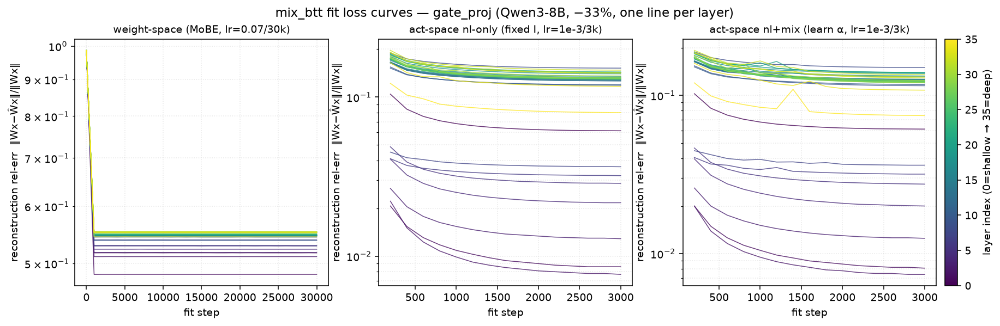
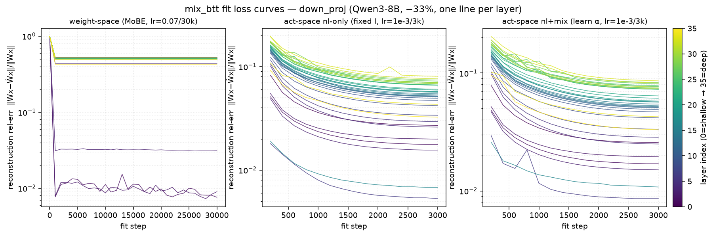
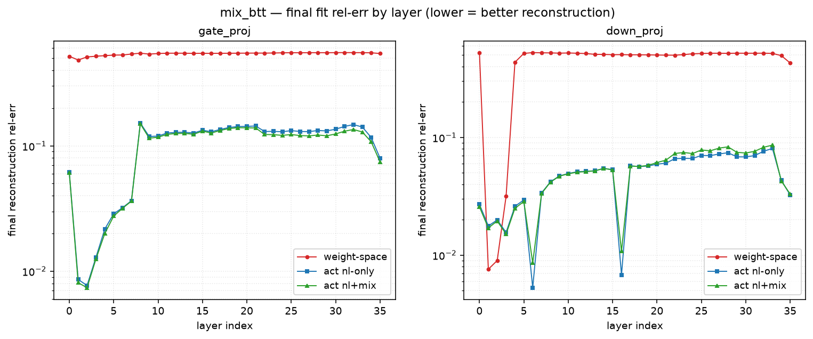

# `mix_btt` — Mixture-of-Basis BTT (MoBE-style) on Qwen3-8B FFN

**Status:** COMPLETE — all 8 runs finished (2026-07-22, A100-New, Qwen3-8B bf16, `attn=sdpa`):
3 ablation cells + plain-BTT baseline, on each of gate_proj and down_proj. Plan:
[`plan.md`](plan.md). Fit-scan: [`fit_scan.json`](fit_scan.json).

## What was built

`mix_btt` generalizes the repo's `output_one_block` BTT factorization
(`src/compress/btt/`) with MoBE's *mixture-of-basis + weight-space nonlinearity* idea.
BTT factorizes `W:(d_out,d_in)` into per-input-block cores via block-wise SVD
(`out = Σ_j L_jᵀ·(R_j·x_j)`). `mix_btt` treats the `n` small cores `{R_k}` as a shared
basis, adds a learnable `n×n` mixing matrix `α` (init `I`) and an activation `f` (SiLU)
between the small-core and large-core stages:

```
z_k = R_k · x_k                  # n basis latents
u_j = f( Σ_k α_{j,k} · z_k )     # per-block mixture + nonlinearity
out = Σ_j L_jᵀ · u_j
```

This is exactly the MoBE reconstruction `Ŵ_i = A_i·f(Σ_j α_{i,j} B_j)` with the
correspondence **expert ↔ input-block** (`A_j = L_jᵀ`, `B_k = R_k`, `α:(n,n)`). Plain BTT
is the exact special case `α = I, f = identity` (unit-tested byte-exact).

**Files:** `src/compress/btt/mix_btt_linear.py` (`MixBTTLinear`),
`src/compress/btt/mix_btt.py` (decompose + fit + driver),
`src/compress/tests/test_mix_btt.py` (8 tests, all pass),
`scripts/mix_btt_fit_scan.py` (lr/iters pre-study). Wired into `compress_then_train.py`
via `compression_rules` (method `mix_btt`) + `KDDecompositionConfig.mix_btt_*` knobs.

### Two fit regimes (the ablation axis)

| Regime | Where `f` acts | `α` | Fit objective | Materializable? |
|---|---|---|---|---|
| **weight-space** (MoBE-faithful) | mixed cores `f(Σ_k softmax(α)_{j,k} R_k)` | softmax | data-free `‖W−Ŵ‖²` (`fit_layer_basis`, MoBE lr=0.07/30k iters) | yes (dense `Ŵ`) |
| **activation-space** (BTT data-path) | data path `f(Σ_k α z_k)` | raw (init `I`) | `E_x‖Wx−mixBTT(x)‖²` (Adam, lr/iters from scan) | only if `f=identity` |

## Setup

- **Model:** Qwen/Qwen3-8B (DENSE; `Qwen3MLP`, `hidden_act=silu`), H=4096, I=12288, 36 layers.
- **Target / ratio:** one projection family at a time, `compression_ratio=0.67` (retain 67%
  ⇒ −33% of that projection's params). `decomp_mode=output_one_block` (m=1).
  - `gate_proj (12288,4096)` → `(m=1,n=64,a=12288,b=64)`, **rank=42**, retain **66.0%**.
  - `down_proj (4096,12288)` → `(m=1,n=96,a=4096,b=128)`, **rank=83**, retain **66.9%**.
  - `α` adds `n²` params (4096 / 9216) — negligible (~4 orders smaller than the cores).
- **One-shot, fit-only:** NO CE recovery / LoRA (`one_shot_eval_only: true`). Isolates the
  decomposition + local fit alone.
- **Eval:** HellaSwag (0-shot acc), MMLU (5-shot acc), plus wikitext2 / c4 PPL. Full tasks
  (`lm_eval_limit: -1`). Calibration: C4, 128 seqs × 2048 tok.
- **3 ablation cells** × {gate_proj, down_proj} + **plain-BTT baseline** (α=I, f=identity, NO
  fit) on each = 8 runs, 1 GPU each on A100-New.

## Pre-study: activation-space local-fit lr / iters (gate_proj)

`scripts/mix_btt_fit_scan.py`, probe layers 2 / 18 / 32, sweep `lr∈{1e-4,3e-4,1e-3,3e-3} ×
iters∈{500,1500,3000}` from the same SVD seed (capture amortized once). Deep-layer
reconstruction rel-error (‖Wx−mixBTT(x)‖/‖Wx‖):

| layer | best rel-err | at (lr, iters) |
|---|---|---|
| 2 (shallow) | 0.0064 | 3e-3, 3000 |
| 18 (mid) | 0.1328 | 3e-3, 3000 |
| 32 (deep) | 0.1345 | 3e-3, 3000 |

Reconstruction is monotone in both lr and iters; `lr=3e-3` is nominally best at 3000 iters
but **overshoots at fewer iters** on deep layers (L32 `it=500`: 3e-3→0.186 vs 1e-3→0.174).
**Locked `lr=1e-3, iters=3000`** for the full runs — ties the best final error within 0.04pt
at every probe layer with no overshoot risk on unprobed layers. (Weight-space cell 1 uses the
fixed MoBE default lr=0.07/30k iters and needs no sweep.)

## Results

Uncompressed Qwen3-8B baseline: **HellaSwag 74.94**, **MMLU 74.86**, wiki PPL 9.73, c4 PPL 15.43.

### gate_proj — 33% reduction (rank=42, retain 66.0%)

| Cell | mix_space | `f` | `α` | HellaSwag | MMLU | wiki PPL | c4 PPL |
|---|---|---|---|---|---|---|---|
| **BTT baseline** (no fit) | — (SVD only) | id | I | 58.07 | 61.56 | 36.68 | 53.94 |
| **1** weight-space | weight | SiLU | learn (softmax) | 58.03 | **61.59** | 36.47 | 54.00 |
| **2** act-space nl-only | activation | SiLU | fixed I | 51.43 | 45.34 | 30.69 | 35.33 |
| **3** act-space nl+mix | activation | SiLU | learn | 53.10 | 46.32 | **26.94** | **31.92** |

Fit reconstruction: cell 1 (weight-space) mean rel-err **0.542**; cells 2/3 (activation-space)
mean rel-err **~0.06–0.13** per layer (far better reconstruction).

### down_proj — 33% reduction (rank=83, retain 66.9%)

| Cell | mix_space | `f` | `α` | HellaSwag | MMLU | wiki PPL | c4 PPL |
|---|---|---|---|---|---|---|---|
| **BTT baseline** (no fit) | — (SVD only) | id | I | 30.75 | 26.15 | 1856.81 | 1385.91 |
| **1** weight-space | weight | SiLU | learn (softmax) | 30.69 | 25.91 | 1863.00 | 1383.63 |
| **2** act-space nl-only | activation | SiLU | fixed I | **36.60** | 25.49 | **55.32** | **59.27** |
| **3** act-space nl+mix | activation | SiLU | learn | 36.54 | 25.72 | 52.54 | 58.48 |

Fit reconstruction: cell 1 (weight-space) mean rel-err **0.465**; cells 2/3 (activation-space)
mean rel-err **0.050 / 0.052** per layer (~9× better).

## Fit loss curves

Parsed from the six fit logs (`run_results/A100-New/run_logs/mixbtt_*.log`) by
`scripts/plot_mix_btt_fit.py`. All 36 layers, one curve each; y-axis is the
reconstruction rel-err `‖Wx−Ŵx‖/‖Wx‖` (log scale). The parsed per-layer means match
the table numbers above exactly (gate ws 0.542 / act 0.108,0.103; down ws 0.465 /
act 0.050,0.052).





What the curves show:
- **Weight-space (left panels) plateaus almost instantly** — the data-free `‖W−Ŵ‖²`
  loss drops in the first ~1k of 30k iters and then sits flat at rel-err ~0.47–0.55 for
  every layer (the ~30k iters buy nothing past step 1000). This is the visual of finding 1:
  the SVD init already (near-)optimizes this objective.
- **Activation-space (middle/right) keeps descending** over all 3k iters to rel-err
  ~0.05–0.15 — ~5–9× lower than weight-space — confirming the far-better layer-function
  reconstruction (finding 2).
- **Layer-depth structure:** gate_proj shallow layers (0–5) fit to <0.03 while mid/deep
  layers saturate ~0.12–0.15. down_proj is noisier with two sharp easy-to-fit layers
  (≈6, 16) dipping to <0.01.
- **nl+mix vs nl-only (right vs middle) is nearly indistinguishable** on reconstruction —
  the learnable `α` barely moves the fit curve (finding 4: the mix is a second-order effect;
  its small downstream benefit is not visible at the MSE level).

## Findings

1. **The weight-space MoBE fit buys ~nothing over plain BTT-SVD — on either projection.**
   gate: cell 1 (30 000-iter data-free `‖W−Ŵ‖²` fit) ≡ no-fit BTT baseline (HS 58.03 vs 58.07,
   MMLU 61.59 vs 61.56, PPL identical). down: cell 1 ≡ BTT baseline again (HS 30.69 vs 30.75,
   MMLU 25.91 vs 26.15, PPL ~identical). The mixture-of-basis + weight-space nonlinearity does not
   improve on the block-SVD init that already seeds it — softmax simplex mixing over `n` blocks is
   too constrained to move the reconstruction, and the data-free `‖W−Ŵ‖²` objective is the same one
   the SVD init already (near-)optimizes.

2. **Activation-space fitting reconstructs the layer function far better and rescues PPL.**
   Cells 2/3 reach rel-err ~0.05–0.13 vs weight-space's 0.47–0.54, and slash PPL:
   - gate: wiki 36.5 → 26.9, c4 54.0 → 31.9 (cell 3 vs cell 1)
   - down: wiki **1863 → 55** (34×), c4 **1384 → 59** (23×) — a total collapse turned into a
     working model, purely from the local activation fit (no CE recovery).

3. **But activation-space fitting does NOT recover MC-task accuracy, and can hurt it.**
   Despite far better MSE/PPL, cells 2/3 *lose* to the weight-space variants on MMLU/HellaSwag:
   - gate: MMLU 45–46 (act) vs 61.6 (weight); HS 51–53 vs 58.
   - down: MMLU stays at **random chance 25.5–25.7** (act) — same as the collapsed baselines;
     HS recovers only to 36.5 (from 30.7). Minimizing per-layer output MSE on C4 is a different
     objective than preserving downstream multiple-choice answer *ranking*; the weight-space
     variants keep the raw weight structure closer and preserve task accuracy better despite worse
     MSE/PPL. **MSE/PPL and MC-accuracy are genuinely decoupled objectives here.**

4. **The learnable mix helps in activation space (cell 3 ≳ cell 2), but weakly.** gate: adding the
   trainable `n×n` `α` improves every metric (HS +1.67, MMLU +0.98, wiki −3.75, c4 −3.41). down:
   marginal / mixed (wiki −2.8, c4 −0.8, MMLU +0.23, HS −0.06). So the mixture-of-basis contribution
   is real *when fit on the data path* (opposite of its null effect in weight space, finding 1), but
   it is a second-order effect next to the choice of fit space.

5. **down_proj is far more compression-sensitive than gate_proj.** −33% of down_proj via BTT-SVD
   collapses the model (MMLU 26 ≈ random, PPL ~1400–1900); the same on gate_proj holds up (MMLU 61.6,
   PPL ~40–54). Even the best down cell recovers PPL but not MMLU — a −33% cut of down_proj alone is
   too aggressive for one-shot fit-only recovery. gate_proj is the safer single-projection target;
   real deployments would need lower per-projection ratios and/or CE recovery (out of scope here).

## Takeaways for the method

- **The MoBE-faithful weight-space path adds nothing on top of BTT-SVD** for this per-Linear,
  within-block setting — its value in the original MoBE comes from sharing a basis *across experts*,
  which the per-Linear analog here cannot exploit (one Linear = one "expert group").
- **Activation-space fitting is the useful half of `mix_btt`**: it is what turns a broken
  factorization into a low-PPL one. But on its own (no CE recovery) it does not restore MC accuracy,
  so `mix_btt` is best viewed as a strong *initialization* for a subsequent recovery fine-tune, not a
  one-shot compressor. The next experiment should add the LoRA/CE recovery stage on top of the
  activation-space cells and re-measure MMLU/HellaSwag.

## Reproduce

```bash
# pre-study (activation-space lr/iters)
ATTN_IMPLEMENTATION=sdpa .venv/bin/python scripts/mix_btt_fit_scan.py \
  --model Qwen/Qwen3-8B --ratio 0.67 --cell 3 --layers 2,18,32 --out docs/results/mix_btt/fit_scan.json

# one cell (edit config for gate/down × ws/act_nl/act_nl_mix)
ATTN_IMPLEMENTATION=sdpa .venv/bin/python src/compress_then_train.py \
  --config configs/compress_then_train/qwen3_8b_mixbtt_gate_act_nl_mix.yaml

# plain-BTT baseline (no fit, output_one_block)
ATTN_IMPLEMENTATION=sdpa .venv/bin/python src/compress_then_train.py \
  --config configs/compress_then_train/qwen3_8b_btt_gate_o1b.yaml
```

Configs: `configs/compress_then_train/qwen3_8b_mixbtt_{gate,down}_{ws,act_nl,act_nl_mix}.yaml`
and `qwen3_8b_btt_{gate,down}_o1b.yaml`.
