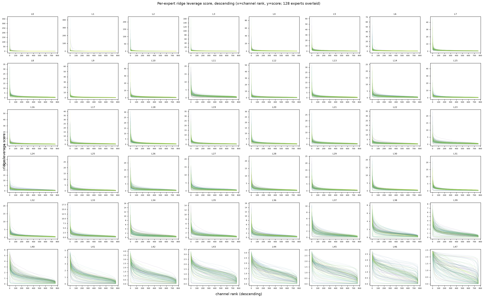
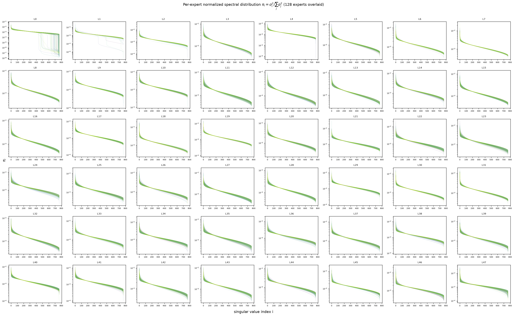
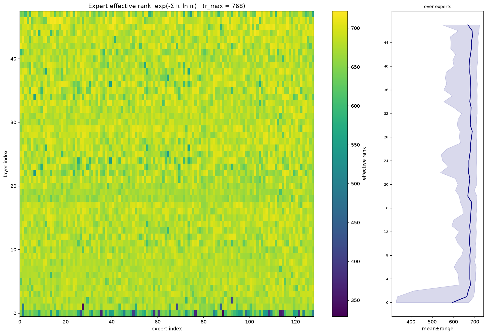
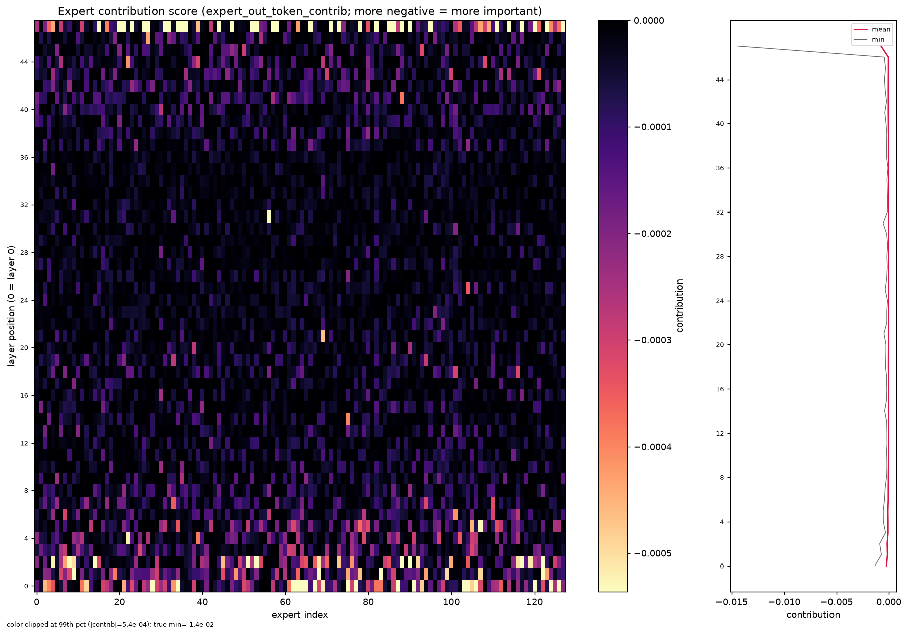

#Per-Expert Statistics — Qwen3-30B-A3B (all layers)

Model: **`Qwen/Qwen3-30B-A3B-Thinking-2507`** · 128 experts/layer · MoE intermediate
size `I = 768` · hidden `2048` · **48 layers (indices 0–47, all reported)**.

All numbers are reproducible with [`scripts/expert_stats.py`](../../../scripts/expert_stats.py):

```bash
export PYTHONPATH="$PWD:$PWD/src"
python scripts/expert_stats.py \
  --model-id Qwen/Qwen3-30B-A3B-Thinking-2507 \
  --scores-dir results/Qwen_Qwen3-30B-A3B-Thinking-2507/c4/scores_50p \
  --out-dir docs/results/stats/figures \
  --stats-json docs/results/stats/expert_stats_data.json
# --layers defaults to every layer present in the score dict.
```

Raw values are dumped to [`expert_stats_data.json`](expert_stats_data.json); the
expensive SVD sweep is cached in `figures/spectral_cache.npz`, so re-plotting is
instant.

## Data sources

| Quantity                               | Source                                                                      | Notes                                                          |
| -------------------------------------- | --------------------------------------------------------------------------- | -------------------------------------------------------------- |
| Ridge leverage                         | `expert_scores['leverage']` from the C4 calibration run (`scores_50p/`) | Computed on A100-New;`(128 experts, 768 channels)` per layer |
| Contribution score                     | `expert_scores['expert_out_token_contrib']` (same run)                    | `(128,)` per layer                                           |
| Spectral distribution / effective rank | SVD of expert weights from the HF safetensors checkpoint                    | Computed offline (~13 min for 48 layers), then cached          |

The leverage and contribution tensors were **already computed on A100-New** (the
calibration-scoring stage saves them); this analysis reads them directly. The
spectral quantities are a pure function of the model weights and are computed
here from the checkpoint.

---

## 1. Ridge leverage score per expert (descending)

**Definition.** For each expert, the ridge leverage of channel *i* is
`diag((C + λI)⁻¹ C)ᵢ`, where `C` is the per-expert `down_proj` input covariance
(`zᵀz / N`) collected on the C4 calibration set and `λ = 1.0`
(`src/calibration/channel_scoring/leverage.py`). It ranks how important each of
the 768 intermediate channels is for the Nyström reconstruction — higher =
harder to drop. Scores are `_layer_norm`-normalized across experts within a
layer, as stored by the scoring stage.

One subplot per layer (`L0`…`L47`), all 128 experts overlaid (one faint line
each), sorted **descending** within each expert.



Layers 0, 15, 31, 47 broken out for readability:


**Observations.**

- **Monotone flattening with depth.** The per-layer mean top-1 leverage falls
  steadily from the input to the output: **L0 = 36.8 → L1 = 24.0 → L5 = 10.6 →
  L15 = 8.2 → L31 = 8.2 → L47 = 2.4**. Early layers concentrate importance in a
  few channels (steep spike, long ~0 tail — cheap to prune the intermediate
  dim); late layers spread it across all 768 channels (nearly flat, gentle
  slope — riskier to prune).
- **L0/L1 are the extreme cases**, with peaks up to ~350/~420 on individual
  experts. From ~L8 onward the y-scale drops into single/low-double digits and
  the curves broaden.
- **L40–L47 no longer have a sharp knee**: the descending curves become S-shaped
  and diffuse, so uniform channel budgets are more defensible at the top of the
  stack.

---

## 2. Normalized spectral distribution πᵢ

**Definition.** `πᵢ = σᵢ² / Σⱼ σⱼ²`, where `σ` are the singular values of each
expert's **stacked weight matrix**

```
W = [ gate_proj ‖ up_proj ‖ down_projᵀ ]   ∈ ℝ^{768 × (3·2048)}
```

so every row is one intermediate channel and there are exactly `r = 768`
singular values. π is the fraction of squared-spectral energy in each mode
(sums to 1), plotted on a log-y axis, descending. One subplot per layer, all
128 experts overlaid.



Layers 0, 15, 31, 47 broken out for readability:


**Observations.**

- **Nearly flat, heavy-tailed spectra everywhere.** Across all 48 layers the top
  mode holds only ~1–2 % of the energy and π decays gently over hundreds of
  modes — the expert weight matrices are close to full-rank, not low-rank. This
  is the structural reason the pipeline prunes *channels* (Nyström neuron
  selection) rather than doing a low-rank SVD factorization of the experts.
- **Only L0 (and mildly L1) show a truncatable spectrum**: a subset of experts'
  π falls off a cliff after ~450–500 modes (down to 1e-7–1e-8), while others
  stay flat — the same heterogeneity seen in the leverage and effective-rank
  views.
- **L2 onward are visually indistinguishable** in shape: a tight bundle of 128
  gently-decaying curves with no knee. Middle layers (≈ L10–L35) are the most
  uniform across experts.

---

## 3. Expert effective rank (layer × expert)

**Definition.** Spectral entropy of the same π:
`erank = exp(−Σᵢ πᵢ ln πᵢ)`. It is the "effective number of active singular
directions" (`1 ≤ erank ≤ r = 768`); high erank = energy spread over many modes
= hard to compress. Shown as a **layer × expert heatmap** with a depth marginal
(mean ± range over experts).



**Observations.**

- **All experts are high-rank** — overall mean **676.5 / 768 (88 %)**. The
  weights are barely compressible by rank, confirming the π read above.
- **L0 is the clear outlier**: lowest mean (**595.5**) and by far the widest
  spread (**std 79.1**, some experts down to ~330), visible as the darker,
  speckled bottom row of the heatmap. The next-lowest layers are L1 (662.9),
  L18 (667.4), L47 (667.9), L2 (670.0).
- **Spread collapses almost immediately with depth** (per-layer std 79 → 48 → 28
  for L0/L1/L2, median 19.3 thereafter): from ~L3 up, every expert in a layer is
  similarly hard to compress, so uniform per-expert budgets are reasonable.
- Peak homogeneity/rank is in the upper-middle stack (max mean **L45 = 689.1**).

---

## 4. Expert contribution score (layer × expert)

**Definition.** `expert_out_token_contrib`, a usage-weighted first-order
(Taylor) estimate of the loss change from removing an expert's output:
`Σ token_contrib(∂L/∂down_out, down_out) · usage`
(`src/calibration/channel_scoring/collector/attn_mlp.py:63`). This is the
per-**expert** attribution the coverage planner uses (`prepare_scores.py`) to
allocate channel budget across experts. Values are **≤ 0**; **more negative =
that expert matters more**. Shown as a layer × expert heatmap (color clipped at
the 99th percentile so mid-stack structure survives the L47 outlier) plus a
depth marginal (mean and min over experts).



**Observations.**

- **Importance is concentrated at the two ends of the stack.** The
  highest-magnitude contribution experts cluster in the **earliest layers (L0–L4)**
  and again in the **last few layers (L44–L47)**; the entire middle (≈ L6–L40) is
  near-zero (dark), meaning those experts are individually cheap to touch.
- **Layer 47 dominates the extremes**: most-negative layer mean
  (**−7.5e-4**) and the single most-important expert overall
  (**expert 127, −1.44e-2**, ~20× the next). The most-negative *mean*-contrib
  layers are L47, L0, L2, L1, L5 — i.e. the input block and the final layer.
- **Sparse spikes within each end-layer**: even in L0–L4 and L44–L47, only a
  handful of experts per layer are strongly negative, which is exactly the skew
  the coverage-maximized intra-layer planner exploits to hand extra channel
  budget to a few experts.

---

## Cross-cutting takeaway

Extending to all 48 layers sharpens the depth story that the 4-layer sample
suggested:

- **Layer 0 is uniquely compressible and heterogeneous** across every view —
  peaked leverage (top-1 ≈ 37), truncatable π spectra, lowest & most-varied
  effective rank (595.5 ± 79). L1 is a milder version of the same.
- **The middle of the stack (≈ L5–L40) is uniformly high-rank and flat** —
  tight π bundles, effective rank ≈ 680 with std ≈ 19, and near-zero per-expert
  contribution. Hard to compress by rank; safe for uniform channel budgets.
- **The top of the stack (L44–L47) flattens per-channel leverage but
  re-concentrates importance into a few high-contribution experts**, with L47 the
  single most important layer.

This supports the pipeline's two-axis budgeting: non-uniform *inter-layer*
budgets (spend the cuts where rank/leverage is low — chiefly L0/L1) and
coverage-weighted *intra-layer* allocation (protect the sparse set of
high-contribution experts, concentrated at the two ends of the network).
