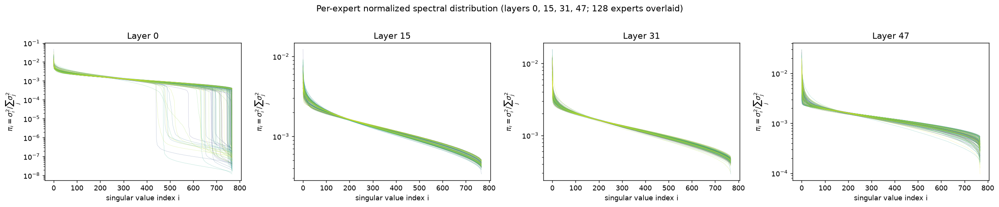
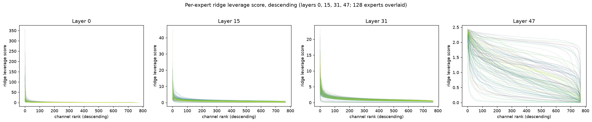

# Heterogeneous Budget Allocation for MoE Compression: Intern Plan

## Introduction

The Macro team's goal is to run large MoE models on Cor3 hardware — P1 (cloud) and Tehama (edge) — through structural parameter reduction. On Cor3 decode is memory-bandwidth bound, so what matters is how many weights must be *loaded*, not just how many are *stored*.

A MoE layer holds dozens of experts that are **not** equally important or equally compressible. Compressing every expert by the same ratio therefore wastes budget. The unifying goal of this plan is **heterogeneous budget allocation across experts** — give each expert exactly the capacity it is worth — along two axes:

- **Total parameters (Stage 1).** Allocate a different compression ratio per expert. Shrinks the model footprint in DRAM. Token-independent, decided once, offline.
- **Active parameters (Stage 2).** Load a different subset of each expert's parameters *per token*. Cuts the weights loaded on each forward pass — the quantity that bounds decode latency — without shrinking the stored model.

Both reduce to the same question — *how much of each expert to keep, and which part* — asked at two granularities.

---

## Background

### Expert Statistics

A calibration study of Qwen3-30B-A3B across all 48 layers (`ref/expert_stats.md`) measures each expert's **contribution** (usage-weighted first-order loss impact of removing it) and its **compressibility** (ridge-leverage concentration of its 768 channels; effective rank of its weight spectrum). Both vary widely, and neither is predicted by routing frequency — a rarely-fired expert can still be high-rank and information-dense. Three findings shape the plan:

- **Experts are barely rank-compressible, but channel-compressible.** Effective rank averages 676/768 (88%) and the spectra are near-flat — so the pipeline prunes *channels* (Nyström neuron selection) rather than doing low-rank SVD on the experts.
- **Compressibility varies strongly with depth.** Early layers concentrate leverage in a few channels (steep knee, long ~0 tail — cheap to prune); late layers spread it across all 768 (nearly flat — riskier). Layer 0 is the uniquely compressible, uniquely heterogeneous outlier.
- **Contribution is concentrated at the two ends and skewed within a layer.** Importance clusters in L0–L4 and L44–L47 (the middle is near-zero), and within those layers only a handful of experts are strongly negative (L47's expert 127 is ~20× the next).

Together these license the two-axis budgeting Stage 1 exploits: non-uniform **inter-layer** cuts (spend them where leverage/rank is low — chiefly L0/L1) and coverage-weighted **intra-layer** allocation (protect the sparse set of high-contribution experts at the two ends).

### Expert Compression Methods

- **Per-expert Nyström.** Select a subset of each expert's hidden channels and reconstruct the down-projection in closed form from the activation kernel. Operates on one expert at a time.
- **MoLAE / MoBE.** Group experts and factor them jointly — each expert becomes a small unique factor over a **shared basis** (MoBE factorizes the gate and up projections, leaving `down_proj` intact). Sharing amortizes parameters across experts; the per-expert size is set by the shared-basis rank.

### Heterogeneous Budget Allocation — Prior Work

Two recent papers set a per-expert ratio from an importance × compressibility score.

**Attribution-Guided Coverage-Maximized Pruning.** Structured, token-independent channel pruning. Metric: a per-expert **contribution prior** $\phi_g$ (loss-based) and a per-channel **activation-magnitude** score, combined through a **coverage ratio** $\rho_g(n)$ — the fraction of a group's total score captured by its top-$n$ channels (an effective-rank measure that makes groups comparable across a layer). *Algorithm:* set each group's target coverage $\propto \phi_g$, bisect a single scalar to find the largest coverage vector satisfying the global budget, then retain the highest-scoring channels per group. Rationale: raw statistics are not comparable across experts/layers, so allocate by *covered score* rather than raw magnitude.

**RFID-MoE.** Keeps every expert but assigns each a low-rank SVD budget. Metric: **routing frequency** fused with **information density** (effective rank of the singular spectrum). *Algorithm:* score each expert, allocate rank proportionally (important experts keep more, none goes to zero), compress via shared-basis truncated SVD (building on MoBE), and cheaply reconstruct the low-energy residual. Rationale: frequency alone deletes rare-but-dense experts; effective rank restores the capacity they hold.

Both are **static and forward-only**: one ratio per expert, fixed for all tokens.

---

## Stage 1: Heterogeneous Allocation for Total-Parameter Reduction

**Actions.** Implement the methods above and their compositions (per-expert Nyström, MoBE, Attribution-Guided allocation, and combinations), and benchmark on Qwen3-30B-A3B against a uniform-ratio baseline, before and after recovery training.

**Preliminary results.** Heterogeneous allocation compresses substantially with little accuracy loss — but it reduces **total** parameters only, not active ones (the per-expert ratios still leave every routed expert to run near-full per token).

Qwen3-30B-A3B (Hellaswag 80.7, MMLU 81.7):

| Method                        | total ratio | active ratio | Hellaswag (post / trained) | MMLU (post / trained) |
| ----------------------------- | :---------: | :----------: | :------------------------: | :-------------------: |
| Nyström, uniform             |     1.5     |     1.5     |        63.9 / 80.2        |      70.3 / 77.2      |
| Attribution-Guided            |     1.5     |     1.1     |         77.9 / —         |       71.2 / —       |
| Attribution-Guided + Nyström |     1.5     |     1.1     |         78.4 / —         |       73.0 / —       |
| MoBE                          |     —     |      —      |             —             |          —          |
| MoBE + ratio                  |     —     |      —      |             —             |          —          |

**Reading.** At the same 1.5× total ratio, heterogeneous allocation recovers most accuracy *even before training* (77.9 vs. 63.9 on Hellaswag). But its active ratio is only ~1.1 — it barely cuts the per-token load that Cor3 latency depends on. That gap motivates Stage 2.

---

## Stage 2: Adaptive Allocation at Inference — Reducing Active Parameters

**Heads up.** Heterogeneous allocation preserves accuracy well but does not reduce active parameters much. To *guarantee* an active-parameter reduction we instead fix a target active ratio $\rho$ and decide the allocation **per token, on the fly**.

### Common Formulation

Deleting channel $j$ of expert $e$ is exact in output space: it changes the layer output by $-\,g_e(x)\,h_{e,j}(x)\,w_j$ (no higher-order terms). To second order, the loss impact **factorizes**:

$$
\delta\mathcal{L}_{e,j}(x)\;\propto\;\underbrace{g_e(x)^2}_{\text{router (online)}}\;\cdot\;\underbrace{h_{e,j}(x)^2\,\lVert w_j\rVert_H^2}_{\text{channel importance}},
$$

where $H$ is the output-side loss curvature (Fisher). Because every channel costs the same $3d$ parameters, minimizing this under a budget of $B=\rho\,K\,m$ channels has a **water-filling** solution: activate a channel iff its score exceeds a single threshold $\lambda(x)$, chosen to hit $B$. An expert whose every channel falls below $\lambda$ is skipped — so the active expert count is emergent, not preset.

**The binding constraint (bandwidth trap).** The channel term needs $h_{e,j}(x)$, which requires reading every expert's gate+up weights — 10–16× the baseline load, defeating the purpose. The design question of Stage 2 is therefore: *how much of the per-token channel score can be moved offline so the online decision touches no expert weights?* The two ideas answer it differently.

### Idea 1 — Per-Token Expert Budget, then Within-Expert Channels

Two-level view: first a budget per active expert, then the channels within it. This structure is not imposed — it *falls out* of the objective under a diagonal (atom-orthogonality) approximation, and its main concern is how much of the channel score can stay online without touching expert weights.

- **Statistic needed.** Per expert, a sorted channel-importance sequence $s_{e,(1)}\ge s_{e,(2)}\ge\cdots$ (magnitude score $h^2\lVert d\rVert_H^2$, or its redundancy-aware ridge-leverage version), plus the router weight $g_e(x)$.
- **How collected.** One calibration pass: accumulate the output metric $H$, the per-expert channel kernels, and a pivoted-Cholesky order with prefix sums of the tail error. A power-law fit $(C_e,\gamma_e)$ of each spectrum enables closed-form water-filling.
- **Inference (fast decision).** Score $g_e(x)^2\,s_{e,c}$ and take the global top-$B$; the KKT-optimal budget is $n_e(\lambda)=(g_e^2 C_e/\lambda)^{1/\gamma_e}$, found by bisecting one scalar $\lambda$ in $O(E\log\frac1\varepsilon)$ — no per-atom sort. The remaining obstacle is getting the channel term online; three variants trade cost for fidelity: **(A)** freeze the ranking, keep only $g_e(x)$ online → zero scoring overhead, kept set is a fixed prefix; **(B)** pre-filter to the top experts by an upper bound, then exact-score only those; **(C)** a shared low-rank sketch $\tilde x=\Pi x$ to *rank* channels cheaply, recomputing exactly on the selected few.

### Idea 2 — Rank All Channels in the Layer

One unified ranking over all $E\cdot m$ channels of the layer, selected by rows/cols. Commits to freezing the *within-expert* order and invests in the systems design that makes it exact and fast.

- **Statistic needed.** Per expert, the pivoted-Cholesky order $\pi_e$ and pivot values $\sigma_{e,1}\ge\sigma_{e,2}\ge\cdots$ of the loss-weighted channel **coupling matrix** $M^{(e)}_{jk}=\mathbb{E}[h_j h_k]\,\langle w_j,w_k\rangle_H$, plus the Nyström reconstruction operand $C=L^\top W_D$. Only the router $g_e(x)$ is online.
- **How collected.** One calibration pass with backward hooks accumulates the Fisher curvature $H$ (labels sampled from the model, or self-distillation KL so the first-order term vanishes exactly); form $M^{(e)}$ per expert and take its pivoted Cholesky. The pivot values $\sigma_{e,k}$ are exactly the marginal error of the $(k{+}1)$-th channel *after reconstruction*, so the per-expert error curve is convex and its ranking already accounts for channel redundancy. Tables ($\sigma,\pi$) are ~1% of the per-token read.
- **Inference (fast decision).** The router gives $g(x)$ for free (no expert weights touched). Online score $\omega_{e,k}=g_e(x)^2\,\sigma_{e,k}$; merge the 128 pre-sorted per-expert lists to depth $B$ with a heap ($O(B\log E)$), equivalently a binary search for the water level $\lambda$. Since $\sigma_{e,\cdot}$ is pre-sorted, each expert's kept set is a **prefix** $\{1,\dots,B_e\}$ — permute weights by $\pi_e$ offline and the reads are contiguous slices, no gather. Reconstruction is applied to the *activation vector* (a $B_e\times B_e$ triangular solve), so the retained down-projection is a contiguous row prefix of precomputed $C$ and nesting is preserved. Read volume is linear in $B$ — a true 50% cut at $\rho=0.5$, versus ~33% for any scheme that must read gate+up in full.

**What is sacrificed.** Freezing the within-expert order to its calibration mean discards only the *within-expert* token dependence; the dominant token signal — the router weight $g_e(x)$, which spans a huge dynamic range across experts — is preserved exactly.

---

## Timeline

| Week | Task                                                                                                                                                                                                                           |
| ---- | ------------------------------------------------------------------------------------------------------------------------------------------------------------------------------------------------------------------------------ |
| 1    | Finalize plan. Expert-statistics study (contribution vs. compressibility) on Qwen3-30B-A3B.                                                                                                                                    |
| 2    | **Stage 1:** implement per-expert Nyström, MoBE, and Attribution-Guided allocation; reproduce the total-ratio benchmark table with/without healing.                                                                     |
| 3    | **Stage 1 → 2 bridge:** offline statistics pipeline — Fisher curvature $H$, per-expert coupling matrices, pivoted-Cholesky orders + reconstruction operands.                                                         |
| 4    | **Stage 2:** prototype the per-token water-filling selector (Idea 2 prefix scheme; Idea 1 variant A as the zero-overhead baseline). Active-ratio vs. accuracy curve; projected Cor3 decode speedup. Identify next steps. |

---

## Deliverables

1. **Stage 1** — heterogeneous per-expert allocation on Qwen3-30B-A3B at 1.5× / 2.0× total ratio, benchmarked against uniform compression before and after healing.
2. **Stage 2** — a per-token channel-allocation scheme that guarantees a target *active* ratio, with accuracy vs. active-parameter (bandwidth) trade-off at $\rho\in\{0.75,0.5,0.25\}$ and measured bytes-read, against static baselines (REAP, LExI, uniform truncation).
3. **Validation** — the two load-bearing offline studies: (E1) is the separable top-$B$ threshold legal (channel coupling near-diagonal)? and (E2) how much does freezing the within-expert order cost, and does it shrink with expert specialization?

---

## Summary

| Stage | Axis          | Mechanism                                                                | Success metric                                                     |
| ----- | ------------- | ------------------------------------------------------------------------ | ------------------------------------------------------------------ |
| 1     | Total params  | Static heterogeneous per-expert ratio                                    | Beats uniform compression at matched total ratio                   |
| 2     | Active params | Per-token water-filling over channels (router² × frozen channel score) | Holds accuracy at 50% active ratio; near-proportional Cor3 speedup |

**The core bet:** experts differ in worth and compressibility, so budget should be heterogeneous — allocated **statically per expert** to shrink the stored model (Stage 1), and **dynamically per token** to shrink the loaded model (Stage 2), with the expensive channel scoring pushed offline so the online decision is just a router-weighted threshold.
