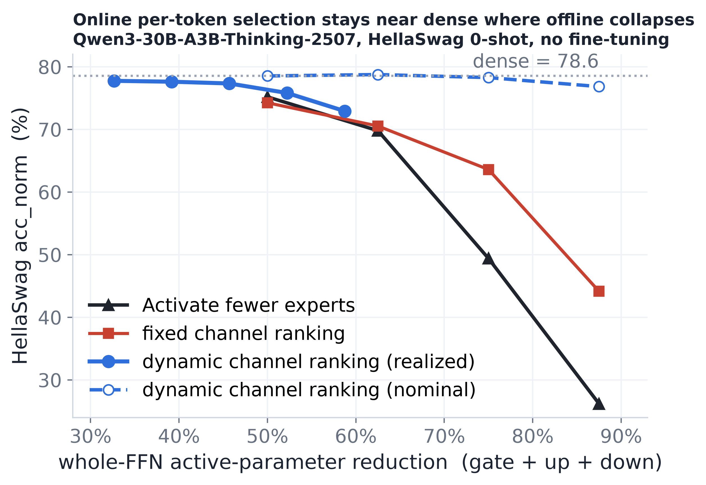

# Failing Experiments — Offline Static Channel Ranking (Level 1)

Model: Qwen3-30B-A3B (E=128, top-K=8, I=768, 48 MoE layers), no fine-tuning;
HellaSwag 0-shot acc_norm, MMLU 5-shot acc.

---

## Slide L1.1: The Target — a Fixed Ranking of *Unique* Channels

**If channel importance were token-independent, we could rank once and skip the online scorer entirely.**

The online method pins `up_proj` at full width (it IS the scorer). The offline question: can we precompute a fixed per-expert channel order so inference just keeps the top-B, with **no full-width computation**?

Payoff if it worked: all three matrices narrow, "keep top-B" is a contiguous prefix slice, online cost ≈ 0.

**Requirements for the offline score:**

1. **Redundancy-aware** — don't double-spend on duplicate channels
2. **Nested order** — every prefix must be good (budget varies per token)
3. **Cross-expert comparable** — one global threshold, per-expert quotas emerge
4. **Reweightable by router** — the only free online signal is `g_e(x)`

---

## Slide L1.2: Pivoted-Cholesky — Greedy, Conditional Channel Selection

**Pick the most important channel, then subtract what it already explains — duplicates collapse to ≈0.**

Build a per-expert coupling matrix (activation covariance ⊙ weight Gram), then run pivoted Cholesky: greedily select the largest-residual channel and downdate all remaining channels by what the chosen one explains.

- The pivot order is **nested** and **monotone** → a single global threshold cuts a clean prefix
- Online: score by `g_e² · σ_{e,r}` (router weight × precomputed marginal gain), keep global top-B
- Stored once (~57 MB), budget-agnostic, no weight modified; overhead ≈ 0.016% of expert-FFN MACs

---

## Slide L1.3: Results — Offline Beats Its Baselines, Online Beats Them All

**Pivoted-Cholesky is the best offline selector — but even the best fixed ranking is 4–33 pts below per-token online selection.**

| Active reduction | Reduce top-k (8→k) | MoSE (per-expert) | **Pivoted-Cholesky** | **Dynamic (online)** |
| :--------------: | :----------------: | :---------------: | :------------------: | :------------------: |
| Dense (—)        |         —          |        —          |          —           |      **78.56**       |
| −50%             |    75.2 (8→4)      |      69.45        |       74.26          |      **78.54**       |
| −62.5%           |    69.8 (8→3)      |      61.00        |       70.54          |      **78.76**       |
| −75%             |    49.4 (8→2)      |      43.66        |       63.60          |      **78.28**       |
| −87.5%           |    26.2 (8→1)      |      30.32        |       44.15          |      **76.84**       |

**Takeaways:**

- Pivoted-Cholesky dominates the offline bracket at every budget (+5 to +20 pts over MoSE)
- But the entire offline family caps out — the best fixed ranking trails online by 4 / 15 / 33 pts
- Cross-expert offline coupling buys nothing (<2% selection change)
- The headroom is **per-token activation information** that no fixed ranking can capture

→ The deployable method must score online.

---

# Bonus Results

---

## Slide L1.4: Online Selection Stacks on an Already-Compressed Base

**Per-token channel selection on a 33%-Nyström + KD-healed base degrades identically to the dense model — the two compressions are orthogonal.**

| nominal | online cut | wikitext ppl ↓ | mmlu ↑  | hellaswag ↑ | gsm8k ↑ |
| :-----: | :--------: | :------------: | :-----: | :---------: | :-----: |
| base    |    0%      |    10.11       |  0.767  |    0.799    |  0.817  |
| 50%     |  −32.6%    |    10.30       |  0.763  |    0.795    |  0.820  |
| 70%     |  −45.7%    |    10.96       |  0.749  |    0.786    |  0.787  |
| 80%     |  −52.2%    |    11.90       |  0.733  |    0.767    |  0.748  |

- Cumulative ~68% reduction of original expert weights at 80% nominal for only +1.79 ppl
- The two axes (offline weight compression + online channel selection) stack independently

---

## Slide L1.5: A Fixed Per-Layer Threshold Beats the Online Top-B

**A per-layer score threshold replaces the pooled top-B and improves accuracy on all metrics at matched mean budget.**

A threshold `keep iff score ≥ τ_l` is elementwise — each channel is decided independently (no cross-expert synchronization). Budget floats per token: hot tokens keep more, quiet tokens fewer.

All rows at 80% nominal, same mean budget:

| selection rule                | ppl ↓  | mmlu ↑  | hellaswag ↑ | winogrande ↑ |
| ----------------------------- | :----: | :-----: | :---------: | :----------: |
| online top-B (B=1229)         | 12.65  |  0.779  |    0.758    |    0.671     |
| **fixed per-layer threshold** | **12.32** | **0.785** | **0.762** | **0.691** |
| threshold + FloE predictor    | 12.98  |  0.771  |    0.745    |    0.690     |

- Threshold wins by reallocating budget across tokens (variable spend > fixed spend)
- Does not compose with predict-ahead: a stale signal now moves both the count and the choice

---

## Slide L1.6: Cloud Resident Decode — Dynamic Selection Is Not the Right Lever

**On resident GPUs, dynamic channel selection degrades decode throughput (0.65–0.88× dense); tensor parallelism without the dynamic method is the real win (2.2–2.4×).**

| Parallelism     | Dense (tok/s) | Dynamic (tok/s) | Ratio |
| --------------- | :-----------: | :-------------: | :---: |
| FSDP2 (dp)      |     base      |   0.83–0.88×    |  ↓   |
| TP=2            |   ~2.2× base  |   0.77× dense   |  ↓   |
| TP=4            |   ~2.4× base  |   0.65× dense   |  ↓   |

**Why it hurts instead of helps:**

- Under FSDP2, the bottleneck is the all-gather of each block's full sharded weights (~83% of GPU-busy time), independent of per-token budget — channel reduction doesn't shrink what's expensive
- Under TP, the weight read is already split tp-ways to a tiny per-rank slice (18.9 MB/rank at tp=4), leaving nothing worth cutting
- The dynamic method adds fixed overhead: ~0.17 ms/token for top-k + gather/scatter, plus ~0.1 ms all-reduce over H under TP — this dominates whatever byte saving remains

**Key insight:** The levers for cloud throughput are collectives + batch/parallelism layout (larger batch amortizes per-step cost; TP splits the per-token GEMV), not activated-parameter count. The dynamic method's cloud payoff is activation memory, not tokens/s.

---

## Appendix — one-line map into the main deck

- Main deck **Slide 20** (offline Level 1) → **L1.1 + L1.2**
- Main deck **Slide 21** (why offline fails) → **L1.3**
- **L1.4 / L1.5** are bonus results for the efficiency / future-work section
- **L1.6** is for the efficiency section — explains why dynamic selection targets edge, not cloud
