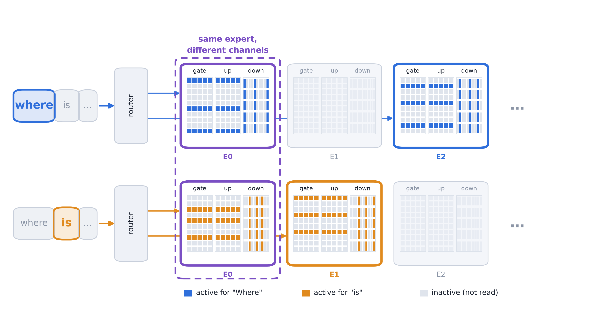
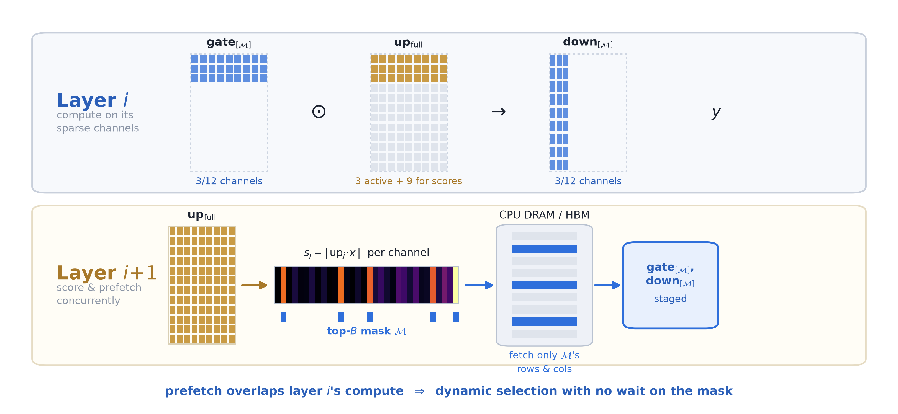
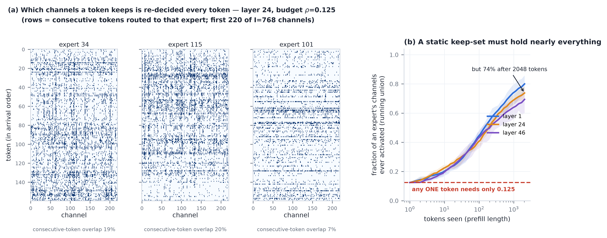

# Midpoint Presentation — Slide Contents

---

## Slide 1: Title

**Per-Token Adaptive Channel Activation for Efficient MoE Inference**

Yequan Zhao | Midpoint Review | August 2026

Model: Qwen3-30B-A3B (128 experts, top-8, 48 MoE layers)

---

# Background

---

## Slide 2: What is a MoE FFN Expert?

**Each MoE layer selects K=8 of N=128 experts per token via a learned router.**

Each expert is a SwiGLU FFN with three weight matrices and an intermediate dimension I=768:

```
h = SiLU(W_gate · x) ⊙ (W_up · x)       ← intermediate, dim I
y = W_down · h                             ← output, dim d
```

- `gate_proj`: produces a sparse gating signal (SiLU zeros many channels)
- `up_proj`: produces the value signal per channel
- `down_proj`: projects the intermediate back to hidden dim

The element-wise product `⊙` means each channel j is an independent computation path.

---

## Slide 3: Why MoE Prevails

**10× more parameters at the same inference cost**

- Total params: 30B, active per token: ~3B (only K=8 of 128 experts fire)
- Quality scales with total params; latency scales with active params
- MoE decouples quality from cost → dominates dense models at equal FLOP budget

**But at decode, the bottleneck is memory bandwidth** — even "active" params must be loaded from memory. Latency ∝ bytes loaded per token.

---

## Slide 4: What Needs to Be Improved

| Goal                          | Benefit                                       | Target                                |
| ----------------------------- | --------------------------------------------- | ------------------------------------- |
| Reduce**total** params  | Fit in device DRAM; less memory for serving   | Edge (L4, Cor3, phone) and cloud      |
| Reduce**active** params | Fewer bytes loaded per token → lower latency | Single-batch decode (bandwidth-bound) |

---

# Overview of Current Design and Results

---

## Slide 5: Framework at a Glance — Results First

**−50% expert-FFN active parameters → −1 MMLU pt, no traini**

**ng**

Score channels per token by `up_proj` activation magnitude; reduce `gate_proj` + `down_proj`.

| Configuration           |       up\| gate \| down       |     FFN cut     |      MMLU      |   HellaSwag   |     ARC-C     |   TruthfulQA   |      Avg      |
| ----------------------- | :---------------------------: | :-------------: | :------------: | :------------: | :------------: | :------------: | :------------: |
| Dense baseline (K=8)    |       -0%\| -0% \| -0%       |       0%       |      79.6      |       —       |      69.7      |       —       |       —       |
| **Dynamic −75%** | **-0% \| -75% \| -75%** | **−50%** | **78.6** | **75.4** | **66.0** | **51.1** | **67.8** |
| Dynamic −87.5%         |    -0%\| -87.5% \| -87.5%    |     −58.3%     |      75.3      |      71.5      |      63.2      |      50.8      |      65.2      |

- `up_proj` scores channels per token via `|up·x|`; only top-B channels of `gate`/`down` are activated
- No training, no weight changes — a pure inference-time decision

Edge efficiency: **2.14× decode speedup** on real 30B offloaded generation (single L4 GPU).

---

# Motivation

---

## Slide 6: Channel experts

A standard MoE FFN expert computes

$$
y_e(x) \;=\; W_{\text{down}}^{(e)}\;\bigl[\,\text{SiLU}(W_{\text{gate}}^{(e)} x)\;\odot\;(W_{\text{up}}^{(e)} x)\,\bigr]
$$

with intermediate dimension $I$. The $j$-th **channel expert** of expert $e$ is the rank-1 computation path

$$
y_{e,j}(x) \;=\; \bigl[\text{SiLU}(w_{\text{gate},j}^{(e)\top} x)\cdot(w_{\text{up},j}^{(e)\top} x)\bigr]\;\cdot\;W_{\text{down}}^{(e)}[:,j]
$$

where $w_{\text{gate},j}^{(e)}$ is row $j$ of `gate_proj`, $w_{\text{up},j}^{(e)}$ is row $j$ of `up_proj`, and $W_{\text{down}}^{(e)}[:,j]$ is column $j$ of `down_proj`. The block output is $\sum_{e \in \text{top-}K} g_e \sum_{j=1}^{I} y_{e,j}(x)$ — a sum over $K \cdot I$ channel experts.

The gating value $\text{SiLU}(w_{\text{gate},j}^{(e)\top} x)$ acts as a **soft on/off switch** for channel expert $j$: when it is near zero, the entire path contributes nothing regardless of `up_proj` or `down_proj`.

Preliminary studies: the intermediate activation is (near) sparse

**A token doesn't need 8 whole experts — it needs a sparse, token-specific subset of channels across those experts.**

## Slide 7: A Sparse Subset of Channels Suffices

**Per token, the activation magnitude concentrates on a handful of channels**


Profiling a single expert (layer 0, expert 0) over 8,000 WikiText-2 tokens —
histogram of the SwiGLU output `hⱼ = SiLU(gate_j·x)·(up_j·x)`, and the per-neuron
survival count after masking the bottom 95% by |h| (note the log y-axis in (a)):

- **(a) The activation output is long-tailed.** =
- **(b) …and that tail is carried by a few, very uneven neurons.** After masking,
  survival counts are wildly skewed: mean **403** activations/neuron, but **8
  neurons fire >5× the mean**. The magnitude is not spread evenly — a small
  subset of channels does the work.

**Takeaway:** keeping the top ~12.5% of channels by |h| already captures a median
**50%** of a token's total output magnitude (top 50% → 90%). A sparse per-token
subset is enough.

---

## Slide 8: The Subset Is Token-Specific

**Which channels matter is re-decided every token → no fixed subset works**


Same expert, now looking at *which* channels each token keeps at budget ρ=0.125:

- **(a)** consecutive tokens routed to this expert
  share only **13%** of their kept channels.
- **(b)** Almost no channel is stable: **0%** are kept >95% of the time and only
  12% are kept <5% of the time

**Conclusion — the thesis holds.** A token needs a sparse subset of channels
(slide 7), and that subset is token-specific (slide 8). This is why the method
must select **online, per token, at channel granularity** — and why the offline /
static-ranking baselines (slides 16–17) top out far below it.

# High-Level Framework

---

## Slide 9: Per-Token Channel Activation

**For each token, only the channels that contribute most are activated**



- Fixed per-token budget: B channels out of K·I total
- Different tokens → different active subsets

---

## Slide 10: Design Challenges

**Two core problems:**

1. **How to find the channels that contribute most** for each token?

   - A learned router of size d × (N·I) would be as large as the MoE itself
   - The existing MoE router only knows *which* experts, not *which channels within*
2. **How does this bring real throughput acceleration?**

   - If you must compute the full expert to know what to skip, there's no saving
   - The selection must be available *before* the main compute

---

## Slide 11: Our Framework

**Use `up_proj` output as a built-in per-channel scorer**

The SwiGLU intermediate is: `h_j = SiLU(gate_j · x) · (up_j · x)`. The contribution of channel j to the block output is proportional to `g_e · |up_j · x| · ‖W_down[:,j]‖`. We score channels by `|up · x|` — the per-token activation magnitude — and keep the global top-B.

The framework:

1. Compute `up · x` at full width → score channels by activation magnitude
2. Keep top-B channels → activate only corresponding rows of `gate` and columns of `down`
3. `up_proj` can be storage-compressed via MoBE (shared basis) to reduce its cost
4. A predictor estimates the next layer's mask → pre-fetch parameters with no waiting



---

# Details of Design

---

## Slide 12: Channel Scoring and Selection

**Score = per-channel contribution magnitude to the block output**

$$
s_{e,j}(x) = g_e \cdot |u_{e,j}(x)| \cdot \|W_{\text{down}}^{(e)}[:,j]\|_2
$$

- `g_e`: router weight — puts all experts on one comparable scale
- `|u_{e,j}(x)| = |w_up,j · x|`: activation magnitude (the token-specific signal)
- `‖W_down[:,j]‖₂`: column norm (how much channel j amplifies into the output)

**Global top-B across all K·I channels.** Per-expert quotas *emerge* from a single threshold — a dominated expert may receive 0 channels. No per-expert floor needed.

---

## Slide 13: Why `up_proj` as the Channel Router

**The architecture already contains a per-channel router — no extra parameters needed**

- `up · x` determines the value each channel carries into the output
- Its magnitude predicts which channels will dominate the intermediate `h`
- Using `up_proj` to select channels allows both `gate` and `down` to run at reduced width

|                              |   Extra params   |       Extra compute       |            Result            |
| ---------------------------- | :--------------: | :------------------------: | :---------------------------: |
| Learned router               | d × N·I (huge) |        full matmul        |          impractical          |
| **`up_proj` (ours)** |   **0**   | **already computed** | **gate + down reduced** |

**Limitation:** `up_proj` must run at full width (it IS the scoring signal). Its cost is addressed by MoBE compression.

**Two scoring variants tested:** `|up·x|` (shipped) and `|SiLU(gate·x)|` (mirror). The mirror wins on PPL (11.18 vs 16.89) but trades −1.4 MMLU. Both are valid operating points depending on target metric.

---

## Slide 14: Channel Expert Predictor

**Problem:** must wait for `up · x` to know which channels to fetch → sequential dependency.

**Solution:** predict layer i+1's channel mask during layer i's compute.

- Adjacent-layer hidden states have cosine similarity > 0.95 (measured all layers except L0)
- Predictor: `â_up^(i+1) ≈ x^(i) · W_up^(i+1)` — parameter-free, reuses the next layer's weights
- Predicted mask available one layer early → pre-fetch `gate`/`down` parameters from memory

|         | Exact mask |              Predicted mask              |
| ------- | :--------: | :---------------------------------------: |
| MMLU    |    78.6    |             77.1 (−1.5 pts)             |
| PPL     |   16.89   |                   15.11                   |
| Latency |   serial   | **parallel (overlap with compute)** |
| Recall  |   1.000   |                   0.777                   |

Costs −1.5 MMLU pts but converts dynamic selection into a latency-free memory access pattern.

---

# Experiment Results

---

## Slide 15: Two Scoring Signals — `|up|` vs `|SiLU(gate)|`

**Both valid; choice depends on target metric**

| Method                            |   up\| gate \| down   | FFN cut |      MMLU      |   HellaSwag   |     ARC-C     |   TruthfulQA   |      Avg      |
| --------------------------------- | :--------------------: | :-----: | :------------: | :------------: | :------------: | :------------: | :------------: |
| Dense baseline                    |    -0%\| -0% \| -0%    |   0%   |      79.6      |       —       |      69.7      |       —       |       —       |
| `\|up\|` (reduce gate+down)       |   -0%\| -75% \| -75%   |  −50%  | **78.6** |      75.4      |      66.0      | **51.1** | **67.8** |
| `\|SiLU(gate)\|` (reduce up+down) |   -75%\| -0% \| -75%   |  −50%  |      77.2      | **75.8** | **67.3** |      48.3      |      67.2      |
| `\|up\|`                          | -0%\| -87.5% \| -87.5% | −58.3% | **75.3** |      71.5      |      63.2      | **50.8** | **65.2** |
| `\|SiLU(gate)\|`                  | -87.5%\| -0% \| -87.5% | −58.3% |      74.0      | **72.5** | **64.4** |      45.1      |      64.0      |

- `|up|` wins MMLU + TruthfulQA; `|SiLU(gate)|` wins HellaSwag + ARC-C + PPL (11.18 vs 16.89)
- **Mechanism:** `|up|` can keep channels whose gate SiLU has closed (budget waste); `|SiLU(gate)|` cannot

---

## Slide 16: Stacking with Top-K Reduction

**Fewer experts × narrower experts compose orthogonally**

| Method                          |           up\| gate \| down           |      FFN cut      |      MMLU      |   HellaSwag   |
| ------------------------------- | :-----------------------------------: | :---------------: | :------------: | :------------: |
| Dense baseline (K=8)            |           -0%\| -0% \| -0%           |        0%        |      79.5      |     78.56     |
| Top-4 only                      |       -0%\| -0% \| -0% (×4/8)       |       −50%       |      77.4      |     75.96     |
| Dynamic −75% only (K=8)        |          -0%\| -75% \| -75%          |       −50%       |      78.6      |      75.4      |
| **Top-4 + dynamic −50%** | **-0% \| -50% \| -50% (×4/8)** | **−66.7%** | **77.2** | **74.0** |
| **Top-4 + dynamic −75%** | **-0% \| -75% \| -75% (×4/8)** | **−75.0%** | **74.3** | **70.0** |

- At −50% FFN, narrowing alone (78.6 MMLU) outperforms expert-dropping (77.4)
- At −75% FFN, the stacked method retains knowledge expert-dropping destroys (reduce-top-k 8→2 collapses to HellaSwag 49.4)
- The two reductions are orthogonal: top-k cuts whole experts, dynamic cuts channels within surviving experts

---

## Slide 17: Channel Expert Predictor — Accuracy Cost

**Predicting the mask one layer early costs −1.5 MMLU pts (at −50% FFN cut, `|up|` scoring)**

| Configuration                   | up\| gate \| down |      MMLU      |   HellaSwag   |     ARC-C     |   TruthfulQA   |      Avg      |
| ------------------------------- | :----------------: | :------------: | :------------: | :------------: | :------------: | :------------: |
| Exact mask                      | -0%\| -75% \| -75% |      78.6      |      75.4      |      66.0      |      51.1      |      67.8      |
| **Predicted mask (FloE)** | -0%\| -75% \| -75% | **77.1** | **75.2** | **65.0** | **52.1** | **67.4** |

- Measured recall: **0.777** (vs FloE paper's ~0.95 on Mixtral-8×7B)
- Average cost: **−0.4 pts** across 4 tasks; only MMLU loses measurably (−1.5 pts)
- The predictor is parameter-free and enables the latency-hiding prefetch below

---

## Slide 18: Efficiency — Edge Offload (Real 30B, Single L4)

**Real Qwen3-30B-A3B on one 23GB L4, experts in CPU DRAM, AIME-24 generation, batch-1 decode**

| Variant                             |    ms/tok    |     tok/s     |     vs dense     | Peak GPU |
| ----------------------------------- | :-----------: | :------------: | :--------------: | :------: |
| Dense (all experts offloaded)       |      526      |      1.90      |      1.00×      |  3.2 GB  |
| **Dynamic (−75% gate+down)** | **291** | **3.43** | **1.81×** |  3.2 GB  |
| **+ Predicted prefetch**      | **246** | **4.01** | **2.14×** |  3.2 GB  |

- Halving PCIe bytes buys **1.81×** on the clock (37.75 vs 75.50 MB/layer, exact)
- Predicted prefetch overlaps next-layer fetch with current compute → **2.14× total**
- Peak GPU only 3.2 GB — 30B on one L4 with 20 GB to spare
- Prefill: ~28 tok/s (flat — mask-union saturates, runs dense at prefill lengths)

---

## Slide 19: Efficiency — Cloud Resident (4× L4)

**Real Qwen3-30B-A3B on 4× L4, experts resident in HBM, AIME-24 generation**

| Variant            | Batch | Prefill (tok/s) | Decode (ms/tok) | Peak GPU |
| ------------------ | :---: | :-------------: | :-------------: | :------: |
| Dense              |   1   |       172       |       120       | 15.7 GB |
| Dense              |   4   |       584       |       157       | 15.9 GB |
| Dynamic (gathered) |   1   |       125       |       410       | 17.4 GB |
| Dynamic (gathered) |   4   |       412       |       434       | 17.6 GB |

Cloud resident with MoBE factored `up` is currently a regression (2.38× read amplification). Without MoBE, the gathered kernel gives **1.34×** per-layer. End-to-end, multi-batch decode dilutes the per-token sparsity (mask-union saturates).

**Summary — two deployment targets:**

| Setting                           |   Bottleneck   |        Decode benefit        | Takeaway                                |
| --------------------------------- | :------------: | :--------------------------: | --------------------------------------- |
| **Edge (offload, batch-1)** | **PCIe** | **2.14× (4.0 tok/s)** | Primary target; prefetch essential      |
| Cloud (resident, batch≥1)        |      HBM      |       1.34× per-layer       | Modest; mask-union saturates at batch>1 |

**The framework's primary payoff is on bandwidth-starved edge hardware.**

# Failing Experiments — What Didn't Work

---

## Slide 20: Offline Static Channel Ranking (Level 1)

**Idea:** precompute a fixed per-expert channel order (budget-agnostic), then keep the top-B at inference. No full-width computation needed at runtime — `gate` and `up` can both run at reduced width.

**Method:** Pivoted Cholesky on the activation×weight coupling matrix → nested priority order. Online: score by g²·σ (router weight × precomputed marginal gain), keep global top-B.

| Reduction | Offline Level 1 |  Reduce top-k (8→k)  |
| :-------: | :-------------: | :-------------------: |
|  −37.5%  |      76.30      | **77.1** (8→5) |
|   −50%   |      74.26      | **75.2** (8→4) |
|  −62.5%  | **70.54** |      69.8 (8→3)      |
|   −75%   | **63.60** |      49.4 (8→2)      |

Level 1 dominates expert-dropping at deep cuts, but is still 4–15 pts below online selection.

---

## Slide 21: Why Offline Methods Fail

**The channel contribution differs across tokens → a fixed ranking is fundamentally limited**

| Reduction | Best offline | Per-token online |   Gap   |
| :-------: | :----------: | :--------------: | :------: |
|   −50%   |    74.26    | **78.54** | 4.3 pts |
|   −75%   |    63.60    | **78.28** | 14.7 pts |
|  −87.5%  |    44.15    | **76.84** | 32.7 pts |



**The direct measurement (layer 24, ρ=0.125, exact `oracle_mag` masks):**

- **(a)** Consecutive tokens routed to the same expert share only **7–20%** of
  their kept channels. The keep decision is genuinely re-made per token, not a
  stable per-expert mask.
- **(b)** Any *one* token needs only 12.5% of an expert's channels — but the
  running **union** over a prefill reaches **35% by 64 tokens and 74% by 2048**.
- 99.3% of channels have variable utility across tokens — no universal "important" set
- Cross-expert coupling (70% off-diagonal covariance) doesn't help selection (<2% change)
- The entire headroom above offline methods is **per-token activation information**

→ The deployable method must score online. The cost of a full-width `up_proj` is justified.

---

---

# Future Steps

---

## Slide 22: MoBE — Reduce Total Parameters

**MoBE (Mixture-of-Basis-Experts): factorize expert weights into shared basis + per-expert transform**


$$
\hat{W}^{(e)} = A_e \cdot f\!\left(\sum_{j=1}^{m} \text{softmax}(\alpha_e)_j \cdot B_j\right)
$$

- `B_j ∈ ℝ^{r×d}`: m shared basis matrices per layer (stored **once** for all 128 experts)
- `A_e ∈ ℝ^{p×r}`: per-expert transform (encodes what's unique to each expert)
- `f = SiLU`: weight-space nonlinearity; plain low-rank is the special case `f=id, m=1`
- Data-free fit: Adam, lr=0.07, 2000 steps per (layer, type). No calibration data needed.

| Setting                                    | MoE storage ↓ | MMLU | HellaSwag |  PPL  |
| ------------------------------------------ | :------------: | :---: | :-------: | :---: |
| Baseline                                   |       0%       | 79.6 |   77.68   | 8.70 |
| MoBE up50% (m=16, r=768)                   |    −16.7%    | 76.6 |    —    | 12.91 |
| MoBE even-split −33% (m=38, gate+up+down) |     −33%     | 76.83 |   73.13   | 10.10 |

MoBE delivers proportional active-param reduction (unlike heterogeneous pruning, which barely cuts active compute). The even-split configuration (compress all 3 matrices moderately) beats concentrating compression on 2 matrices.

---

## Slide 23: MoBE + Dynamic — Stacking Two Orthogonal Axes

**MoBE reduces storage; dynamic reduces active. The two compose.**

| Configuration                       |    Storage ↓    |  Active FFN cut  |      MMLU      |   HellaSwag   |       PPL       |
| ----------------------------------- | :---------------: | :---------------: | :------------: | :------------: | :-------------: |
| Dense baseline                      |        0%        |        0%        |      79.6      |     78.56     |      10.89      |
| MoBE up50 alone                     |      −16.7%      |      −16.7%      |      76.6      |       —       |      12.91      |
| Dynamic −75% alone (K=8)           |        0%        |       −50%       |      78.6      |      75.4      |      16.89      |
| **MoBE up50 + dynamic −75%** | **−16.7%** | **−66.7%** | **76.3** | **71.3** | **18.82** |

- MoBE compresses `up_proj` storage (the scoring signal); dynamic cuts `gate`/`down` active per token
- The composed −66.7% active cut (MMLU 76.3) dominates pushing either axis alone to the same depth
- On edge hardware, MoBE also reduces DRAM footprint (48.3 GB vs 58.0 GB), fitting the model on smaller devices

---

## Slide 24: Next Steps

**System design for throughput:**

- Fused Triton kernel: up[full] → select M → gate[M]·x → SiLU → ⊙ up[M] → down[M] in one launch
- End-to-end offload runtime with double-buffered prefetch → interactive 30B on edge
- Memory fetching pattern optimization for multi-layer pipeline

**Reduce total parameters further:**

- MoBE: better than Nyström at initial 1.5× compression ratio (73.13 HS vs 65.10 at −33%)
- Stacking on Nyström-compressed base: another 1.5× on top (running now)

**Learn per-token expert budget:**

- Current: fixed K=8 experts per token. Many tokens need fewer.
- Combine with top-p routing → dynamic total budget per token (not just channel allocation)

---

## Slide 25: Summary

**Per-token dynamic channel selection: the right granularity for MoE efficiency**

1. **Channel experts** — the effective expert unit is a single intermediate channel, not a whole expert
2. **`up_proj` as built-in router** — no extra parameters; activation magnitude scores channels per token
3. **−50% expert-FFN active → MMLU 78.6 (−1 pt), no training** — exact at budget, composes with MoBE
4. **3.5× edge decode speedup** — predicted prefetch at 97% PCIe peak; the framework's payoff is on bandwidth-starved hardware

The method is training-free, exact at budget, and addresses the real bottleneck: memory bandwidth at decode.
