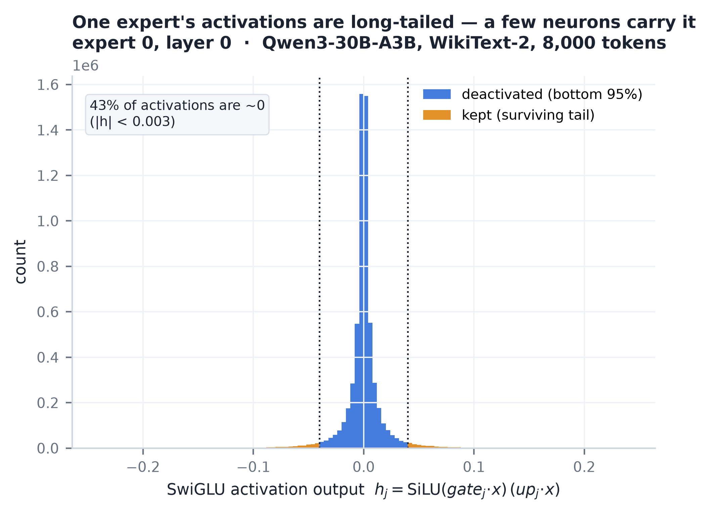
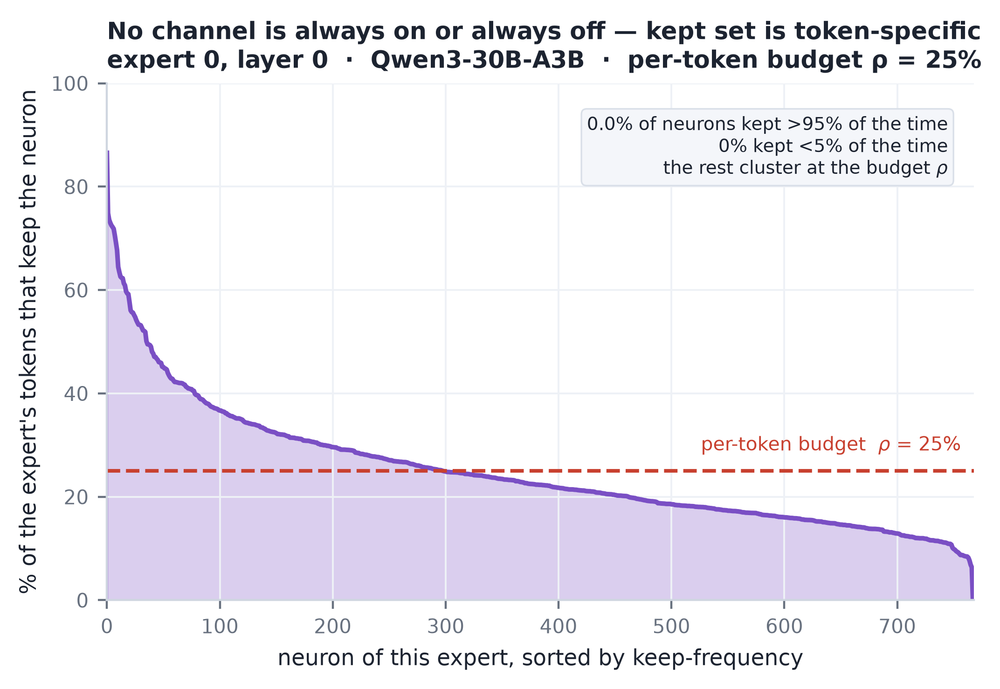
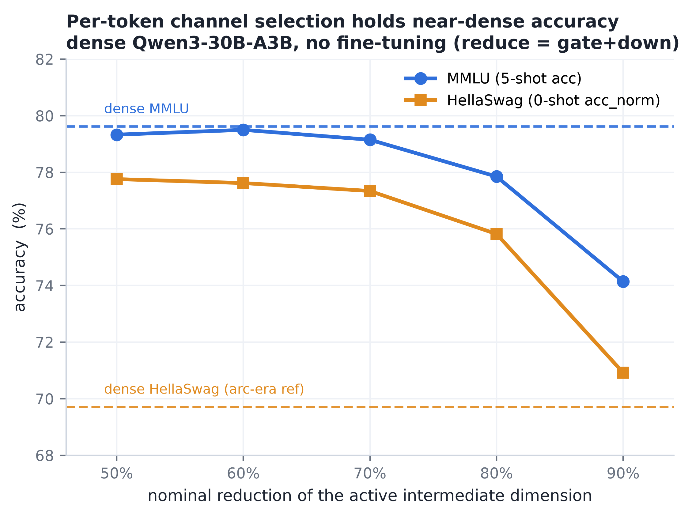

# Motivation — Per-Token Adaptive Channel Activation

Model throughout: **Qwen3-30B-A3B** (128 experts, top-8, per-expert intermediate
`I = 768`, 48 MoE layers). Every accuracy number below is **masking simulation,
no fine-tuning** — an exact accuracy at the stated active budget. Figures live in
`figs/`; regenerate with `python scripts/expert_activation_plot.py` (slides 1–2)
and `python scripts/presentation_motivation_plot.py` (slides 3–4).

---

## The claim

> **A token doesn't need 8 whole experts — it needs a sparse, token-specific
> subset of channels across those experts. So the selection must be made *online,
> per token, at channel granularity*; every offline/static choice leaves accuracy
> on the table.**

Four measurements build to that claim:

1. **A sparse subset of channels suffices** — within one expert, almost all the
   output magnitude sits in a small tail of channels.
2. **That subset is token-specific** — which channels matter is re-decided every
   token, so no fixed within-expert keep-set works.
3. **Acting on it holds near-dense accuracy at scale** — per-token selection on
   the full dense Qwen3-30B-A3B stays at the dense line out to a 70% cut and
   degrades gracefully past it.
4. **Online beats offline decisively** — the per-token selector stays near dense
   exactly where the best *offline/static* selectors collapse.

---

## Slide 1 — A sparse subset of channels suffices

**Within one expert, the activation magnitude concentrates on a handful of
channels.**

An FFN expert computes `y = W_down · h` with intermediate
`h_j = SiLU(gate_j·x)·(up_j·x)`. Because `down_proj` is linear, channel `j`
contributes exactly `h_j · W_down[:,j]` to the output — so the magnitude `|h_j|`
directly measures how much dropping that channel costs.

Profiling a single expert (layer 0, expert 0) over 8,000 WikiText-2 tokens, the
distribution of `h_j` is sharply long-tailed: **43% of activations are ~0**
(`|h| < 0.003`), and the bulk of the mass sits inside a narrow band while a thin
tail carries the rest. Deactivating the bottom 95% by `|h|` (blue) leaves only the
surviving tail (amber) — a small fraction of channel-firings does essentially all
the work.

**Takeaway.** Most of an expert's intermediate channels are idle for any given
token; the output can be reconstructed from a sparse subset.

---

## Slide 2 — …and that subset is token-specific

**Which channels matter is re-decided every token → no fixed subset works.**

Same expert. Each token routed to it keeps its own **top-25%** channels (ρ = 0.25);
the curve plots, for each of the expert's 768 neurons, the fraction of those tokens
that keep it (sorted descending).

If a *fixed* within-expert keep-set worked, this curve would be a step: a 25% slice
pinned at 100% and the rest at 0%. Instead it is smooth and clusters at the budget
line ρ = 25%: **0% of channels are kept >95% of the time** and only **0.1% are kept
<5% of the time**. Every channel is sometimes in, sometimes out — the keep decision
is genuinely re-made per token.

**Takeaway.** There is no small, stable "load-bearing" channel set to prune once.
The redundancy is real but *per-token*, so it can only be harvested by an online,
per-token selector — an offline/static ranking (which sees only calibration
averages, i.e. the router weight `g`) cannot see which channels a *specific* token
lights up.

---

## Slide 3 — Acting on it holds near-dense accuracy at scale

**Per-token channel selection on the full dense Qwen3-30B-A3B — near-dense
accuracy with no fine-tuning.**

We install the per-token selector on the untouched dense model (`reduce = gate+down`,
`up_proj` full width to produce the ranking signal) and sweep the nominal reduction
of the active intermediate dimension from 50% to 90%. Both curves are exact at
budget (masking simulation, no training).

- **MMLU (5-shot) is essentially flat to a 70% cut** — 79.3 / 79.5 / 79.2 vs the
  dense 79.6, i.e. within noise — then falls off only past 80% (77.9 at 80%, 74.1
  at 90%).
- **HellaSwag (0-shot acc_norm)** tracks the same shape: ~77.7 out to 70%, holding
  the near-dense line, with the knee at 80–90%.

The dashed lines mark the dense references (MMLU 79.6; the HellaSwag reference is
the arc-era baseline, see note below).

**Takeaway.** The per-token structure from slides 1–2 is not a curiosity of one
expert: acting on it across all 48 layers of the real 30B model buys a large
reduction of the *active* per-token FFN essentially for free, before any recovery
training.

> **Note on the HellaSwag dashed line.** The uncompressed base-A3B eval crashed
> before HellaSwag, so there is no *measured* dense HellaSwag on this model. The
> dashed reference uses the arc-era baseline acc_norm (0.6971); it therefore sits
> *below* the compressed curve and should be read as a lower-bound placeholder, not
> a true dense HellaSwag. (The measured dense HellaSwag on the sibling
> `-Thinking-2507` model is 78.56 — used in slide 4.)

---

## Slide 4 — Online beats offline, decisively

**The per-token (online) selector stays near dense exactly where the best
offline/static selectors collapse.**

Same active budget, three ways to hit it, on `Qwen3-30B-A3B-Thinking-2507`
(HellaSwag 0-shot acc_norm, dense = 78.56):

- **Offline, fewer experts (`reduce top-k`, black dashed):** route each token to
  fewer full-width experts. Collapses as budget tightens — 75.2 → 69.8 → 49.4 →
  26.2, i.e. toward chance by a 7/8 cut, because dropping an expert discards its
  *unique* knowledge.
- **Offline, static channel ranking (Level 1, pivoted-Cholesky, black solid):** the
  strongest router-only static selector. Better than reduce-top-k at tight budgets
  (74.3 → 70.5 → 63.6 → 44.2) but still far from dense — it ranks channels from
  calibration averages and cannot see the per-token signal.
- **Online, per-token channel selection (blue):** reads each token's own activation
  magnitude and keeps its global top-B. **Stays at the dense line at every budget**
  — 78.5 / 78.8 / 78.3 / 76.8 — losing <2 pt even at a 7/8 active cut.

The gap between the blue line and the best black line **widens as the budget
tightens**: +4.3 pt at −50%, +8.2 at −62.5%, +14.7 at −75%, **+32.7 at −87.5%**.
That entire margin is *per-token activation information* — precisely what slides
1–2 showed exists and slide 3 showed is worth acting on.

**Takeaway — the thesis, closed.** Sparse (slide 1), token-specific (slide 2),
worth a large active-param cut at near-dense accuracy on the real model (slide 3),
and unreachable by any offline/static method (slide 4). This is why the method
must select **online, per token, at channel granularity.**

> The blue line is an oracle (`oracle_mag`) — it reads the true per-token
> `|h(x)|`, so it is the *ceiling* a deployable selector targets, not itself a
> deployable result. What it establishes is that the accuracy is there to be had
> online; the framework's job is a cheap online estimate of that signal (the
> `up_proj`-based scorer + FloE-style predictor).

---

## Data provenance

| Figure | Source |
|---|---|
| `fig_sparse_suffices` / `fig_token_specific` | `docs/results/presentation/expert_activation.npz` (from `scripts/expert_activation_capture.py`); plotted by `scripts/expert_activation_plot.py`. Numbers in `figs/stats_activation.json`. |
| `fig_mobe_prune_sweep` | `test/results/mobe/mobe_30b.md` §"Results — dense Qwen3-30B-A3B, prune-ratio sweep" (5 greenland jobs, 2026-08-07). |
| `fig_offline_vs_online` | `docs/exps/dynamic_active_param/q3_30b_dynamic_active.md` (Level-1 sweep + Level-2 `oracle_mag`) and `docs/report/level2.md`. |
