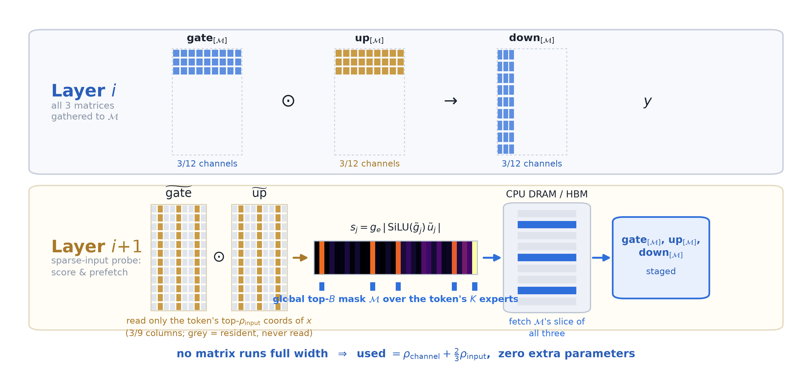
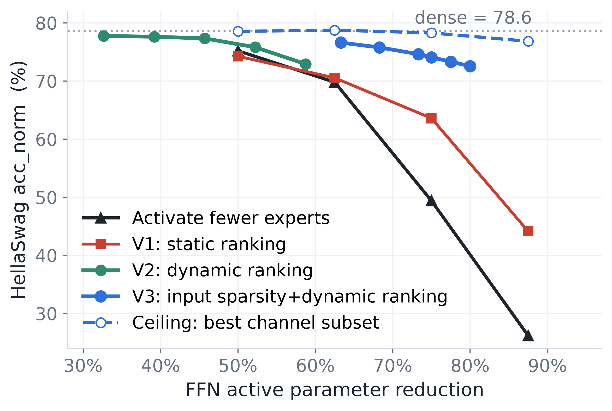
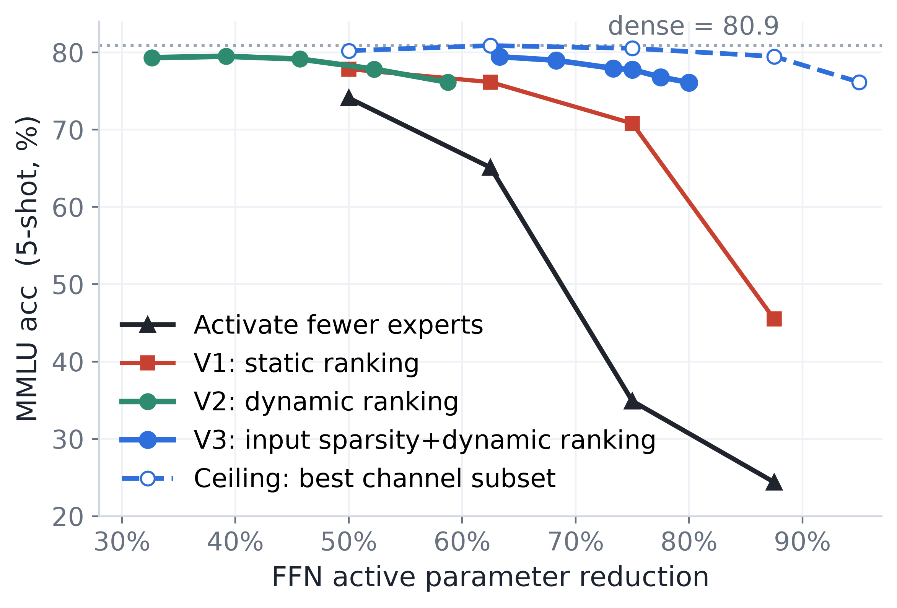

# Channel Experts — Experts at Finest Granularity

An MoE expert's intermediate channels are themselves micro-experts: each `(gate_row, up_row, down_column)` triplet is a self-contained rank-1 path that either fires or stays silent for a given token, so the useful "expert set" per token is a subset of the **channel experts** rather than $K$ whole experts. For any token keeping 15% of activated channels is enough to preserve the performance, but *which* 15% changes token-to-token.

We developed efficient methods to identify the channel experts, and bring to real active parameter reduction and edge decoding speedup:

* There is no static keep-set, which is why an offline-calibrated ranking (V1) degrades sharply past ~50% reduction.
* V2 uses the full  `up_proj`, as the channel router, decide which channels to activate and shrinks both `gate_proj` and `down_proj` for 2× the real active-param reduction
* V3 `input_sparse` breaks the `up_proj`-full-width floor by using only the token's largest input coordinates for channel router, so all three matrices shrink — reaching −75/−80% cuts .
* Recovery via hologram KD fully restores ARC-C / HellaSwag / Winogrande at a −49% cut (MMLU is the lone axis that does not recover).
* Finally, a parameter-free predictor forecasts the next layer's channel mask one layer early to enable prefetch, and end-to-end this yields a measured **1.8× decode speedup (2.1× with prefetch)** in  the edge-offload regime where memory access bound decode throughput.

Implementation: Percipio2 branch [feature/dynamic-channel](https://gitlab.aws.dev/edgeai/Percipio2/-/tree/feature/dynamic-channel?ref_type=heads)

## MoE

A standard MoE FFN expert computes

$$
y_e(x) \;=\; W_{\text{down}}^{(e)}\;\bigl[\,\text{SiLU}(W_{\text{gate}}^{(e)} x)\;\odot\;(W_{\text{up}}^{(e)} x)\,\bigr]
$$

with intermediate dimension $I$. The $j$-th **channel expert** of expert $e$ is the rank-1 computation path

$$
y_{e,j}(x) \;=\; \bigl[\text{SiLU}(w_{\text{gate},j}^{(e)\top} x)\cdot(w_{\text{up},j}^{(e)\top} x)\bigr]\;\cdot\;W_{\text{down}}^{(e)}[:,j]
$$

where $w_{\text{gate},j}^{(e)}$ is row $j$ of `gate_proj`, $w_{\text{up},j}^{(e)}$ is row $j$ of `up_proj`, and $W_{\text{down}}^{(e)}[:,j]$ is column $j$ of `down_proj`. The block output is $\sum_{e \in \text{top-}K} g_e \sum_{j=1}^{I} y_{e,j}(x)$ — a sum over $K \cdot I$ channel experts.

## Intuitions

1. **Partial experts suffice.**
   1. $\bigl[\text{SiLU}(w_{\text{gate},j}^{(e)\top} x)\cdot(w_{\text{up},j}^{(e)\top} x)\bigr]$ acts as a **soft on/off switch** for channel expert $j$: when it is near zero, the entire path contributes nothing regardless of `up_proj` or `down_proj`.
   2. Measured only 10%-20% or neurons (channels) in an expert have larger magnitudes. Removing others have little impact in final accuracy. A 512-neuron expert that effectively uses 60 is a 60-neuron expert paying rent on 512. We call these neurons *channel experts*.
2. **Find out channel experts is critical and need to be done efficiently**: token-dependent utility of channels, no fixed subset. Need an efficient proxy to find them out.
3. **Predict-and-Prefetch**: memory access is the bottleneck. Stream parameters in layer i+1 while executing computation i to avoid idle time. The residual stream entering consecutive MoE blocks moves small: $\cos\!\bigl(x^{(i)},\,x^{(i+1)}\bigr) > 0.95$, making it a failthful proxy.

## Overall formulation and Results

### High-level flow:

1. Predict what channels will have larger magnitudes using a small proxy of `up_proj` and `gate_proj` restricted to the input entries with large magnitudes.
2. Only activate channels with large magnitudes.
3. Use the input to layer $i$, $x_i$, to predict and prefetch the channels to be loaded in layer $i{+}1$.



### Algorithm

**Notation.** Per token: $x^{(i)}\in\mathbb{R}^d$ is the hidden state entering MoE block $i$; $\mathcal{E}_K^{(i)}$ its $K$ routed experts with router gates $g_e$; $W_{\text{gate}}^{(e,i)},W_{\text{up}}^{(e,i)}\in\mathbb{R}^{I\times d}$ and $W_{\text{down}}^{(e,i)}\in\mathbb{R}^{d\times I}$ the expert FFN matrices ($I$ = intermediate width; row/column $j$ = channel expert $j$, with $w_{\bullet,j}^{(e,i)}$ its projection). Budgets: read $n_{\text{in}}=\lfloor\rho_{\text{input}}\,d\rfloor$ input coordinates per expert for scoring, keep $B=\lfloor\rho_{\text{channel}}\,K I\rfloor$ channels for compute across the token's $K$ experts. Hats ($\hat{\cdot}$) mark predicted quantities.

**Goal.** Never let the accelerator idle waiting for expert weights. On bandwidth-starved hardware (experts in DRAM, streamed over a slow link), the channels a block needs are token-dependent, so a naive scheme must finish selecting them before it can fetch the weights to compute with — a serial `select → fetch → compute` chain that stalls on the fetch. We hide the fetch by predicting the channel set **one block ahead** and streaming its weights during the previous block's compute.

Two cores run concurrently per token. At block $i$:

**Core P — predict + prefetch** (targets block $i{+}1$; reads $x^{(i)}$ and block $i{+}1$'s weights)

- **P1 — route the proxy.** Run block $i{+}1$'s router on $x^{(i)}$ → predicted active experts $\hat{\mathcal{E}}_K^{(i+1)}$ and gates $\hat{g}_e$.
- **P2 — sparse-probe score.** Keep only $x^{(i)}$'s largest-magnitude coordinates, $\mathcal{I}$, and let $\tilde{x}=x^{(i)}[\mathcal{I}]\in\mathbb{R}^{n_{\text{in}}}$. For each $e\in\hat{\mathcal{E}}_K^{(i+1)}$ read the matching sub-columns of block $i{+}1$'s weights to form partial pre-activations

$$
\tilde{g}^{(e)}=W_{\text{gate}}^{(e,\,i+1)}[:,\mathcal{I}]\,\tilde{x}\in\mathbb{R}^{I},\qquad \tilde{u}^{(e)}=W_{\text{up}}^{(e,\,i+1)}[:,\mathcal{I}]\,\tilde{x}\in\mathbb{R}^{I},
$$

then the predicted channel score (router-gated SwiGLU product)

$$
\hat{s}_{e,j} = \hat{g}_e\cdot\bigl\lvert\operatorname{SiLU}\!\bigl(\tilde{g}_j^{(e)}\bigr)\cdot\tilde{u}_j^{(e)}\bigr\rvert,\qquad j\in[I].
$$

- **P3 — predict the top-$B$ set.** Pool the scores across the predicted experts and keep the $B$ largest: $\hat{\mathcal{M}}^{(i+1)} = \operatorname{top\text{-}}B\{(e,j):\hat{s}_{e,j}\}$, with $\hat{\mathcal{M}}_e^{(i+1)}=\{j:(e,j)\in\hat{\mathcal{M}}^{(i+1)}\}$.
- **P4 — prefetch.** Stream only the predicted rows/columns from DRAM into the compute core's fast memory, resident before block $i{+}1$ starts:

$$
W_{\text{gate}}^{(e,\,i+1)}[\hat{\mathcal{M}}_e^{(i+1)},:],\quad W_{\text{up}}^{(e,\,i+1)}[\hat{\mathcal{M}}_e^{(i+1)},:],\quad W_{\text{down}}^{(e,\,i+1)}[:,\hat{\mathcal{M}}_e^{(i+1)}].
$$

**Core C — compute** (runs block $i$ on the channels prefetched during block $i{-}1$)

- **C1 — exact SwiGLU** on the resident channels $\hat{\mathcal{M}}^{(i)}$, using the *true* block-$i$ input and the *actual* router output $(\mathcal{E}_K^{(i)}, g_e)$ — the numbers are exact, only the channel set is predicted:

$$
a_j = \operatorname{SiLU}\!\bigl(w_{\text{gate},j}^{(e,i)\top} x^{(i)}\bigr)\cdot\bigl(w_{\text{up},j}^{(e,i)\top} x^{(i)}\bigr),\quad j\in\hat{\mathcal{M}}_e^{(i)},
$$

$$
y^{(i)} = \sum_{e\in\mathcal{E}_K^{(i)}} g_e\,W_{\text{down}}^{(e,i)}[:,\hat{\mathcal{M}}_e^{(i)}]\;a_{\hat{\mathcal{M}}_e^{(i)}}\in\mathbb{R}^{d}.
$$

The two cores overlap: block-$i$ compute (Core C) hides the block-$(i{+}1)$ fetch (Core P), so the per-block critical path is $\max(\text{compute},\ \text{fetch})$ instead of $\text{select}+\text{fetch}+\text{compute}$.

```
              block i-1               block i                 block i+1
 Core C  ──  compute M(i-1)   ───   compute M(i)     ───   compute M(i+1)  ──
 Core P  ──  predict+fetch M(i) ──  predict+fetch M(i+1) ── predict+fetch M(i+2) ──
                from x(i-1)            from x(i)               from x(i+1)
```

`M(i)` = the predicted channel set $\hat{\mathcal{M}}^{(i)}$ that Core P produced during block $i{-}1$ and Core C consumes at block $i$.

### Results





## V1 Static channel ranking with offline calibration, and its fundamental limitation

The MoE router produces $g_e(x) \in [0,1]$ per expert but has **no information about expert parameters or channel-level capabilities** — it cannot tell *which* channels within an expert the token needs. Offline calibration scores channels from corpus statistics and the online decision reduces to $\text{score}_{e,j}(x) = r(g_e) \cdot s_{e,j}$ (router reweight $\times$ static channel importance).

The key limitation: the channel ranking is fixed (cannot bear a look-up table for each token), so the best offline methods still **degrade sharply under high reduction ratios.**

**Budget sweep — Level 1 vs the winning 33% baseline (`router_prob × act`), HellaSwag acc_norm:**

| Reduction | reduce top-k          | MoSE (router_prob × act) | Level 1 (pivchol) |
| --------- | --------------------- | ------------------------- | ----------------- |
| 50%       | **75.2** (8→4) | 71.46%                    | 74.26%            |
| 62.5%     | 69.8 (8→3)           | 61.00%                    | **70.54%**  |
| 75%       | 49.4 (8→2)           | 43.66%                    | **63.60%**  |
| 87.5%     | 26.2 (8→1)           | 30.32%                    | **44.15%**  |

## V2 Dynamic channel selection via `up_proj`

To pick the best channel experts for each token online (rather than relying on a fixed offline ranking), the naive approach is an additional learned router of size $d \times (N \cdot I)$ that directly predicts which channels to activate — but this is as large as the MoE parameters themselves and requires full re-training.

Instead, we observe that `up_proj` already *is* a per-channel router: its output $u_{e,j}(x) = w_{\text{up},j}^{(e)\top} x$ determines which channel experts will fire for each token. We use its magnitude to select the active channels, then retrieve only the corresponding rows of `gate_proj` and columns of `down_proj`.

Scoring channels by $g_e \cdot |u_{e,j}(x)| \cdot \|W_{\text{down}}[:,j]\|_2$ and keeping the global top-B across the $K$ active experts:

Dense baseline: HellaSwag 78.56 acc_norm, MMLU 5-shot $\approx$ 79.5.

| up_proj | gate_proj | down_proj | Whole-FFN active cut | HellaSwag | MMLU |
| :-----: | :-------: | :-------: | :------------------: | :-------: | :---: |
|  full  |   full   |   -75%   |       −25.0%       |   78.28   | 80.53 |
|  full  |   full   |  -87.5%  |       −29.2%       |   76.84   | 79.48 |
|  full  |   -75%   |   -75%   |       −50.0%       |   75.31   | 79.47 |
|  full  |  -87.5%  |  -87.5%  |       −58.3%       |   71.30   | 76.43 |

The `up_proj` proxy moves the selection decision **before** `gate_proj`, so both `gate_proj` and `down_proj` run at reduced width — achieving **2$\times$ the actual active-param reduction** at a cost of 3–5.5 pts vs. the full-intermediate oracle. This is still far above any offline method at comparable real reduction. Further ablation shows the weight-norm factor $\|W_{\text{down}}[:,j]\|$ is negligible ($<$ 0.3 pt contribution); the activation magnitude alone carries the signal.

### Recovery Training (Hologram KD, Qwen3-30B-A3B)

**Setting.** Dense Qwen3-30B-A3B with per-token dynamic channel reduction
(`prune_ratio=0.75`, `score_source=up`, `reduce=gate+down`,
`skip_last_layers=1`, expert-FFN active cut = −49%). Recovery via hologram
knowledge distillation from `Qwen3-235B-A22B-Instruct-2507`, 792-step schedule,
AdamW lr 2e-5, FSDP2 on 2×p5en.48xlarge.

The loss has three terms: `perf` (student CE on hard labels), `logits` (KD —
symmetric Bernoulli KL on top-of-head entries), `flow` (tail penalty, ~0.01%
gradient contribution). Four loss settings were trained and evaluated on the
full lm-eval harness (mask re-installed at training knobs):

Each `eval` cell below links to its **W&B training run** (self-hosted
`perceive-ssg`, entity `slalom`); KD 0.1 is in project `yequan26-q3-30b-train`,
the other three in `yequan26-30B-mobe`.

| eval                                                                           | KD weight | total tokens | wikitext ppl | MMLU   | ARC-C norm       | HellaSwag norm   | Winogrande       | mean acc (4)     |
| ------------------------------------------------------------------------------ | --------- | ------------ | ------------ | ------ | ---------------- | ---------------- | ---------------- | ---------------- |
| dense (no reduction)                                                           | —        | —           | 10.89        | 0.7962 | 0.6971           | 0.7790           | 0.7210           | —               |
| Untrained                                                                      | —        | —           | 12.20        | 0.785  | 0.662            | 0.766            | ~0.683           | —               |
| [`kd1`](https://perceive-ssg.wandb.io/slalom/yequan26-30B-mobe/runs/kbr3lc7z) | 1         | 2.21B        | 9.52         | 0.7786 | **0.6877** | **0.7809** | **0.7419** | **0.7473** |

| eval                                                                                 | KD weight     | total tokens | wikitext ppl   | MMLU             | ARC-C norm       | HellaSwag norm   | Winogrande       | mean acc (4)     |
| ------------------------------------------------------------------------------------ | ------------- | ------------ | -------------- | ---------------- | ---------------- | ---------------- | ---------------- | ---------------- |
| dense (no reduction)                                                                 | —            | —           | 10.89          | 0.7962           | 0.6971           | 0.7790           | 0.7210           | —               |
| untrained                                                                            | —            | —           | 12.20          | 0.785            | 0.662            | 0.766            | 0.683            | —               |
| [`perfonly`](https://perceive-ssg.wandb.io/slalom/yequan26-30B-mobe/runs/9hndgr8h)  | ~0            | 0.55B        | 9.35           | 0.7816           | 0.6689           | 0.7747           | 0.7230           | 0.7371           |
| [`kd010`](https://perceive-ssg.wandb.io/slalom/yequan26-q3-30b-train/runs/92kbfzk9) | **0.1** | 4.43B        | **9.30** | **0.7835** | 0.6706           | 0.7690           | 0.7269           | 0.7375           |
| [`kd025`](https://perceive-ssg.wandb.io/slalom/yequan26-30B-mobe/runs/i6l79som)     | 0.25          | 2.77B        | 9.35           | 0.7796           | 0.6817           | 0.7699           | 0.7316           | 0.7407           |
| [`kd1`](https://perceive-ssg.wandb.io/slalom/yequan26-30B-mobe/runs/kbr3lc7z)       | 1             | 2.21B        | 9.52           | 0.7786           | **0.6877** | **0.7809** | **0.7419** | **0.7473** |

`total tokens` = checkpoint step × 6.29M tokens/step (global batch 32 micro × 6 accum
× 16 GPUs = 3072 seqs × 2048 tokens); the evaluated checkpoints sit at steps
88 / 704 / 440 / 352 for `perfonly` / `kd010` / `kd025` / `kd1`. The `perfonly`
row is the full 6/6 rerun (`fa1d4dba`), which reproduced the crashed attempt's
wikitext/MMLU to every decimal.

### Efficiency — Edge Offload

The framework's primary payoff is on bandwidth-starved edge hardware, where experts live in CPU DRAM and are streamed over PCIe. Measured on real Qwen3-30B-A3B on a single 23 GB L4 GPU, experts offloaded to host DRAM, AIME-24 generation, batch-1 decode:

| Variant                             |    ms/tok    |     tok/s     |    vs. dense    | Peak GPU |
| ----------------------------------- | :-----------: | :------------: | :--------------: | :------: |
| Dense (all experts offloaded)       |      526      |      1.90      |      1.00×      |  3.2 GB  |
| **Dynamic (−75% gate+down)** | **291** | **3.43** | **1.81×** |  3.2 GB  |
| **+ predicted prefetch**      | **246** | **4.01** | **2.14×** |  3.2 GB  |

- Halving the PCIe bytes moved per layer (37.75 vs. 75.50 MB/layer, exact) buys **1.81×** on the wall clock — decode is bandwidth-bound, so latency tracks bytes moved almost exactly.
- The **predicted prefetch** overlaps the next layer's fetch with the current layer's compute, lifting the total to **2.14×** (4.0 tok/s).
- Peak GPU is only 3.2 GB — the full 30B runs on one L4 with ~20 GB to spare.
- Prefill is flat (~28 tok/s): at prefill lengths the per-token masks union to near-full width, so there is nothing to skip. The win is a decode-time, single-batch phenomenon.

By contrast, in the **cloud-resident** setting (experts in HBM, batch ≥ 1) the benefit is modest — the gathered kernel gives ~1.34× per layer without MoBE, but multi-batch decode dilutes the per-token sparsity as the mask-union saturates. Edge offload, not cloud serving, is where the method pays off.

### Ablation 1: Two Scoring Signals — `|up|` vs `|SiLU(gate)|`

The channel score can be built from either half of the SwiGLU product. `|up_j|` is the shipped signal (it is available *before* `gate_proj`, so it can reduce both `gate` and `down`); `|\text{SiLU}(gate_j)|` is the mirror (available only *after* `gate_proj`, so it can reduce `up` and `down` but not `gate`). At equal whole-FFN cut:

| Method                            |   up\| gate \| down   | FFN cut |      MMLU      |   HellaSwag   |     ARC-C     |   TruthfulQA   |      Avg      |
| --------------------------------- | :--------------------: | :-----: | :------------: | :------------: | :------------: | :------------: | :------------: |
| Dense baseline                    |    -0%\| -0% \| -0%    |   0%   |      79.6      |       —       |      69.7      |       —       |       —       |
| `\|up\|` (reduce gate+down)       |   -0%\| -75% \| -75%   |  −50%  | **78.6** |      75.4      |      66.0      | **51.1** | **67.8** |
| `\|SiLU(gate)\|` (reduce up+down) |   -75%\| -0% \| -75%   |  −50%  |      77.2      | **75.8** | **67.3** |      48.3      |      67.2      |
| `\|up\|`                          | -0%\| -87.5% \| -87.5% | −58.3% | **75.3** |      71.5      |      63.2      | **50.8** | **65.2** |
| `\|SiLU(gate)\|`                  | -87.5%\| -0% \| -87.5% | −58.3% |      74.0      | **72.5** | **64.4** |      45.1      |      64.0      |

- The two signals split the benchmarks: `|up|` wins MMLU and TruthfulQA; `|SiLU(gate)|` wins HellaSwag, ARC-C, and PPL (11.18 vs. 16.89 at −50%).
- **Mechanism.** `|up|` can spend budget on a channel whose gate SiLU has closed for this token (the gate is precisely the on/off switch), whereas `|SiLU(gate)|` cannot — so the mirror wastes no budget on dead channels and is the tighter *accuracy-per-budget* signal.
- **Why we still ship `|up|`.** `|SiLU(gate)|` requires `gate_proj` before it can decide, so it can only reduce `up`+`down`, never `gate`; `|up|` decides pre-gate and shrinks two matrices for the same budget. `|up|` is the deployable choice; `|SiLU(gate)|` is the per-unit-budget ceiling.

### Ablation 2: Stacking with Top-K Reduction

Reducing the *number* of experts (route each token to top-4 of 8 at full width) and narrowing the *surviving* experts (dynamic per-token channel selection) are orthogonal — the first drops whole experts, the second drops channels within the experts that remain — so they compose. HellaSwag acc_norm and MMLU 5-shot:

| Method                          |           up\| gate \| down           |      FFN cut      |      MMLU      |   HellaSwag   |
| ------------------------------- | :-----------------------------------: | :---------------: | :------------: | :------------: |
| Dense baseline (K=8)            |           -0%\| -0% \| -0%           |        0%        |      79.5      |     78.56     |
| Top-4 only                      |       -0%\| -0% \| -0% (×4/8)       |       −50%       |      77.4      |     75.96     |
| Dynamic −75% only (K=8)        |          -0%\| -75% \| -75%          |       −50%       |      78.6      |      75.4      |
| **Top-4 + dynamic −50%** | **-0% \| -50% \| -50% (×4/8)** | **−66.7%** | **77.2** | **74.0** |
| **Top-4 + dynamic −75%** | **-0% \| -75% \| -75% (×4/8)** | **−75.0%** | **74.3** | **70.0** |

- **Stacking dominates narrowing-only at equal compute.** At an iso-compute −58.3% whole-FFN cut, halving the experts then narrowing moderately beats narrowing all 8 experts hard by **+4.4 pt** on HellaSwag (75.7 vs. 71.3; +0.9 pt on the more forgiving MMLU).
- The first steps of narrowing on top of top-4 are nearly free: accuracy holds within ~3.4 pt (HellaSwag) / ~2.9 pt (MMLU) of dense out to a **−62.5%** active cut, with no fine-tuning.
- Expert-dropping alone collapses at deep cuts (reduce-top-k 8→2 falls to HellaSwag 49.4), whereas the stacked method retains the knowledge that whole-expert removal destroys.
- The two reductions are close to independent rather than compounding their damage — the accuracy loss of the stack is roughly the sum of the two individual losses, not worse.

### Limitations and improvements

Two structural costs come with using `up_proj` as the channel router.

**Limitation 1 — sequential dependency.** The channel router introduces a strict dependency in the per-layer critical path:

```
route(x) → pick experts → compute u = x·W_up → threshold → know M → fetch W_gate[:,M], W_down[M,:] → compute
```

On bandwidth-starved hardware the GPU idles while waiting for the selection result before loading the next matrices.

**Limitation 2 — `up_proj` stays full width.** `up_proj` *is* the scoring signal, the budget shrinks `gate_proj` and `down_proj`, but not `up_proj`. Also, we showed that use both up_proj and gate_proj gives best channel selection, while it further harm

Two orthogonal improvements address these, each covered in a dedicated section below:

1. **Input sparsity.** Select rows of up_proj and gate_proj corresponds to input entries with large magnitude to rank the channels.
2. **Channel Expert Predictor.** Predict layer $i{+}1$'s channel mask *during* layer $i$'s compute so `gate`/`down` can be prefetched, breaking the sequential chain of Limitation 1 (next section).

## V3: Incorporating input sparsity + dynamic channel selection

### Motivation

The `up_proj` channel router (§ above) is effective but has a hard floor: `up_proj` must run at full width since *it is the scoring signal*. The active-compute floor for the family is $(1 + 2\rho)/3$ of one expert FFN — at $\rho = 0.125$ that is still only a −29.2% whole-FFN cut. The question: can we approximate the oracle's score $g_e \cdot |\text{SiLU}(\text{gate}_j) \cdot \text{up}_j|$ with something costing **≪ full gate+up**, so all three matrices get gathered?

### Method — `input_sparse`

One method, two sparsities. Read the served `gate`/`up` weights on only the token's top-$\rho_{\text{input}}$ input coordinates (ranked by $|x_i|$), compute $g_e \cdot |\text{SiLU}(\tilde{g}_j) \cdot \tilde{u}_j|$ from the partial activations, keep the global top-$B$ channels across the token's $K$ experts, gather all three matrices to those channels.

The probe is a **view** onto the served weight tensors — not a copy, not a quantized proxy. Measured extra allocation: **0.00 MB**. Zero additional parameters, zero extra storage.

**Used-parameter accounting** (one expert FFN = 3 matrices):

$$
\text{used} \;=\; \rho_{\text{channel}} + \tfrac{2}{3}\,\rho_{\text{input}}
$$

The two sparsities (`ρ_input` for scoring, `ρ_channel` for compute) are the only knobs. Input sparsity enters *discounted* 3× (two branches spread over a three-matrix FFN); compute pays at face value.

### Results — budget sweep

| label                                                                               | branches    | `rho_input` | `rho_channel` | B    | used   | MoE-FFN used cut | mmlu             | arc_c acc_norm   | hellaswag acc_norm | winogrande  |
| ----------------------------------------------------------------------------------- | ----------- | ------------- | --------------- | ---- | ------ | ---------------- | ---------------- | ---------------- | ------------------ | ----------- |
| Baseline                                                                            | —          | —            | 1.0             | 6144 | 1.0000 | 0.0%             | **0.7962** | **0.6971** | 0.7780             | 0.6980      |
| [upgate-cut70](https://perceive-ssg.wandb.io/slalom/yequan26-30B-mobe/runs/6i277uxm) | `up+gate` | 0.2250        | 0.1500          | 922  | 0.3000 | −70.0%          | 0.7757           | 0.6706           | 0.7537             | 0.6851      |
| [gate-cut70](https://perceive-ssg.wandb.io/slalom/yequan26-30B-mobe/runs/u5qrmqqw)   | `gate`    | 0.4500        | 0.1500          | 922  | 0.3000 | −70.0%          | 0.7523           | 0.6596           | _pending_        | _pending_ |
| [up-cut70](https://perceive-ssg.wandb.io/slalom/yequan26-30B-mobe/runs/c278w024)     | `up`      | 0.4500        | 0.1500          | 922  | 0.3000 | −70.0%          | 0.7621           | 0.6442           | 0.7228             | 0.6630      |
| [upgate-cut75](https://perceive-ssg.wandb.io/slalom/yequan26-30B-mobe/runs/nm2p6fjx) | `up+gate` | 0.1875        | 0.1250          | 768  | 0.2500 | −75.0%          | 0.7626           | 0.6664           | 0.7414             | 0.6819      |
| [gate-cut75](https://perceive-ssg.wandb.io/slalom/yequan26-30B-mobe/runs/2kmymdhg)   | `gate`    | 0.3750        | 0.1250          | 768  | 0.2500 | −75.0%          | 0.7413           | 0.6502           | 0.7266             | 0.6606      |
| [up-cut75](https://perceive-ssg.wandb.io/slalom/yequan26-30B-mobe/runs/7ejiti8a)     | `up`      | 0.3750        | 0.1250          | 768  | 0.2500 | −75.0%          | 0.7500           | 0.6297           | 0.7052             | 0.6448      |
| [upgate-cut80](https://perceive-ssg.wandb.io/slalom/yequan26-30B-mobe/runs/9d0tolo8) | `up+gate` | 0.1500        | 0.1000          | 614  | 0.2000 | −80.0%          | 0.7514           | 0.6468           | 0.7202             | 0.6717      |
| up-cut80                                                                            | `up`      | 0.3000        | 0.1000          | 614  | 0.2000 | −80.0%          | 0.7334           | 0.6135           | 0.6786             | 0.6314      |
| gate-cut80                                                                          | `gate`    | 0.3000        | 0.1000          | 614  | 0.2000 | −80.0%          | 0.7220           | 0.6399           | 0.7077             | 0.6511      |


### Efficiency — Edge Offload

Because `input_sparse` gathers **all three** matrices to the per-token channel set, it moves fewer PCIe bytes than V2 and reaches cuts V2 cannot. Measured on real Qwen3-30B-A3B on a single 22 GiB L4, non-expert weights on-GPU (~3.1 GB) and all experts offloaded to host DRAM, streamed over PCIe (13.5 GB/s vs. HBM's 230), 158-token prompt + 32 generated tokens, batch-1 decode:

| Variant                                               |   cut   |     ms/tok     |     tok/s     |    vs. dense    |
| ----------------------------------------------------- | :-----: | :-------------: | :------------: | :--------------: |
| Dense (all experts offloaded)                         |   —   |      521.8      |      1.91      |      1.00×      |
| V2`dyn` (−50%, `up` full width)                  | −50.0% |      288.9      |      3.45      |      1.81×      |
| **`input_sparse` −70%**                      | −70.0% | **242.0** | **4.09** | **2.16×** |
| **`input_sparse` −75%**                      | −75.0% | **228.1** | **4.33** | **2.29×** |
| **`input_sparse` −80%**                      | −80.0% | **208.5** | **4.72** | **2.50×** |
| **`input_sparse` −75% + predicted prefetch** | −75.0% | **207.0** | **4.75** | **2.52×** |

- **−75% is 2.29× dense offloaded** (228.1 vs. 521.8 ms/token; 4.33 vs. 1.91 tok/s). Bytes moved are **exactly** 0.2500 of dense (18.87 vs. 75.50 MB/layer), so wall-clock tracks the used-param identity $\text{used}=\rho_{\text{channel}}+\tfrac23\rho_{\text{input}}$ to the decimal.
- **Predicted prefetch → 207.0 ms, 2.52× dense (4.75 tok/s)** — the fastest configuration measured, and faster than V2 `dyn`+prefetch (246.2 ms) at a cut V2 cannot express. The prefetch starts the DMA a layer early on a side stream using the predicted mask; bytes are identical to the no-prefetch row (verified to the decimal).
- **What's left is the ~50 ms non-expert floor, not the transfer.** The pinned DMA already runs at 89–94% of PCIe peak, so the transfer is not the thing to optimize; the floor (attention / KV / 48 routers / LM head / launch) is 22% of the −75% step — the arithmetic reason a 4× byte cut returns 2.29×, not 4×. `input_sparse` also pays ~22 ms/token more GPU work than `dyn` (the pooled coordinate `topk` + 16 per-slot proxy GEMVs), the tax for breaking the floor — still well below dense's 107.5 ms of compute.
- **Prefill is flat** (~28 tok/s across every variant): the per-token masks union to near-full width, so the reduction is a decode-time, batch-1 phenomenon.

### Ablation: Scoring branches: up+gate vs single branch

The full probe scores `g_e·|SiLU(gate)⊙up|` using both branches. What if we
use only `up` or only `gate`?

Tested at iso-cost −75% (each single-branch variant gets 2× the `ρ_input` to
stay at the same `used`):

| branches          | wikitext ppl    | MMLU             | HellaSwag 10-shot | ARC-C            |
| ----------------- | --------------- | ---------------- | ----------------- | ---------------- |
| **up+gate** | **12.41** | **0.7626** | **0.7414**  | **0.6664** |
| gate only         | 13.12           | 0.7413           | 0.7266            | 0.6502           |
| up only           | 20.61           | 0.7500           | 0.7052            | 0.6297           |

**Read:** Doubling coordinate reads does not buy back a dropped branch.
`up`-only is catastrophic for perplexity (+8 ppl) because it keeps channels the
gate has closed. `gate` beats `up` on 4/5 tasks. Scoring the SwiGLU *product*
(both branches) is load-bearing.

### Ablation: `input_only` — stop scoring, just compute on the sparse input

**Setup.** Delete the second (exact) pass: run gate+up on only the sparse input
coordinates, use the result as the actual computation, and output it through
`down_proj`. The sparse read *is* the computation. Cost =
`(2·ρ_input + ρ_channel)/3` — no double-billing, so the same sparsity reaches a
deeper cut.

| ρ (symmetric) | used-param cut | HS (+router) | HS (+uniform) | gap (router vs uniform) |
| -------------- | -------------- | ------------ | ------------- | ----------------------- |
| 0.300          | −70.0%        | 73.18        | 64.33         | **+8.85**         |
| 0.250          | −75.0%        | 71.35        | 56.95         | **+14.40**        |
| 0.200          | −80.0%        | 67.38        | 45.58         | **+21.80**        |

**And vs two-pass `input_sparse` at matched used-params:**

| cut     | `input_only` (+router) | `V3 input_sparse` | gap              |
| ------- | ------------------------ | ------------------- | ---------------- |
| −70.0% | 73.18                    | 75.39               | **−2.21** |
| −75.0% | 71.35                    | 74.08               | **−2.73** |
| −80.0% | 67.38                    | 72.55               | **−5.17** |

**Read (why it lags behind):** The one-pass method loses 2–5pt vs two-pass at
matched cost, and the gap *widens* with depth. The loss is in channel
*values*: a sparse input **truncates the actual intermediate** (not just the
ranking).

## Channel Expert Predictor

**Design.** The hidden state entering adjacent MoE blocks is nearly unchanged — the residual stream feeding layer $i$ and layer $i{+}1$ has cosine similarity $> 0.95$ (measured across all layers except layer 0). This lets us predict $(\text{experts}, \mathcal{M})$ for layer $i{+}1$ *during* layer $i$'s compute, with two components:

- **Inter-expert predictor (which experts):** a learned MLP on the current hidden state + historical trajectory; average precision 0.88. Mispredictions force a synchronous reload but are rare.
- **Intra-expert predictor (which channels):** **parameter-free** — feed the *current* hidden state through the *next* layer's own `up_proj`, $\hat{a}_{\text{up}}^{(i+1)} \approx x^{(i)} W^{\text{up},(i+1)}$, then threshold to get $\hat{\mathcal{M}}$. Recall is the right metric here: a missed channel costs accuracy, a spurious one only wastes a little bandwidth.

While layer $i$ computes, the predictor identifies which channel experts layer $i{+}1$ needs, enabling **prefetching** `gate_proj`/`down_proj` from memory before they are needed — converting dynamic selection into a latency-free memory-access pattern.

**Results.** Predicting the mask one layer early, at the −50% whole-FFN operating point (`|up|` scoring, `gate`/`down` reduced −75%). The predicted-mask row follows the FloE prefetch scheme:

| Configuration            | up\| gate \| down |      MMLU      |   HellaSwag   |     ARC-C     |   TruthfulQA   |      Avg      |  wikitext PPL  |
| ------------------------ | :----------------: | :------------: | :------------: | :------------: | :------------: | :------------: | :-------------: |
| Exact mask               | -0%\| -75% \| -75% |      78.6      |      75.4      |      66.0      |      51.1      |      67.8      |      16.89      |
| **Predicted mask** | -0%\| -75% \| -75% | **77.1** | **75.2** | **65.0** | **52.1** | **67.4** | **15.11** |

- Measured intra-expert **recall 0.777** on Qwen3-30B-A3B (vs. FloE's ~0.95 on Mixtral-8×7B — the recall gap is the room a better predictor still has).
- **Average cost −0.4 pt** across the four tasks; only MMLU loses measurably (−1.5 pt), and PPL actually improves (spurious kept channels do no harm).
- The predictor is parameter-free and turns the serial `up → threshold → fetch` critical path into a fetch that overlaps with the current layer's compute — the enabler for the edge speedup below.

## Legacy: Algorithm (per token, per MoE block)

#### Notation

| Symbol                                                                                                                                                                                                                                                                                          | Shape                                                                                                          | Meaning                                                           |
| ----------------------------------------------------------------------------------------------------------------------------------------------------------------------------------------------------------------------------------------------------------------------------------------------- | -------------------------------------------------------------------------------------------------------------- | ----------------------------------------------------------------- |
| $x$                                                                                                                                                                                                                                                                                           | $\mathbb{R}^d$                                                                                               | token hidden state                                                |
| $K,\,N$                                                                                                                                                                                                                                                                                       | scalar                                                                                                         | active experts per token; total experts                           |
| $I$                                                                                                                                                                                                                                                                                           | scalar                                                                                                         | expert FFN intermediate dimension                                 |
| $\mathcal{E}_K \subset [N]$, $\lvert\mathcal{E}_K\rvert=K$                                                 | index set                                  | top-$K$ routed expert indices                                                                                                   |                                                                                                                |                                                                   |
| $g_e$                                                                                                                                                                                       | scalar                                     | router gating score for expert$e$                |                                                                                                                |                                                                   |
| $W_{\text{gate}}^{(e)},\,W_{\text{up}}^{(e)}$                                                                                                                                                                                                                                                 | $\mathbb{R}^{I \times d}$                | gate / up projection (row$j$ = one channel expert's projection) |                                                                   |
| $W_{\text{down}}^{(e)}$                                                                                                                                                                                                                                                                       | $\mathbb{R}^{d \times I}$                | down projection (column$j$ = one channel expert's output)       |                                                                   |
| $\rho_{\text{input}} \in (0,1]$                                                                                                                                                                                                                                                               | scalar                                                                                                         | fraction of input coordinates used for scoring                    |
| $\rho_{\text{channel}} \in (0,1]$                                                                                                                                                                                                                                                             | scalar                                                                                                         | fraction of channels kept for compute                             |
| $n_{\text{in}} = \lfloor \rho_{\text{input}}\cdot d\rfloor$                                                                                                                                                                                                                                   | scalar                                                                                                         | per-expert coordinate budget (uniform) or average budget (router) |
| $B = \lfloor \rho_{\text{channel}}\cdot K\cdot I\rfloor$                                                                                                                                    | scalar                                     | global channel budget kept across all$K$ experts |                                                                                                                |                                                                   |
| $\mathcal{I}_e \subset [d]$                                                                                                                                                                 | index set                                  | coordinate indices scored for expert$e$          |                                                                                                                |                                                                   |
| $\tilde{x}_e = x[\mathcal{I}_e]$                                                                                                                                                                                                                                                              | $\mathbb{R}^{\lvert\mathcal{I}_e\rvert}$ | sparse probe vector for expert$e$                               |                                                                   |
| $\mathcal{M}_e \subset [I]$                                                                                                                                                                 | index set                                  | channels of expert$e$ selected for compute       |                                                                                                                |                                                                   |

**Step 1 — Keep only the token's largest input coordinates**

Score channels from just the biggest entries of $x$. By default, take the top $n_{\text{in}} = \lfloor \rho_{\text{input}}\,d\rfloor$ coordinates by $\lvert x_i\rvert$ and share them across all $K$ experts:

$$
\mathcal{I}_e = \operatorname{top\text{-}}n_{\text{in}}\bigl\{\lvert x_i\rvert : i\in[d]\bigr\}, \qquad \tilde{x}_e = x[\mathcal{I}_e]\in\mathbb{R}^{n_{\text{in}}}.
$$

*Optional (router-weighted budget).* Instead of an equal split, give the token's total budget $K\,n_{\text{in}}$ preferentially to its high-gate experts — a coordinate read on a high-$g_e$ expert shifts the pooled channel ranking (Step 3) more. One global threshold $\tau$ then sets each expert's count $n_e$ (keep coordinate $i$ for expert $e$ if $g_e^{\beta}\lvert x_i\rvert > \tau$); $\beta=0$ is the uniform case above, $\beta=1,2$ the router / router² variants.

**Step 2 — Sparse probe: score all $K \cdot I$ channels** (for each $e \in \mathcal{E}_K$)

Read sub-columns of the served weight matrices — a **view**, zero extra storage:

$$
\tilde{W}_{\text{gate}}^{(e)} = W_{\text{gate}}^{(e)}[:,\,\mathcal{I}_e]\;\in\mathbb{R}^{I\times n_e}, \qquad \tilde{W}_{\text{up}}^{(e)} = W_{\text{up}}^{(e)}[:,\,\mathcal{I}_e]\;\in\mathbb{R}^{I\times n_e}
$$

Compute partial pre-activations:

$$
\tilde{g}^{(e)} = \tilde{W}_{\text{gate}}^{(e)}\,\tilde{x}_e\;\in\mathbb{R}^{I}, \qquad \tilde{u}^{(e)} = \tilde{W}_{\text{up}}^{(e)}\,\tilde{x}_e\;\in\mathbb{R}^{I}
$$

Channel score:

$$
s_{e,j} = g_e\cdot\bigl\lvert\operatorname{SiLU}\!\bigl(\tilde{g}_j^{(e)}\bigr)\cdot\tilde{u}_j^{(e)}\bigr\rvert, \quad j\in[I]
$$

Output: score vector $s^{(e)}\in\mathbb{R}^{I}$ per active expert.

**Step 3 — Global top-$B$ channel selection**

Pool all $K\cdot I$ channel scores; select the $B$-channel global set:

$$
\mathcal{M} = \operatorname{top\text{-}}B\bigl\{(e,\,j) : s_{e,j}\bigr\}_{e\in\mathcal{E}_K,\;j\in[I]}, \qquad \mathcal{M}_e = \{j:(e,j)\in\mathcal{M}\}
$$

**Step 4 — Exact compute on selected channels** (for each $e$)

Fetch only the rows/columns for $\mathcal{M}_e$ (on-demand from DRAM in the edge regime):

$$
W_{\text{gate}}^{(e)}[\mathcal{M}_e,:]\;\in\mathbb{R}^{\lvert\mathcal{M}_e\rvert\times d}, \quad W_{\text{up}}^{(e)}[\mathcal{M}_e,:]\;\in\mathbb{R}^{\lvert\mathcal{M}_e\rvert\times d}, \quad W_{\text{down}}^{(e)}[:,\mathcal{M}_e]\;\in\mathbb{R}^{d\times\lvert\mathcal{M}_e\rvert}
$$

Run SwiGLU with **full** $x$ on the kept channels:

$$
a_j = \operatorname{SiLU}\!\bigl(w_{\text{gate},j}^{(e)\top}x\bigr)\cdot\bigl(w_{\text{up},j}^{(e)\top}x\bigr),\quad j\in\mathcal{M}_e
$$

$$
y_e = W_{\text{down}}^{(e)}[:,\mathcal{M}_e]\;a_{\mathcal{M}_e}\;\in\mathbb{R}^{d}
$$

**Step 5 — Aggregate**

$$
y = \sum_{e\in\mathcal{E}_K} g_e\,y_e\;\in\mathbb{R}^{d}
$$

**Used-parameter fraction** (relative to one dense expert FFN $= 3Id$ parameters):

$$
\text{used} = \underbrace{\rho_{\text{channel}}}_{\text{compute (all 3 matrices)}} + \underbrace{\tfrac{2}{3}\,\rho_{\text{input}}}_{\text{probe (gate+up, 3× discounted)}}
$$

The probe reads 2 matrices (gate+up) at $\rho_{\text{input}}$ column density, spreading the cost over a 3-matrix FFN → discount factor $2/3$.

## What we have achieved

1. **Experts identified at the finest granularity.** Each intermediate channel is a self-contained computation path; the relevant "expert set" per token is a subset of $K \cdot I$ channel experts rather than $K$ whole experts.
2. **The number of unique routers is much smaller.** Instead of requiring a separate $d \times (N \cdot I)$ routing matrix to select among all channel experts, the existing `up_proj` (already computed as part of the FFN) serves as the per-channel router — $K$ projections of dimension $d \times I$ that the model already performs.
3. **Protocol to find channel experts per token — without additional compute or parameters.** The `up_proj` activation magnitude ranks channel experts for each token with no extra weight reads, no calibration artifacts, and no learned router. The decision is made before `gate_proj`, enabling both `gate_proj` and `down_proj` to run at reduced width.

## Next steps

- **Fuse the two-phase forward into a kernel.** The masking simulation demonstrates the accuracy ceiling; a fused kernel — full-width `up_proj` $\to$ select top-B $\to$ reduced-width `gate_proj`/`down_proj` in one launch, with channels pre-sorted so the kept set is a contiguous prefix for regular GEMM slices — is needed to realize the edge speedup end-to-end and to close the cloud-resident gap.
- **Learn the per-token expert budget.** The channel budget $B$ is per-token adaptive but the expert count $K=8$ is fixed; many tokens need fewer. Combining top-p routing with per-token channel allocation would make the *total* active budget per token adaptive, not just its allocation across channels.
