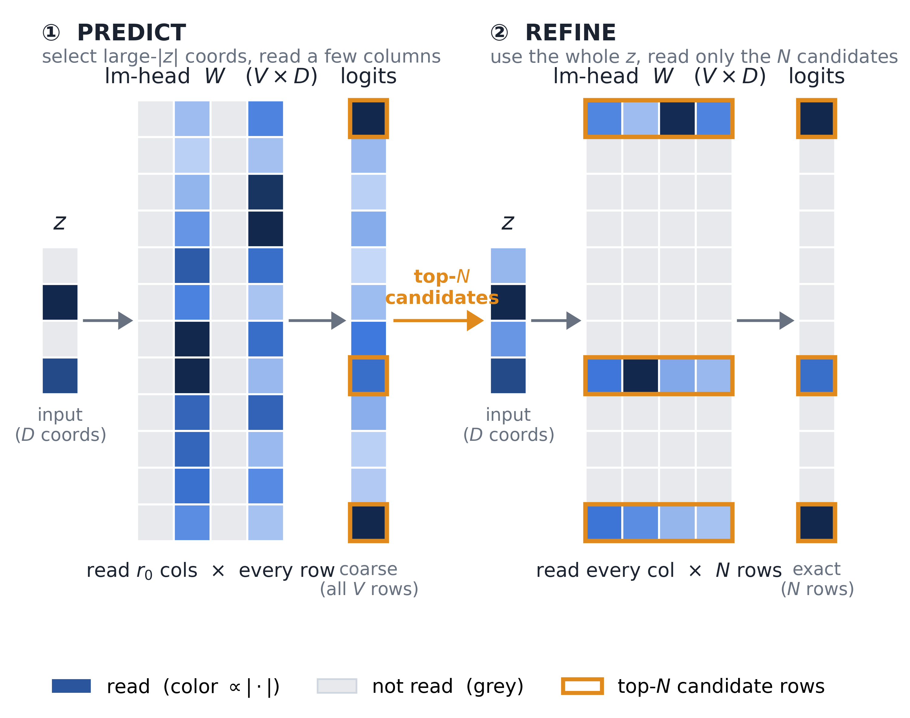

# Sparse LM-Head

Models: **Qwen3-30B-A3B** (head `V×D = 151936×2048`, 311M params) and **Qwen3-0.6B**
(`151936×1024`, 155M). All numbers are inference-time simulation — no fine-tuning, no
weight modification. 

No degradation up to cutting 90% of parameters per token. The high level idea: a **coarse proxy** to predict the ranking of token logits, and do **exact computation** on the logits of predicted high-prob tokens.

---

## Why compress the LM-head

The final projection `logits = W·h` reads the **entire** `V×D` weight to score one token.
That cost is small next to the whole model but large next to what a single decode step
actually touches:

|                            | share of**stored** params | share of**active** params (what decode reads) |
| -------------------------- | ------------------------------- | --------------------------------------------------- |
| Qwen3-0.6B (dense)         | 20.70%                          | **20.70%**                                    |
| Qwen3-30B-A3B (MoE)        | 1.02%                           | **9.28%** (of 3.35B active)                   |
| 30B after −73% expert cut | —                              | **15.33%**                                    |

So in a *small* model the head is a fifth of the whole thing, and in a *big* MoE it is a
tenth of every token's memory traffic — rising past 15% once the experts are pruned. On
memory-bound batch-1 decode, "active params" *is* the bill. The goal is to touch fewer
rows of `W` per token without changing a single stored weight.

Three axes were tested. Only **reads per token** is the one this report is about; the
others are summarized at the end.

---

## The method that works: S1 predict-and-refine

`W·h` is done in two passes so most of `W` is never read at full width.

1. **Rotate the hidden state.** Precompute `R` (`D×D`) from the eigenvectors of the
   activation covariance `C = E[h hᵀ]` (one-time calibration; stored as `D²` extra params,
   **+1.35%**). Set `z = R·h`. The coordinates of `z` are now decorrelated and ordered so
   the first few carry most of the logit energy.
2. **Coarse prediction (touches all `V` rows, cheaply).** Keep only the top-`r0` coordinates of
   `z` and take a partial dot product against every vocabulary row, ranking each row by
   `Σ |coef_i|·‖W u_i‖` over the kept coords. Cost `r0·V`. This gives an approximate logit
   for all 151936 tokens.
3. **Pick candidates, per token.** Keep the top-`N` rows by that ranking. This set adapts to
   context — it is *not* a fixed frequency list.
4. **Exact refine (touches only `N` rows).** For those `N` rows read the remaining `D−r0`
   columns and compute the exact logit. Cost `N·(D−r0)`.
5. **Output.** The `N` refined rows are bit-identical to dense; the other `V−N` rows keep
   their stage-2 approximate score as a **graded** tail — never `−inf`, so every token stays
   emittable.

**Reads/token `= r0·V + N·(D−r0) + D²`.** At `r0=128, N=8192` this is **12.65%** of the
dense head. 

The two stages read complementary slices of the head (blue = read, grey = not read). 

**①PREDICT** keeps only the largest-`|z|` coordinates, so it reads a *few columns* across
*every* vocabulary row — cheap coarse logits that rank the whole vocabulary and pick the
top-`N`. 

**② REFINE** then uses the *whole* input vector `z` but reads *every column* for
*only* the `N` candidate rows, giving them exact logits; the rest keep their coarse score.

### Results — Qwen3-30B-A3B

| method                     | reads            | Δactive          | C4 wppl          | HellaSwag               | ARC-C                   | KL    |
| -------------------------- | ---------------- | ----------------- | ---------------- | ----------------------- | ----------------------- | ----- |
| dense BF16                 | 100%             | —                | 25.349           | 78.57                   | 58.87                   | —    |
| **S1 r0=384 N=8192** | **24.48%** | **−7.01%** | **25.348** | **78.57** (+0.00) | **58.87** (+0.00) | .0003 |
| S1 r0=128 N=8192           | 12.65%           | −8.11%           | 25.430           | 78.52 (−0.05)          | 58.79 (−0.09)          | .0013 |
| F2 low-rank r=512          | 25.34%           | −6.93%           | 88.665           | 60.04 (−18.53)         | 38.48 (−20.39)         | 1.019 |
| B1-p row pruning T=32k     | 21.57%           | −7.28%           | ∞               | 60.16 (−18.41)         | 54.10 (−4.78)          | ∞    |

**At a quarter of the reads every metric equals dense** — the prediction never missed the dense
argmax over the full eval stream (argmax-in-candidate = 100.000%). Against the best prior
method at the same budget: **+18.4pt HellaSwag, +4.8pt ARC-C**. Qwen3-0.6B behaves the same
(S1 at 23.80% reads → C4 ×1.001, HellaSwag +0.00).

---

## How low can the read budget go

Sweeping both knobs down (x = fraction of the head's reads a token can *skip*; left: 30B,
right: 0.6B) gives the same three regimes on both models:

1. **Free up to ~90% reduction** (~9% of reads) — 30B −0.17pt at 90.3%, 0.6B exactly dense
   at 91.0%, both inside the ±1 stderr band. A **2.6× deeper cut** than the 75.5% headline,
   for nothing measurable.
2. **A knee at ~93% reduction** (about −1pt).
3. **Collapse past ~95% reduction**, as the prediction stops surfacing the right rows — whereas
   low-rank and row pruning are already broken at the ~75% reduction where S1 is still dense.

Read the safe budget off **KL, not the task score**: the accuracy plateau above is wider
than the distribution warrants, staying flat inside its noise band while KL to dense rises
20× across it. Taking a 4-bit head's KL (0.0415) as a reference both models cross, **~92%
reduction (~8% of reads) is the model-independent recommendation** — a 12× cut that is still
distributionally better than a 4-bit head.

---

## Two ablations that attribute the win

**1. Refine is essential — the prediction alone is a ranker, not the answer.** Drop stage 4 and
output the coarse prediction logits directly (this is exactly per-token adaptive low-rank —
"use the sparse-input output as the final scores"). At the same ~25% of reads it sits at
**KL ≈ 0.29–0.32 (≈ ×1.33 perplexity)**. Adding the exact refine of the top-`N` rows takes
KL to **0.0003** (30B) / **0.0017** (0.6B) — a ~1000× improvement for a small extra read
budget. The sparse-input prediction is a good *ranker* (it keeps the true argmax) but a poor
final *scorer*.

**2. The prediction's scoring matters — raw input magnitude is not enough.** Replace the `ceig`
rotation and the `‖W u_i‖` column-norm with "directly pick the top-`r0` hidden-state entries
by `|h_i|`":

| variant                   | reads  | KL                           | C4      | HellaSwag      | ARC-C          |
| ------------------------- | ------ | ---------------------------- | ------- | -------------- | -------------- |
| S1 (ceig + col-norm)      | 12.65% | .0013                        | ×1.003 | 78.52          | 58.79          |
| directly select by\|h_i\| | 12.65% | **.0275** (21× worse) | ×1.057 | 77.93 (−0.64) | 58.28 (−0.59) |

The rotation and the column-norm are load-bearing: without them the prediction blows the C4 +1%
budget (×1.057 vs ×1.003). On the small 0.6B the same crude prediction is **86× worse in KL**
yet scores ARC-C *above* dense — pure noise, and the reason we select on KL, not tasks.

---

## Other directions (brief)

| axis                    | direction                                                                                    | verdict                                                                                                                                               |
| ----------------------- | -------------------------------------------------------------------------------------------- | ----------------------------------------------------------------------------------------------------------------------------------------------------- |
| **stored params** | low-rank; union-of-subspaces; low-rank+sparse entries; freq tiering; exact-top+low-rank tail | **all dead at 25%** — none within 3.8× of a 4-bit head's error; low-rank misses by 50× (+250% PPL). The rows fill `R^D`.                   |
| **stored params** | row pruning (keep top-T frequent rows,`−inf` tail)                                        | **breaks multi-token tasks** — PPL ∞ by construction; −6.7 to −18.4pt HellaSwag while discarding only 2–3% of mass (`coverage^L` decay). |
| **reads**         | static sparse reads (B1-a: top-T frequent,`−inf`)                                         | **HellaSwag at chance** (25.67 on 30B). Its two flaws — static read set + ungraded tail — are exactly what S1 fixes.                          |
| **precision**     | 4-bit quantization (ARCHead / frequency tiering)                                             | **nearly free** (+1.3% PPL) — a *different* axis (bytes, not reads); composes with S1.                                                       |

Full detail and all bit-width / storage ladders: `docs/exps/lm_head/results_lm_head.md`.
