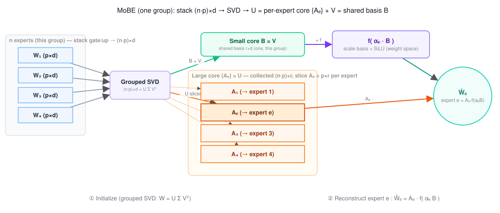

# Week 5 — MoE Compression Progress

Two model families this week: **Qwen3-30B-A3B** (hidden `d=2048`, MoE intermediate
`p=768`, 128 experts/layer, top-8, 48 layers) for the active-parameter work, and
**Qwen3-8B** (dense, `H=4096`, `I=12288`, 36 layers) for the BTT extension. All numbers
are **one-shot** (compress/allocate → eval, **no recovery fine-tuning**) unless stated.
HellaSwag = 0-shot acc_norm, MMLU = 5-shot acc.

---

## 1. Dynamic per-token active-parameter allocation — new results

Recap (Week 4): to guarantee an *active*-param cut (which static pruning does **not**
deliver — it strips the least-routed experts, so a 25–33% storage cut is only a ~3%
active cut), we fix a per-token channel budget `B = ρ·K·I` and split it **unevenly across
each token's top-K experts**. Masking simulation gives exact accuracy at the budget; no
fine-tuning, no physical slimming. Two knobs: **criterion** (how much budget each expert
gets) × **channel_metric** (which channels it keeps). Full detail:
`docs/exps/dynamic_active_param/q3_30b_dynamic_active.md`.

Three things are new since Week 4: (a) the `contribution` grid finished; (b) a harder
**50% cut** with a new coverage-maximized criterion and an expert-dropping baseline; and
(c) **Level 1 (`pivchol_global`)** — a principled narrowing method that dominates the
budget sweep.

### 1a. 33% active cut — grid complete (HellaSwag, acc_norm)

| Config                        | criterion    | channel_metric | acc_norm |
| ----------------------------- | ------------ | -------------- | -------- |
| Dense baseline (unpruned)     | —            | —              | 78.56    |
| Uniform nyström (dyn baseline)| uniform      | —              | 66.29    |
| Uniform MoBE (same budget)    | —            | —              | 69.54    |
| Dynamic prob × leverage       | router_prob  | leverage       | **76.13**|
| Dynamic prob × activation     | router_prob  | activation     | 75.96    |
| Dynamic contrib × leverage    | contribution | leverage       | 69.46    |
| Dynamic contrib × activation  | contribution | activation     | 67.79    |

- **`router_prob` ≫ `contribution`** (76.1 vs 69.5). `expert_out_token_contrib` is a
  fixed per-expert scalar, so `contribution` only varies through *which* experts a token
  picks — it is not truly per-token; `router_prob` is. (The first `contribution` run
  silently fell back to uniform — the score is stored *negative*, and the precompute
  clamped it to ≥0; fixed by negating before clamping. Rows above are the corrected run.)
- **`leverage` ≥ `activation`** for channel ranking under both criteria, though the gap is
  <0.2pt under `router_prob`.

### 1b. 50% active cut — coverage-maximized allocation vs dropping experts

Two ways to halve the active expert-FFN budget: **narrower experts** (keep all K=8, zero
half each token's channels) vs **fewer experts** (route to top-4 of 8 at full width).
`coverage_alloc` is a new criterion combining router contribution with each expert's
leverage-*concentration* curve (paper §4.2, Alg. 1, applied per-token): equal router prob
→ equal coverage *target*, but a concentrated expert reaches it with fewer channels,
freeing budget for spread-out experts.

| Config                             | criterion       | acc_norm | note                     |
| ---------------------------------- | --------------- | -------- | ------------------------ |
| Dense baseline                     | —               | 78.56    |                          |
| **Reduce top-k (8→4 experts)**     | fewer-experts   | **75.96**| full-width, drop 4/token |
| **Level 1 — pivchol global g²**    | pivchol_global  | **74.26**| best *narrowing* method  |
| Dynamic coverage × leverage        | coverage_alloc  | 72.94    |                          |
| Dynamic prob × leverage            | router_prob     | 71.46    |                          |
| Dynamic uniform × leverage         | uniform         | 58.89    | dyn baseline             |

- **`coverage_alloc` beats `router_prob`** by +1.48pt (~3× stderr) — leverage-concentration
  allocates the fixed budget better than router probability alone.
- **Fewer experts > narrower experts at 50%.** Reduce-top-k (75.96) beats even
  `coverage_alloc` by +3pt and comes within 2.6pt of dense. Dropping a token's lowest-prob
  experts is *less destructive* than narrowing every expert (including the dominant ones).
  This is now the baseline the narrowing story must justify itself against.

### 1c. Level 1 (`pivchol_global`) — a correct narrowing ceiling, and the budget sweep

Level 1 replaces the naïve narrowing recipe with two principled fixes: **global g²·σ
competition** across all K experts (a dominated expert can get 0 channels — quotas emerge
from one shadow price) instead of a per-expert linear-`g` quota; and a **pivoted-Cholesky
nested order** (redundancy-aware, off the cached activation×weight Gram `Θ_k = G_k ⊙ B_k`)
instead of ridge-leverage, which double-counts redundant channels. The pivoted-Cholesky
factorization is precomputed once on CPU into `pivchol_artifact.pth` (budget-agnostic; ~5
min/48 layers), then every eval just takes the global top-`B`.

**Budget sweep — Level 1 vs the winning 33% baseline (`router_prob × act`), HellaSwag acc_norm:**

| Reduction | ρ (kept) | router_prob × act | **Level 1 (pivchol)** | Δ (L1 − base) |
| --------- | -------- | ----------------- | --------------------- | ------------- |
| 50%       | 0.50     | 71.46             | **74.26**             | +2.80         |
| 62.5%     | 0.375    | 61.00             | **70.54**             | +9.54         |
| 75%       | 0.25     | 43.66             | **63.60**             | +19.94        |
| 87.5%     | 0.125    | 30.32             | **44.15**             | +13.83        |

**Level 1 dominates at every budget, and the margin widens as the cut deepens** (74.3 →
70.5 → 63.6 → 44.2 vs the baseline collapsing 71.5 → 61.0 → 43.7 → 30.3 toward chance).
Global g² starves weak experts; pivoted-Cholesky avoids redundant channels.

**But it does not beat expert-dropping (74.26 vs 75.96).** This is the predicted outcome:
L1's scoring matrix `Θ_k` is **block-diagonal** (no cross-expert terms), so it cannot
exploit cross-expert redundancy — the true bottleneck. L1 establishes a *correct* narrowing
ceiling and isolates the variable, motivating a **cross-expert (Level 3)** method next.

---

## 2. MoBE — settings and mechanism

MoBE (Mixture-of-Basis-Experts) is our best **factorization** result on Qwen3-30B-A3B (not
pruning). It compresses **every routed expert's `gate_proj` and `up_proj`**; **`down_proj`,
router, attention, norms are left dense.** The idea: instead of storing 128 independent
weight matrices per (layer, projection), store one small **shared per-layer basis** plus a
cheap **per-expert transform**, and reconstruct each expert by *mixing* the shared basis
with a weight-space nonlinearity.

### How it works (initialize by grouped SVD, reconstruct by mixture-of-basis)

So a group of experts is SVD'd **together** to seed the shared basis (the small core `B`),
and the residual expert-specific structure becomes the large core `A_e` (one slice per
expert). At reconstruction, each expert mixes the `m` shared bases with its own weights
`α_e`, applies a **SiLU in weight space**, then multiplies by its transform `A_e`. Plain
low-rank / SVD is the special case with `f = identity` and no mixing — the mixture + `f` is
what lets `m` bases cover 128 experts.

### Settings (Qwen3-30B-A3B, `Qwen/Qwen3-30B-A3B` base)

- **Rank fixed `r = p = 768`; the basis count `m` is the only compression knob.** Per
  (layer, type) MoBE stores `A: n·p·r` + `B: m·r·d` + `α: n·m` vs the original `n·p·d`.
  Since up+gate are 2/3 of expert-FFN params and `down_proj` stays dense (1/3), the
  whole-MoE ratio is exactly `(2·γ_ug + 1)/3`.
- **Fitter:** reference-matched `inclusionAI/MoBE` — grouped-SVD init, std-only
  normalization, mean-MSE, **Adam lr=0.07, 2000 fixed steps per (layer,type)**, all 48
  layers. **Data-free** (fits weights directly; no calibration tokens enter).

| `m`     | up+gate γ_ug | whole-MoE reduction | HellaSwag        | MMLU  | wiki2 / c4 PPL |
| ------- | ------------ | ------------------- | ---------------- | ----- | -------------- |
| —       | —            | 0% (baseline)       | 77.68            | 82.0† | 8.70 / 14.05   |
| **32**  | 0.625        | **−25.0%**          | **73.67** (−4.0) | 77.23 | 9.59 / 15.98   |
| **16**  | 0.500        | **−33.3%**          | **69.64** (−8.0) | 74.05 | 11.75 / 20.32  |

† MMLU baseline not re-run on this checkpoint (cited 82.0). Going m=32→16 (25%→33%)
costs ~4 extra pts on both tasks. One-shot, no recovery. Impl `src/compress/moe_basis/`.

MoBE is a clean ~4-pt HellaSwag drop at 25% with zero fine-tuning — the best factorization
result, and close to the same-budget pruning result on MMLU. Its whole-layer sharing (one
basis for all 128 experts) is exactly the cross-expert redundancy Level 1 above **could
not** touch — which motivates the BTT extension in §3.

---

## 3. Extending the MoBE idea to BTT — `mix_btt`

**Question:** does MoBE's mixture-of-basis + weight-space nonlinearity help *any*
structured factorization, or only the cross-expert MoE case? We grafted it onto the repo's
**BTT** (block tensor-train) factorization of a *single dense* `Linear` and tested on
Qwen3-8B. Detail: `docs/exps/mix_btt/mix_btt_result.md`.

BTT factorizes `W:(d_out,d_in)` into per-input-block cores via block-wise SVD, so
`out = Σ_j L_jᵀ·(R_j·x_j)`. `mix_btt` treats the small cores `{R_k}` as a **shared basis**
(≙ MoBE's `B`), the large cores `L_jᵀ` as **per-block transforms** (≙ `A_e`, with the
correspondence **expert ↔ input-block**), and inserts a learnable `n×n` mixing `α` (init
`I`) and a SiLU `f` between the two stages — `z_k = R_k x_k`, `u_j = f(Σ_k α_{j,k} z_k)`,
`out = Σ_j L_jᵀ u_j`. Plain BTT is the exact special case `α = I, f = identity`.

Two fit regimes are the ablation axis: **weight-space** (MoBE-faithful, data-free
`‖W−Ŵ‖²`, lr=0.07/30k) vs **activation-space** (BTT data-path, `E_x‖Wx−mixBTT(x)‖²`, Adam
lr=1e-3/3k, locked by a pre-study lr/iters scan). One projection at a time, `ratio=0.67`
(−33% of that projection), one-shot, no CE recovery.

### Results (Qwen3-8B; baseline HS 74.94, MMLU 74.86, wiki 9.73, c4 15.43)

**gate_proj −33%**

| Cell                    | fit space   | `f`  | `α`   | HellaSwag | MMLU  | wiki / c4 PPL |
| ----------------------- | ----------- | ---- | ----- | --------- | ----- | ------------- |
| BTT baseline (no fit)   | SVD only    | id   | I     | 58.07     | 61.56 | 36.7 / 53.9   |
| 1 weight-space          | weight      | SiLU | learn | 58.03     | 61.59 | 36.5 / 54.0   |
| 2 act-space nl-only     | activation  | SiLU | fixed | 51.43     | 45.34 | 30.7 / 35.3   |
| 3 act-space nl+mix      | activation  | SiLU | learn | 53.10     | 46.32 | **26.9 / 31.9** |

**down_proj −33%**

| Cell                    | fit space   | `f`  | `α`   | HellaSwag | MMLU  | wiki / c4 PPL   |
| ----------------------- | ----------- | ---- | ----- | --------- | ----- | --------------- |
| BTT baseline (no fit)   | SVD only    | id   | I     | 30.75     | 26.15 | 1857 / 1386     |
| 1 weight-space          | weight      | SiLU | learn | 30.69     | 25.91 | 1863 / 1384     |
| 2 act-space nl-only     | activation  | SiLU | fixed | **36.60** | 25.49 | 55.3 / 59.3     |
| 3 act-space nl+mix      | activation  | SiLU | learn | 36.54     | 25.72 | **52.5 / 58.5** |

### Findings

1. **The weight-space MoBE fit buys ~nothing over plain BTT-SVD**, on either projection
   (cell 1 ≡ no-fit baseline to <0.2pt everywhere). The mixture+nonlinearity does not
   improve the block-SVD init that already seeds it — softmax simplex mixing is too
   constrained, and the data-free `‖W−Ŵ‖²` objective is the one SVD already near-optimizes.
2. **Activation-space fitting reconstructs the layer far better and rescues PPL** (rel-err
   ~0.05 vs ~0.5; down_proj wiki **1863 → 55**, c4 **1384 → 59** — a collapse turned into a
   working model, purely from the local fit).
3. **…but it does not recover MC accuracy, and can hurt it.** Despite far better MSE/PPL,
   act-space cells *lose* on MMLU/HellaSwag (gate MMLU 45–46 vs 61.6; down MMLU stays at
   chance ~25.5). **Per-layer MSE/PPL and downstream MC-ranking are decoupled objectives.**
4. **The learnable mix helps in act space (cell 3 ≳ cell 2) but weakly** — real when fit on
   the data path (opposite of its null effect in weight space), but second-order to fit space.
5. **`down_proj` is far more compression-sensitive than `gate_proj`** — −33% of `down_proj`
   collapses the model (MMLU ≈ chance); the same on `gate_proj` holds up (MMLU 61.6).

### Takeaway

**MoBE's weight-space mixture adds value only when it shares a basis *across experts*** —
the cross-expert redundancy a per-Linear BTT (one Linear = one "expert group") cannot
exploit, and the same redundancy §1's block-diagonal Level 1 could not touch. The useful
half of `mix_btt` is the **activation-space fit** (it fixes a broken factorization's PPL),
but on its own it is a strong *initialization* for a recovery fine-tune, not a one-shot
compressor. Next step for both §1 and §3: a cross-expert method (Level 3) and a LoRA/CE
recovery pass on top of the activation-space fit.
