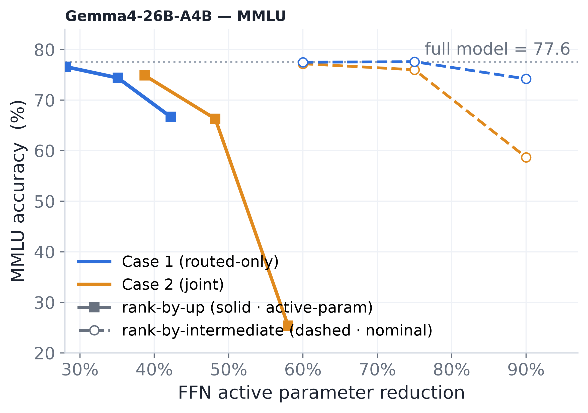
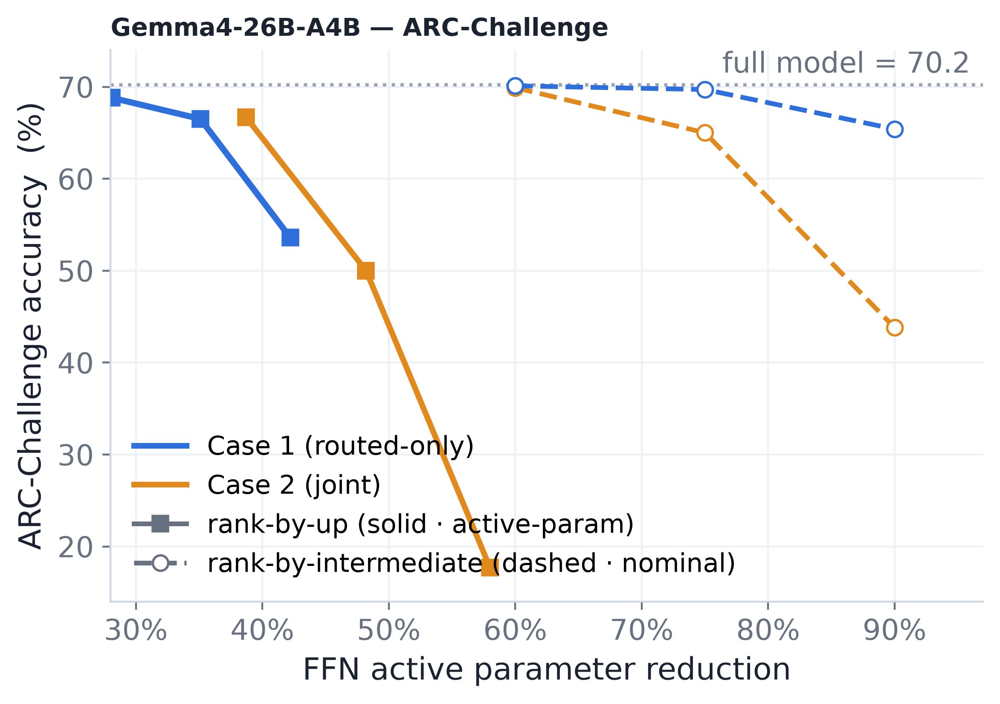

# Week 9 — Input Sparsity Ablations, Gemma4, LM-Head

Model (Sections 1–2): **Qwen3-30B-A3B** / **Gemma4-26B-A4B**. All numbers are
masking simulation (no recovery fine-tuning). Dense baselines: Qwen3 HellaSwag
78.56, MMLU 80.91; Gemma4-pt MMLU 0.776, ARC-C 0.702.

---

## 1. Input Sparsity — Procedure and Ablations

### The procedure (best-practice `input_sparse`)

Per token, per MoE layer:

1. **Rank input coordinates.** Sort the token's hidden-state coordinates by
   `|x_i|`. Keep only the top-`ρ_input` fraction (e.g. 384 of 2048).
2. **Sparse scoring.** Read the `gate_proj` and `up_proj` weights at *only*
   those coordinates — these are **views** on the served weight (no copy, no
   quantization, zero extra storage). Compute approximate channel scores:
   `s_j = g_e · |SiLU(gate_partial_j) · up_partial_j|` for every channel `j`
   across the token's K active experts.
3. **Global top-B selection.** Pool all `K·I` scores, keep the top-`B` channels
   globally (across experts). This is the channel mask M.
4. **Exact computation.** Gather only the kept channels of **all three**
   matrices (`gate_proj[M]`, `up_proj[M]`, `down_proj[:,M]`) and run the
   standard SwiGLU at reduced width. No matrix runs full width.

**Cost:** `used = ρ_channel + 2·ρ_input/3`. Nothing stored beyond the model
weights themselves.

### The full frontier (six budgets, best practice)

| cut     | ρ_input | ρ_channel | HellaSwag | MMLU  |
| ------- | -------- | ---------- | --------- | ----- |
| −63.3% | 0.2500   | 0.2000     | 76.61     | 79.45 |
| −68.3% | 0.2400   | 0.1567     | 75.78     | 78.98 |
| −73.3% | 0.1875   | 0.1417     | 74.63     | 77.94 |
| −75.0% | 0.1875   | 0.1250     | 74.08     | 77.77 |
| −77.5% | 0.1875   | 0.1000     | 73.33     | 76.81 |
| −80.0% | 0.1575   | 0.0950     | 72.55     | 76.11 |

Roughly **0.24pt per pp of cut**, no cliff across the whole range.

---

This section covers three ablation questions on top of this method.

### 1.1 Router allocation of input reads

The scoring budget per token is `K·round(ρ_input·H)` coordinate reads pooled
across the token's K experts. By default these are split equally (`uniform`).
`router` instead ranks by `g_e·|x_i|` across (expert, coordinate), giving
more reads to higher-probability experts.

| allocation           | ρ_ch=0.10 HS / MMLU    | ρ_ch=0.20 HS / MMLU |
| -------------------- | ----------------------- | -------------------- |
| `uniform`          | 74.06 / 77.20           | 76.72 / 79.10        |
| **`router`** | **74.64 / 77.67** | 76.61 / 79.45        |
| Δ                   | **+0.58 / +0.47** | −0.11 / +0.35       |

**Read:** `router` is free (one extra bisection on a sort already done) and
gains +0.58pt where the budget is tight (ρ_ch=0.10). At loose budgets it's a
wash. It's the right default for this method's operating range.

### 1.2 Scoring branches: up+gate vs single branch

The full probe scores `g_e·|SiLU(gate)⊙up|` using both branches. What if we
use only `up` or only `gate`?

Tested at iso-cost −75% (each single-branch variant gets 2× the `ρ_input` to
stay at the same `used`):

| branches          | wikitext ppl    | MMLU             | HellaSwag 10-shot | ARC-C            |
| ----------------- | --------------- | ---------------- | ----------------- | ---------------- |
| **up+gate** | **12.41** | **0.7626** | **0.7414**  | **0.6664** |
| gate only         | 13.12           | 0.7413           | 0.7266            | 0.6502           |
| up only           | 20.61           | 0.7500           | 0.7052            | 0.6297           |

**Read:** Doubling coordinate reads does not buy back a dropped branch.
`up`-only is catastrophic for perplexity (+8 ppl) because it keeps channels the
gate has closed. `gate` beats `up` on 4/5 tasks. Scoring the SwiGLU *product*
(both branches) is load-bearing.

### 1.3 `input_only` — stop scoring, just compute on the sparse input

**Setup.** Delete the second (exact) pass: run gate+up on only the sparse input
coordinates, use the result as the actual computation, and output it through
`down_proj`. The sparse read *is* the computation. Cost =
`(2·ρ_input + ρ_channel)/3` — no double-billing, so the same sparsity reaches a
deeper cut.

| ρ (symmetric) | used-param cut | HS (+router) | HS (+uniform) | gap (router vs uniform) |
| -------------- | -------------- | ------------ | ------------- | ----------------------- |
| 0.300          | −70.0%        | 73.18        | 64.33         | **+8.85**         |
| 0.250          | −75.0%        | 71.35        | 56.95         | **+14.40**        |
| 0.200          | −80.0%        | 67.38        | 45.58         | **+21.80**        |

**And vs two-pass `input_sparse` at matched used-params:**

| cut     | `input_only` (+router) | two-pass`input_sparse` | gap              |
| ------- | ------------------------ | ------------------------ | ---------------- |
| −70.0% | 73.18                    | 75.39 (interpolated)     | **−2.21** |
| −75.0% | 71.35                    | 74.08                    | **−2.73** |
| −80.0% | 67.38                    | 72.55                    | **−5.17** |

**Read (why it lags behind):** The one-pass method loses 2–5pt vs two-pass at
matched cost, and the gap *widens* with depth. The discarded exact pass is worth
far more than the third of the budget it consumed. The loss is in channel
*values*: a sparse input truncates the actual intermediate (not just the
ranking), and deeper cuts amplify the truncation.

**Finding worth keeping:** `router` allocation is worth **+8.9 to +21.8pt** in
this regime — the largest single effect measured. When sparse reads carry values
(not just a ranking), allocating more reads to higher-probability experts is
critical.

---

## 2. Gemma4-26B-A4B — Dynamic Channel Selection

**Motivation.** Gemma4-26B-A4B has a fundamentally different MoE structure:
each layer runs an **always-on dense MLP** (intermediate 2112) plus **routed
experts** (top-8 of 128, intermediate 704 each). Unlike Qwen3 which has only
routed experts, this model has a permanent feed-forward path that every token
pays. Goal: test whether per-token channel selection transfers, and understand
what happens when you have an always-on component.

### Method

Same channel scoring as the Qwen3 study — per token, rank intermediate channels
by `g_e·|signal|·‖W_down col‖` and keep the top-B. Two cases:

- **Case 1 (routed-only):** reduce only the routed experts; always-on MLP stays
  full width.
- **Case 2 (joint):** pool always-on MLP channels *with* routed channels into
  one budget — the dense MLP gets reduced too.

Two scoring signals: `rank-by-intermediate` (keep gate+up full, shrink down
only) and `rank-by-up` (shrink gate+down, keep up full). The former is
higher-fidelity / lower-compression.

### Results — Case 1 (routed-only, `-pt` base model)

| scoring        | nominal cut | active-param ratio | MMLU            | ARC-C  |
| -------------- | ----------- | ------------------ | --------------- | ------ |
| baseline       | —          | 1.000              | 0.776           | 0.702  |
| only always-on | 100%        | 0.5                | 0.2562          | 0.2065 |
| rank-by-inter  | 60%         | 0.859              | **0.775** | 0.701  |
| rank-by-inter  | 75%         | 0.824              | **0.776** | 0.697  |
| rank-by-inter  | 90%         | 0.789              | 0.742           | 0.654  |
| rank-by-up     | 60%         | 0.719              | 0.766           | 0.688  |
| rank-by-up     | 75%         | 0.649              | 0.744           | 0.665  |
| rank-by-up     | 90%         | 0.578              | 0.667           | 0.536  |

### Results — Case 2 (joint)

| scoring       | nominal cut | active-param ratio | MMLU  | ARC-C |
| ------------- | ----------- | ------------------ | ----- | ----- |
| rank-by-inter | 60%         | 0.807              | 0.772 | 0.699 |
| rank-by-inter | 75%         | 0.758              | 0.760 | 0.650 |
| rank-by-inter | 90%         | 0.710              | 0.587 | 0.438 |
| rank-by-up    | 90%         | 0.420              | 0.254 | 0.177 |

### Key reads

1. **Rank-by-intermediate is nearly free through 75%.** MMLU 0.776 → 0.776 at
   75% nominal (−0.0pt), ppl 8.70 → 8.88. The routed experts tolerate dropping
   75% of the ranking dimension with gate+up left dense.
2. **Joint case (Case 2) is aggressive.** It reaches a lower active-param ratio
   for the same nominal cut, but collapses at high reduction (rank-by-inter 90%
   joint → MMLU 0.587) because **cutting into the always-on MLP is what breaks
   the model**. At mild budgets (60%), joint is close to routed-only.
3. **The instruct `-it` model shows the same ordering.** Rank-by-intermediate
   routed-only: MMLU 0.837 → 0.834 → 0.805 from 60→90% — remarkably flat.

---

## 3. LM-Head Compression — Screen-and-Refine (S1)

**Motivation.** The lm_head (`W: V×D`, 311M params on Qwen3-30B) is 9.28% of
active parameters. After −73% expert pruning it rises to 15.33%. Can we
reduce it?

Three axes were tested: stored parameter count (5 families, all dead at 25%),
precision (4-bit is nearly free), and **read parameters per token** — how many
rows of W are touched to produce one output.

### S1: the method that works

The lm_head computes `logits = W · h` where `W` is `V×D` (151936 × 2048). A
dense head reads all 311M entries every token. S1 reads ~25% of them by doing
the multiplication in two passes:

**Step 1 — Rotate the hidden state.** Precompute a rotation matrix `R` (D×D)
from the eigenvectors of the activation covariance `E[h hᵀ]` (one-time
calibration, stored as D² extra parameters = +1.35%). Multiply: `z = R · h`.
Now `z` has D coordinates ordered by importance — the first few capture most
of the variance across tokens.

**Step 2 — Coarse screen (cheap, touches all V rows).** Take only the first
`r0` coordinates of `z` (e.g. r0=384 out of 2048). Compute a partial dot
product of every vocabulary row with just these `r0` values. Cost: `r0 · V`
reads. This gives an approximate logit for all 151936 tokens.

**Step 3 — Pick candidates.** Take the top-N rows (e.g. N=8192) by that
approximate ranking. These are the tokens likely to matter for this position.

**Step 4 — Exact refine (expensive, touches only N rows).** For those N
candidate rows, read the *remaining* `D − r0` columns and compute the full
exact logit. Cost: `N · (D − r0)` reads.

**Step 5 — Output.** The N refined rows have exact logits (bit-identical to
dense). The other `V − N` rows keep their stage-2 approximate score as a
graded fallback — never `−inf`, so every token remains emittable.

**Total reads:** `r0·V + N·(D−r0) + D²`. At r0=384, N=8192: **24.48%** of the
dense head's reads. The candidate set is chosen **per token** (not a static
frequency list), so it adapts to context. No weight modification, no training.

### Results on Qwen3-30B-A3B

| method                     | reads            | Δactive          | C4 wppl          | HellaSwag       | ARC-C           |
| -------------------------- | ---------------- | ----------------- | ---------------- | --------------- | --------------- |
| dense BF16                 | 100%             | —                | 25.349           | 78.57           | 58.87           |
| **S1 r0=384 N=8192** | **24.48%** | **−7.01%** | **25.348** | **78.57** | **58.87** |
| S1 r0=128 N=8192           | 12.65%           | −8.11%           | 25.430           | —              | 58.79           |
| F2 low-rank r=512          | 25.34%           | −6.93%           | 88.665           | 60.04           | 38.48           |
| B1-p row pruning T=32k     | 21.57%           | −7.28%           | ∞               | 60.16           | 54.10           |

**At a quarter of the reads, every metric is indistinguishable from dense.**
Perplexity is 0.001 lower (noise), HellaSwag and ARC-C identical to two
decimals. The screen did not miss the dense argmax once over the full eval
stream.

**vs prior methods at matched budget:** +18.4pt HellaSwag and +4.8pt ARC-C
above the best previously measured method (row pruning / low-rank).

### Why it works where static tiers fail

The old approach (B1-a: read only the top-T frequent rows, `−inf` for the rest)
collapses because per-token coverage exponentiates over a continuation:
88% per-token coverage at T=4096 → **9.35%** per-ending on HellaSwag. S1
escapes this by choosing candidates **per token** (the dense argmax is in the
candidate set on 100.000% of positions) and keeping a **graded** tail (a miss
costs a small logit error, not an unemittable token).

### What the storage axis looks like (dead)

Five representation families tested at 25% stored parameters: global low-rank,
union of subspaces (k-means + per-cluster PCA), low-rank + sparse entries,
frequency tiering, exact-top + low-rank tail. **None comes within 3.8× of the
error a 4-bit head achieves.** The head's rows fill R^D; they do not lie near
any low-dimensional union of subspaces.

---

## 4. Recovery Training (Hologram KD, Qwen3-30B-A3B)

**Setting.** Dense Qwen3-30B-A3B with per-token dynamic channel reduction
(`prune_ratio=0.75`, `score_source=up`, `reduce=gate+down`,
`skip_last_layers=1`, expert-FFN active cut = −49%). Recovery via hologram
knowledge distillation from `Qwen3-235B-A22B-Instruct-2507`, 792-step schedule,
AdamW lr 2e-5, FSDP2 on 2×p5en.48xlarge.

The loss has three terms: `perf` (student CE on hard labels), `logits` (KD —
symmetric Bernoulli KL on top-of-head entries), `flow` (tail penalty, ~0.01%
gradient contribution). Four loss settings were trained and evaluated on the
full lm-eval harness (mask re-installed at training knobs):

| eval                    | KD weight     | wikitext ppl   | MMLU             | ARC-C norm       | HellaSwag norm   | Winogrande       | mean acc (4)     |
| ----------------------- | ------------- | -------------- | ---------------- | ---------------- | ---------------- | ---------------- | ---------------- |
| dense (no reduction)    | —            | 10.89          | 0.7962           | 0.6971           | 0.7790           | 0.7210           | —               |
| untrained 0.75 (interp) | —            | ~12.20         | ~0.785           | ~0.662           | ~0.766           | ~0.683           | —               |
| `kd010-s704`          | **0.1** | **9.30** | **0.7835** | 0.6706           | 0.7690           | 0.7269           | 0.7375           |
| `kd025-s440`          | 0.25          | 9.35           | 0.7796           | 0.6817           | 0.7699           | 0.7316           | 0.7407           |
| `kd1-s352`            | 1             | 9.52           | 0.7786           | **0.6877** | **0.7809** | **0.7419** | **0.7473** |
| `perfonly-s88`        | ~0            | 9.35           | 0.7816           | —               | —               | —               | —               |

### Key reads

1. **Recovery training clearly works.** All settings bring perplexity from ~12.2
   down to 9.3–9.5 — *below* the uncompressed model's 10.89. A −49% expert-FFN
   cut that ends up 1.6 ppl better than the model it was cut from; this is what
   distilling from a 235B teacher buys.
2. **MMLU drift is caused by head reshaping toward the instruct teacher.** The
   `logits` term acts on only the top few tokens per position (masked to
   `|T−S| > 0.01`), reshaping the head toward the instruct distribution. 0-shot
   MMLU (a 4-way letter argmax) is the most head-shape-sensitive probe; at
   KD=0.1 the effect balances and MMLU holds flat.

---

## Summary

| direction                         | status                    | headline                                                                         |
| --------------------------------- | ------------------------- | -------------------------------------------------------------------------------- |
| `input_sparse` scoring branches | **closed**          | up+gate is load-bearing; single branch loses even at 2× reads                   |
| `router` input allocation       | **confirmed**       | +0.58pt at tight budget, free; +8–22pt when reads carry values                  |
| `input_only` (one-pass)         | **closed negative** | −2.2 to −5.2pt vs two-pass; the exact pass is worth paying for                 |
| Gemma4 dynamic channel selection  | **works**           | rank-by-inter nearly free through 75%; always-on MLP alone is useless            |
| LM-head S1 screen-and-refine      | **works**           | −7% active params at 0.00pt loss; +18pt over prior methods                      |
| LM-head stored params             | **closed**          | irreducible at 25% (5 families tested)                                           |
| Recovery training (hologram KD)   | **works**           | −49% FFN → ppl 9.30 (below dense 10.89); KD weight trades ppl/MMLU vs MC tasks |

Full detail: `docs/exps/dynamic_active_param/efficient_scorer.md`,
`docs/exps/lm_head/results_lm_head.md`.
